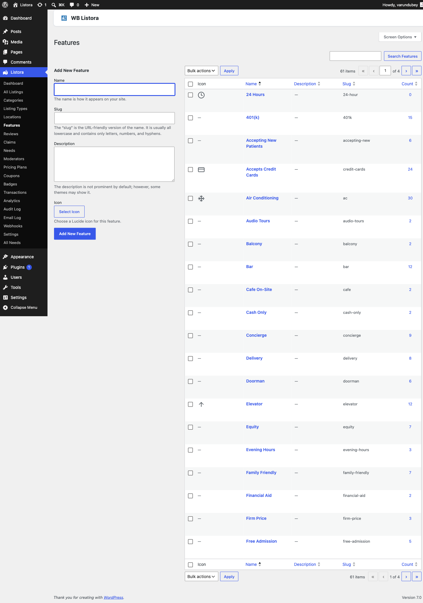

# Amenities / Features Taxonomy

Built into WB Listora **Free**.

A flat (non-hierarchical) taxonomy for tagging listings with the amenities or attributes that matter to the customer - Free WiFi, Parking, Pet Friendly, Wheelchair Accessible, Outdoor Seating, etc. Different from [Categories](listing-categories.md) (what the listing IS) and [Locations](locations.md) (where it IS) - amenities are the FACETS visitors filter on within a category.



## What it is

The `listora_listing_feature` taxonomy. Same shape as WordPress's built-in `post_tag` (flat, comma-separated entry, no parent/child), specialized for directory amenities:

- **Flat - no parent/child.** Amenities are independent attributes; nesting them adds friction without value.
- **Comma-entry on the listing edit screen** - type "WiFi, Parking, Pet Friendly" and tab to add. Autocomplete suggests existing terms.
- **Public archive** at `/{feature_slug}/{term}/` - shows every listing with that amenity.
- **Search facet** - the `listing-search` block's "Features" facet auto-populates from this taxonomy. Multi-select is the natural UX (visitors filter by "WiFi AND Parking AND Pet Friendly").
- **REST-exposed** at `/wp-json/wp/v2/listing-features` (WP core) and `/wp-json/listora/v1/search?feature[]=wifi,parking` (Listora search facet).

Listora calls these "Features" in admin UI to keep terminology consistent with WordPress (we already overload "Categories" for `listora_listing_cat`, and the post type is "Listing", so "Features" is the natural complement). Many directories use the customer-facing label "Amenities" instead - change it via the `wb_listora_taxonomy_labels` filter or directly in the registration via `register_taxonomy_for_object_type()`.

## How you use it

### Build your amenity list

1. **Admin → Listora → Features.**
2. **Add the amenities customers will filter on.** Common starter set:
- WiFi, Parking, Wheelchair Accessible, Pet Friendly, Outdoor Seating, Takeout, Delivery, Reservations Required, Vegan Options, Family Friendly, 24/7, Credit Cards Accepted
3. **Keep the list FLAT and SCANNABLE.** 8-15 amenities is the sweet spot for filtering UX. Bigger lists overwhelm the sidebar.
4. **Use existing terms** - encourage listing owners to pick existing amenities rather than create new ones. The submission wizard's autocomplete makes this natural.

### Assign amenities to a listing

- **Wizard** - Features field appears as a tag picker (autocomplete from existing terms) in step 2 of the submission wizard. Customers can pick existing terms; creating new ones requires `manage_listora_types`.
- **Admin** - the standard WP taxonomy metabox on listing edit screens.
- **CSV import** - comma-separated term slugs in the `listora_listing_feature` column.
- **REST** - `POST /listora/v1/submit` accepts `listora_listing_feature: ['wifi', 'parking']` (slugs).

### Filter by amenity

- **Search block** - Features facet on the sidebar / drawer of `listing-search` block. Multi-select (AND logic by default - listings matching ALL selected amenities). Switch to OR via `wb_listora_search_feature_logic` filter.
- **Archive page** - `/{feature_slug}/wifi/` lists every listing tagged WiFi. Order via the standard `pre_get_posts` hook.
- **Card display** - toggle the Features chips on the Listing Card block's Inspector → Display panel.

## Permissions

| Capability | Who has it | What it gates |
|---|---|---|
| `manage_listora_types` | Administrator (custom roles via [Capabilities](../developer-guide/capabilities.md)) | Add / edit / delete Feature terms |
| `edit_listora_listings` | Admin, Editor, Author, Contributor, Subscriber | Assign existing Feature terms to listings |

Customers can't add new amenities from the frontend wizard by default - they pick from the curated list. To allow open submission, filter `wb_listora_submission_can_create_terms` to `true`.

## Customizing the customer-facing label

Default admin label is "Features" but many directories prefer "Amenities". Override globally:

```php
add_filter( 'wb_listora_taxonomy_labels', function ( $labels, $taxonomy ) {
if ( 'listora_listing_feature' !== $taxonomy ) {
return $labels;
}
$labels['name'] = __( 'Amenities', 'your-textdomain' );
$labels['singular_name'] = __( 'Amenity', 'your-textdomain' );
$labels['menu_name'] = __( 'Amenities', 'your-textdomain' );
return $labels;
}, 10, 2 );
```

## Settings & options

| Setting | Default | Where |
|---|---|---|
| Archive permalink base | `listing-feature` | Settings → General → Slugs |
| Show Features facet on search | On | Listing Search block → Inspector → Filters |
| Show Features chips on card | On | Listing Card block → Inspector → Display |
| Multi-select logic | AND (listings matching all selected) | `wb_listora_search_feature_logic` filter |

## Related

- [Listing Categories](listing-categories.md) - what the listing is (hierarchical).
- [Locations](locations.md) - where the listing is (hierarchical).
- [Search & Filters](search-and-filters.md) - how the Features facet renders on listing-search.
- [Advanced Search (Pro)](advanced-search.md) - saved filters and proximity search on top of amenities.
- [Custom Fields](../developer-guide/custom-fields.md) - when an amenity needs structured data (e.g. WiFi password) instead of a tag.
