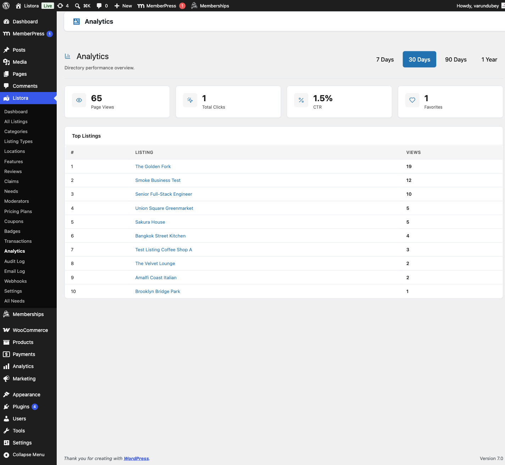

# Analytics

> **Availability:** Free + Pro. Free tracks listing views (since 1.2.0); Pro adds click-event tracking and the full Analytics dashboard.

## Free-tier view tracking (since 1.2.0)

WB Listora Free now tracks page views for every listing automatically - no Pro required, no configuration needed.

**What you get on Free:**

- A **Views** count on each listing's row in the admin listings table (Listora → All Listings).
- View counts on the listing owner's User Dashboard under My Listings.
- A `views` field on the listing REST response.

View tracking is bot-filtered (known crawler user-agents are excluded) and rate-limited per visitor per listing to avoid inflation from page refreshes. Your own views as a site admin are not counted.

**Deferral to Pro:** If WB Listora Pro is active with its **Analytics** feature turned on, Pro owns view recording and the Free tracker steps aside. Both write to the same `listora_analytics` table, so the numbers are consistent whether you upgrade later.

## Pro analytics

> **Pro feature** - requires [WB Listora Pro](../getting-started/activating-pro.md). Pro adds click-event tracking, the Analytics screen and the member Analytics tab.

Turn it on at **Listora → Settings → Features → Analytics**. It is off until you do. Once on, Pro tracks views and engagement clicks on every listing without cookies or third-party scripts. Listing owners see their own numbers in their dashboard. You see the whole directory in the admin.

## Why you'd use Pro analytics

- Listing owners get data on how their listing performs, which gives them a reason to keep it updated and renew their plan.
- You can spot listings that get visits but no contact clicks.
- Click events (phone, website, email, directions) show real engagement, not just passive views.
- Privacy-safe: no personal data is stored, only daily counts.

## How to use it

### For site owners (admin steps)

Go to **Listora → Analytics**. Use the buttons at the top right to choose the period: **7 Days**, **30 Days**, **90 Days** or **1 Year**. The screen has two tabs, **Overview** and **Search**.

**Overview**

- **Listing views** - how many times listings were opened.
- **Contact clicks** - phone, website, email and directions clicks added together.
- **Click-through rate** - contact clicks per listing view.
- **Favourites and leads** - how many listings were saved and how many contact-form messages were sent.
- Each tile shows its change on the previous period, for example "+12% on the previous 30 days", or "New this period" when there was nothing before.
- **Views and contact clicks per day** - a chart of the period with views and contact clicks as two lines. Longer periods group the chart by week. A table of the same numbers sits under the chart for screen readers.
- **Top listings** - the ten most viewed listings with their **Views**, **Contact clicks** and **Rate**.

**Search**

The **Search** tab shows what visitors search for. See [Search analytics](#search-analytics) below.

Bot visits are excluded, and so are visits by people who can manage Listora settings, so your own browsing does not inflate the counts.

**On the Listora dashboard**

With Monetization on, the dashboard's last-30-days row also shows **Money received**. With Analytics on, it shows **Listing views** and **Leads**. Both link to their screens. Completed credit purchases appear in the dashboard's activity feed ("Alex paid 25.00 USD for credits"). Needs waiting for review appear in **Needs attention** as "posted needs to review".

### For listing owners (member dashboard)

Members with at least one listing see an **Analytics** tab in their dashboard. It is shown whatever plan the listing is on. A plan does not switch it on or off.

- Pick a range: **7 days**, **30 days** or **90 days**. The default is 30 days.
- A chart shows **Daily views, all listings** for the range.
- Each listing shows its **Views**, **Clicks** and **Leads**. Paused and expired listings are included.
- Open a listing to see its breakdown by event type for the range. The range buttons there let the member change it without leaving the page.

## Tips

- Encourage owners to check their analytics each month. It is a strong reason to renew a paid plan.
- If you sell a featured upgrade, point owners at their analytics to show the difference in views.
- Analytics data is stored in the `listora_analytics` table, shared with Free. Do not truncate it by hand.
- Views are tracked on listing page loads. Click events are sent with `POST /listora/v1/analytics/track` when a visitor clicks a phone, website, email or directions link.
- To read the data in code, use `GET /listora/v1/analytics/listing/{listing_id}?period=30d`. The period can be `7d`, `30d`, `90d` or `1y`. Site owners can use `GET /listora/v1/analytics/overview`. See `docs/REST-API.md` in the Pro plugin.
- Old analytics rows are removed by a cleanup job. The retention period is the `wb_listora_pro_analytics_retention_days` option, 365 days by default.

## Common issues

| Symptom | Fix |
|---------|-----|
| No **Analytics** screen or tab | Turn on **Analytics** in **Listora → Settings → Features**. A member also needs at least one listing to see the tab. |
| View counts not increasing | Bots and your own visits are not counted. Check the page is a single listing page. |
| Click events not tracking | Clicks are sent by JavaScript. Check the browser console for errors. |
| Counts look wrong after a migration | The `listora_analytics` table is separate from your posts. Include it in any site migration. |

## Search analytics

The **Search** tab at **Listora → Analytics** records the search terms visitors use. It shows how many searches were made, how many different keywords, how many returned nothing and the share that returned nothing, followed by **Top Search Keywords** and **Keywords With No Results**. Each empty keyword has an **Add Listing** link, and **Copy Keywords** copies the list. This shows where your directory has gaps. You can also **Export CSV**.

Search term data is stored in the `listora_search_terms` table and pruned by the same retention job. Read it with `GET /listora/v1/analytics/search`, which needs the `manage_listora_settings` capability.

## Related features

- [Credits and Plans](credits-and-plans.md)
- [User Dashboard](user-dashboard.md)
