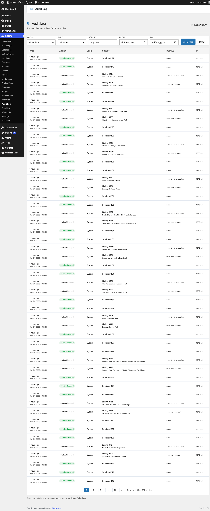

# Audit Log

> **Pro feature** — Available with WB Listora Pro.

A tamper-evident, searchable record of every meaningful action across your directory — who created, edited, approved, or deleted what, when, and why. Used by moderators to investigate disputes, by site owners to demonstrate compliance, and by support to reconstruct what happened on a problem listing.

## What it is

Most directory plugins log basic moderation actions but lose the trail of everyday edits. Audit Log records every meaningful change with the actor's user ID, IP, timestamp, before/after diff (where applicable), and a structured payload — stored in a dedicated `audit_log` table so the data outlives the originating row.

Events recorded:

| Category | Actions |
|---|---|
| **Listings** | created, updated, deleted, status-changed, reactivated, claimed, verified |
| **Reviews** | created, updated, deleted, status-changed |
| **Claims** | submitted, approved, rejected, reassigned |
| **Credits** (Pro) | added, deducted, refunded, plan activated, paused, resumed |
| **Webhooks** (Pro) | endpoint created, delivery succeeded, delivery failed |
| **Auth** | user role transitions, capability changes affecting listings |

How it works:

- Listeners attach to every `wb_listora_after_*` hook (create/update/delete) — see the long `add_action` list in `class-audit-log.php:191-260`.
- Each entry persists actor (user_id + IP), event key, object reference (post_id / review_id / claim_id), timestamp, and a JSON `data` blob with the relevant fields.
- The admin page (Listora → Audit Log) supports filter-by-event, filter-by-actor, filter-by-date, and a search box across the JSON payload.
- Retention is automatic: a daily Action Scheduler job (`wb_listora_pro_audit_cleanup`, group `wb-listora-pro`) prunes rows older than the configured retention window.

Why this matters: when a customer disputes a charge, a listing owner says "I never edited that", or a reviewer claims their review was tampered with — Audit Log is the source of truth.

## How you use it

### As a site owner / moderator

1. **Enable the feature:** Listora → Settings → Features → **Audit Log** (on by default).
2. **Browse:** Listora menu → **Audit Log**. The chronological feed shows the most recent 50 events with one-line summaries.
3. **Filter:**
   - **By event type** — pick "Listing updated", "Claim approved", etc.
   - **By actor** — type a username or pick from the dropdown.
   - **By date range** — start/end dates.
   - **Search** — full-text across the JSON payload (e.g. find every entry mentioning a specific listing title).
4. **Drill into an event:** click the row → opens a detail panel with the full JSON payload + before/after diff (where the event recorded one).

### As a compliance officer / auditor

- Export filtered results as CSV via the **Export** button (top-right of the page).
- Set retention to your jurisdiction's minimum via Settings → Audit Log → Retention.
- Combine with [Outgoing Webhooks (Pro)](outgoing-webhooks.md) to stream audit events to an external SIEM in real time.

## Settings & options

| Setting | Location | Default | Notes |
|---|---|---|---|
| Feature toggle | Settings → Features → Audit Log | On | |
| Retention window | Settings → Audit Log → Retention | 90 days | Older rows pruned by daily cron |
| Cleanup cron | `wb_listora_pro_audit_cleanup` | Daily | Action Scheduler, group `wb-listora-pro` |
| Storage | `wp_listora_audit_log` table | InnoDB, indexed on `event`, `user_id`, `object_id`, `created_at` | Survives plugin deactivation |

Developer hooks worth knowing:

- `wb_listora_pro_audit_log_event` (filter) — modify a recorded event before insert (add custom fields, redact PII).
- `wb_listora_pro_audit_log_record` (action) — fire your own custom events into the log: `do_action( 'wb_listora_pro_audit_log_record', 'my_event', $payload );`

## Related

- [Outgoing Webhooks (Pro)](outgoing-webhooks.md) — same event surface, routed to external systems.
- [Moderator Role (Pro)](moderators.md) — moderator-only access to the Audit Log page.
- [Developer Reference: Hooks](../developer-guide/hooks-reference.md) — the underlying `wb_listora_after_*` hooks Audit Log subscribes to.
