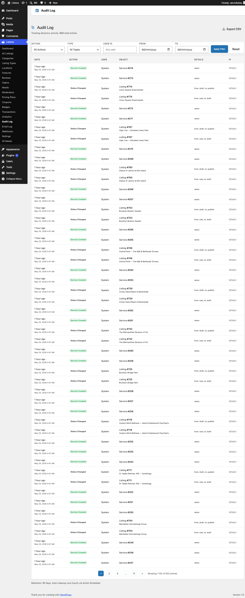

# Audit Log

> **Availability:** Pro only. Requires [WB Listora Pro](../getting-started/activating-pro.md).

A searchable record of the meaningful actions in your directory: who created, edited, approved or deleted what, and when. Use it to investigate disputes, to show what happened on a listing, and to reconstruct a problem after the fact.



## What it is

Every entry records who did it (or **System** when no one was signed in), what happened, what it happened to, when, the IP address, and the details of the change where there are any. Entries are stored in a dedicated table, so they outlive the item they describe.

Entries are recorded for:

| Group | What is recorded |
|---|---|
| **Listings** | Created, updated, deleted, approved, submitted, status changed, paused, resumed, renewed |
| **Reviews** | Created, updated, deleted, submitted |
| **Claims** | Submitted, approved, rejected, updated |
| **Favourites** | Added, removed |
| **Services** | Created, updated, deleted |
| **Credits** | Added, spent, refunded |
| **Members** | Suspended, reinstated |
| **Badges** | Assigned, removed |
| **Settings** | Settings changed |
| **Webhooks** | A payment webhook request that was refused |

## How you use it

### Reading the log

1. Go to **Listora → Tools → Audit Log**. Only people who can manage Listora settings, such as administrators, can open it. The feature is on by default. You can switch it off under **Listora → Settings → Features → Audit Log**.
2. The newest entries are at the top, 50 to a page. Columns are **When**, **What happened**, **On**, **By** and **Details**.
3. Click the **When** column heading to sort oldest first. With no sort chosen the log always shows newest first.
4. Where an entry recorded a change, the **Details** column lists the fields that changed. Open the row to see a **Field**, **Before** and **After** table.

Since 1.9.0 the log shows newest first when no sort is chosen. It used to come back in the wrong order.

### Filtering

Use the filters above the table:

| Filter | What it does |
|---|---|
| **Any action** | Shows one kind of entry, such as **Claim approved**. The list holds only actions that are in your log. |
| **Anything** | Limits entries to one kind of item: **Listings**, **Reviews**, **Claims**, **Services**, **Members**, **Credits**, **Webhooks** or **Settings**. |
| **Any time** | **Last 24 hours**, **Last 7 days**, **Last 30 days** or **Last 90 days**. |
| **Member name or email** | Shows what one person did. |

### Exporting

Click **Export CSV** at the top of the page to download the log as a CSV file.

### Retention

Entries older than the retention period are removed automatically. The default is 90 days. An hourly job (`wb_listora_pro_audit_cleanup`, group `wb-listora-pro`) deletes up to 10,000 expired entries per run. The text under the page title shows the current period.

There is no screen for changing the period. Set the `wb_listora_pro_audit_retention_days` option, for example with WP-CLI:

```
wp option update wb_listora_pro_audit_retention_days 365
```

Export the log first if you need to keep entries longer than the period.

## Settings and options

| Setting | Location | Default | Notes |
|---|---|---|---|
| Feature toggle | **Listora → Settings → Features → Audit Log** | On | |
| Retention period | `wb_listora_pro_audit_retention_days` option | 90 days | Days to keep entries. |
| Cleanup job | `wb_listora_pro_audit_cleanup` | Hourly | Action Scheduler, group `wb-listora-pro`. Up to 10,000 rows per run. |
| Storage | `listora_audit_log` table | - | Entries are stored in UTC and shown in your site's time zone. |

Developer API:

- `\WBListoraPro\Features\Audit_Log::log( $action, $object_type, $object_id, $details )` - add your own entry. Entries with an action key Listora does not know show the key as their label.
- `wb_listora_rest_prepare_audit_log_entry` (filter) - change an entry in the REST response.

## Related

- [Outgoing Webhooks](outgoing-webhooks.md) - send events to other systems as they happen.
- [Developer Reference: Hooks](../developer-guide/hooks-reference.md)
