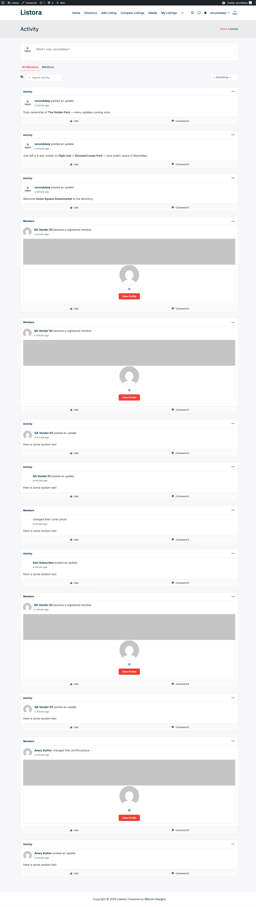

# BuddyPress Integration

> **Pro feature** - Available with WB Listora Pro. Requires BuddyPress (or BuddyBoss) active.

Turn a one-way business directory into a two-way community. When BuddyPress is active, WB Listora Pro automatically posts listing activity to BP activity streams, sends BP notifications, adds a "My Listings" tab to BP member profiles, and links review/claim activity to the actor's BP profile - so a directory site that already runs on BuddyPress feels native, not bolted on.

## What it is

A common Wbcom stack pairs a directory with a community plugin - most often BuddyPress (or BuddyBoss). Without integration, the two systems live side by side but don't talk: a member submits a listing and their BP friends never hear about it; a review is posted and the listing owner has to email-check to find out. BuddyPress Integration closes that gap.

When BuddyPress is detected, the feature wires in:

- **Activity stream entries** for three lifecycle events:
- A new listing is published (`activity_listing_published` on `wb_listora_listing_submitted`)
- A review is posted on a listing (`activity_review_posted` on `wb_listora_review_submitted`)
- A claim is approved (`activity_claim_approved` on `wb_listora_claim_approved`)
- **BP notifications** (when the BP notifications component is active):
- Owners are notified when a new review lands on their listing
- Submitters are notified when their listing is approved (or rejected)
- Claimants are notified when their claim is approved
- **Listings and Reviews sub-navs** on BP member profiles (under the user's profile) that list everything the member owns or has reviewed - so a member's friends can browse what they've published without leaving BuddyPress. Since 1.1.0 both tabs are paginated, so members with many listings or reviews load in pages instead of one large query.
- **Profile-linked review authors** - review author names in the Listora UI link to the reviewer's BP profile (via the `wb_listora_member_profile_url` filter Free fires).
- **Notification formatting** for the BP-standard notifications UI, so Listora notifications appear alongside friend requests, mentions, etc. in the same dropdown.

The integration is **non-destructive**: turning the feature off leaves no orphaned activity or notification rows; turning it on doesn't backfill historical events.

## How you use it

### As a site owner - enable + verify

1. Ensure BuddyPress (or BuddyBoss) is active.
2. **Enable the feature:** Listora → Settings → Features → **BuddyPress Integration** (on by default when BP is detected).
3. **Recommended BP components:** activity stream (for activity entries) + notifications (for notifications). The integration auto-detects which are active.
4. **Verify activity:** as a test user, submit a new listing → visit BP activity stream (`/activity/`) → confirm the publication appears with a link back to the listing.
5. **Verify notifications:** post a review on a listing you don't own → log in as the listing owner → BP notification dropdown should show "New review on your listing".
6. **Verify the profile tabs:** visit your own BP profile → confirm the Listings and Reviews sub-navs appear and show your published listings / reviews (paginated when the list is long).

### As a community member

- **Following another member's directory activity:** activity entries appear in the BP stream you already read - no separate notification setting to manage.
- **Linking from a review back to your profile:** when you post a review, your name on the review card links to your BP profile, helping you build reputation across both systems.

## Settings & options

| Setting | Location | Default | Notes |
|---|---|---|---|
| Feature toggle | Settings → Features → BuddyPress Integration | On (when BP active) | Auto-detects BP; idle when BP is not installed |
| Activity stream entries | (auto) | On with BP activity component | Listings / reviews / claims |
| BP notifications | (auto) | On with BP notifications component | New review, listing approved, claim approved |
| Listings / Reviews profile sub-navs | (auto) | On with BP active | Surfaces a member's listings and reviews on their profile (paginated) |
| Profile URL filter | `wb_listora_member_profile_url` | Returns `bp_core_get_user_domain($user_id)` | Filter to customize per-user link in non-BP contexts |

Developer hooks worth knowing:

- `wb_listora_member_profile_url` (filter, Free) - Pro's BP integration listens to this to return BP profile URLs; you can override per-user.
- `bp_listora_activity_action` (filter) - customize the text shown for each activity entry.
- `bp_listora_notification_format` (filter) - customize notification rendering.

## Related

- [Reviews & Ratings](reviews-system.md) - every review event flows into BP activity when this integration is on.
- [Business Claims](business-claims.md) - claim approvals notify claimants via BP when active.
- [User Dashboard](user-dashboard.md) - the Listora dashboard remains the canonical management surface; BP profile tab is a discovery surface.
- [Outgoing Webhooks (Pro)](outgoing-webhooks.md) - an alternative when you want to route the same events to non-BP destinations.
