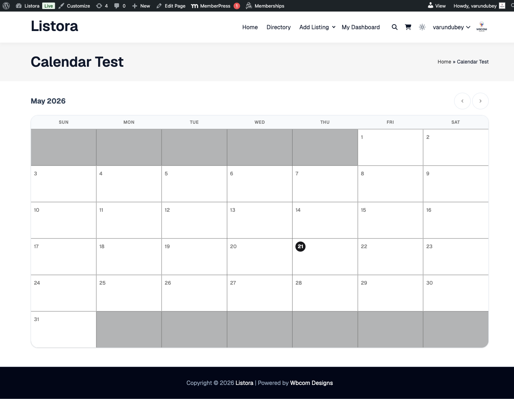

# Calendar & Events

> **Availability:** Free + Pro.

Show a true monthly events calendar driven by your directory - date-bound listings (Event listing type, or any type with date fields) render on the right day, recurring events expand to virtual occurrences for the current month, and clicking any day or event drills into the listings. Color-coded per listing type, accessible with proper ARIA, mobile-friendly.

## What it is

A directory of events without a real calendar is a list of dates pretending to be a calendar. The Listora Calendar block solves three things together:

1. **Date-bound listings** - any listing with a `start_date` (and optional `end_date`) field surfaces on the right day of the month. The Event listing type sets these by default; other types can opt in via custom fields.
2. **Recurring events** - for listings flagged as recurring (weekly, monthly, custom intervals), the block generates **virtual occurrences** for the displayed month. A weekly meetup at 7pm Wednesdays produces 4-5 calendar entries automatically; no separate posts needed.
3. **Color coding by listing type** - each event dot uses the listing's type color (`--listora-type-color`, the per-type class system) - so a calendar with restaurants, events, and jobs becomes glanceable by category.

How it renders:

- **Monthly grid** - 7×5 or 7×6 grid, sized to the month. Hover/focus a day shows the event list as a tooltip; click drills into a day-detail view.
- **SQL - two phases:**
- Phase 1 - `SELECT … WHERE start_date in this month` for non-recurring events.
- Phase 2 - `SELECT … WHERE is_recurring = 1` then PHP-generates virtual occurrences from each recurrence rule within the displayed month.
- **Cache-friendly** - generated occurrences are computed per-request; no DB rows are persisted for virtual occurrences (so deleting a recurring rule cleans up automatically).
- **Hook surface** - `do_action( 'wb_listora_before_calendar' )`, `apply_filters( 'wb_listora_calendar_events', $events, $year, $month )`, `do_action( 'wb_listora_after_calendar' )`.

For event-heavy directories (community calendars, meetup hubs, performance schedules) this turns the directory from a list into a navigable timeline.

## How you use it

### As a site owner - place the block

1. **Insert** the **Listora Calendar** block on any page (homepage, dedicated `/calendar/` page, sidebar).
2. **Inspector controls:**
- **Listing Type** - restrict to one type (e.g. Events only). Leave empty to show all date-bound listings.
- **Categories** - restrict to specific categories.
- **Default month** - current month (default) or a specific year+month.
- **Show navigation arrows** - toggle the prev/next month buttons.
- **First day of week** - Sunday or Monday (locale-aware default).
3. **Save the page.** Date-bound listings auto-render on the right days.

### As a listing owner - add a calendar event

1. Submit a listing with the **Event** listing type (or any type that has Start Date in its fields).
2. Fill in **Start Date** + optional **End Date**.
3. For recurring events: check **Recurring** + pick the pattern (weekly / monthly / custom). Pick the days/dates within the pattern.
4. Save. The event appears on the calendar block(s) on your site immediately.
5. For one-off cancellation of a recurring instance: add a **Skip Dates** entry in the listing.

### As a visitor - what you see

- Monthly grid with colored event dots per day.
- Hover a day → tooltip lists events with title + time.
- Click a day → opens a panel listing all events that day, with click-throughs to each listing's detail page.
- Click prev/next month arrows → calendar reloads via the IAPI store (no page reload).

## Settings & options

| Setting | Location | Default | Notes |
|---|---|---|---|
| Block | Editor → Insert → Listora Calendar | - | Server-rendered, IAPI-powered nav |
| Date fields | Event listing type (default) | `start_date`, `end_date`, `is_recurring`, `recurrence_rule` | Other types can opt in via custom fields |
| Color per dot | `--listora-type-color` (auto) | Per listing type | Set per type in WP Admin → Listora → Listing Types |
| Virtual occurrence generation | (system) | Per request, per displayed month | No DB rows; recurrence is computed on read |
| First day of week | Inspector / locale | Locale default | Per-block override |

Developer hooks:

- `wb_listora_before_calendar` / `wb_listora_after_calendar` (actions).
- `wb_listora_calendar_events` (filter) - modify the events array before render; useful to inject external calendar feeds.
- `wb_listora_calendar_query_args` (filter) - modify the SQL query args.

## Related

- [Listing Types](../getting-started/listing-types.md) - the Event type ships with the date fields by default; create custom types and add date fields to use the calendar for them.
- [Search & Filters](search-and-filters.md) - pair the calendar with type/category search for a discovery surface.
- [Featured Listings](featured-listings.md) - a complementary block - Featured for "what's hot now", Calendar for "what's coming up".
- [Developer Reference: Hooks](../developer-guide/hooks-reference.md) - full calendar hooks list.
