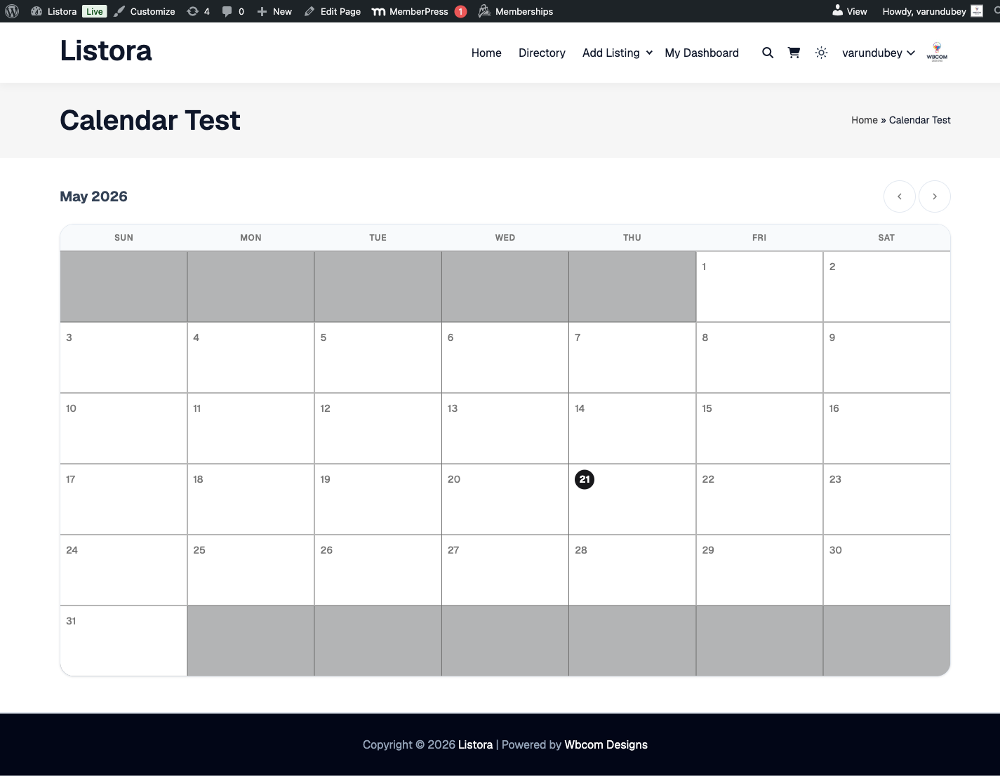

# Calendar & Events

> **Availability:** Free + Pro.

Show a monthly events calendar driven by your directory. Date-bound listings (the Event listing type, or any type with date fields) appear on every day they cover, recurring events expand to occurrences for the displayed month, and each event links to its listing. On phones the calendar adds a month agenda.

## What it is

A directory of events without a real calendar is a list of dates pretending to be a calendar. The Listora Calendar block solves three things together:

1. **Date-bound listings** - any listing with a `start_date` (and optional `end_date`) field surfaces on the right day of the month. The Event listing type sets these by default; other types can opt in via custom fields.
2. **Recurring events** - for listings flagged as recurring (weekly, monthly, custom intervals), the block generates **virtual occurrences** for the displayed month. A weekly meetup at 7pm Wednesdays produces 4-5 calendar entries automatically; no separate posts needed.
3. **Color coding** - an event takes the colour of its first category (set per category under **Listora > Categories**), so a calendar mixing several kinds of event is easy to scan.

How it renders:

- **Multi-day events** - an event with an end date appears on every day from its start to its end that falls in the displayed month, not just on its first day.
- **Monthly grid** - a seven-column grid sized to the month. Each day shows up to three events and a **+N** badge when there are more.
- **Events are links** - each event in the grid is a link to its listing. There is no pop-up.
- **Month agenda on phones** - on screens up to 768px wide the grid cells show only a dot, and a list of the month's events appears under the grid, one day per row, each event linking to its listing. When the month has no events, the calendar says **No events in** that month.
- **Month name** - the heading uses your site's timezone, so it shows the correct month for sites west of UTC.
- **Two queries** - one for events that overlap the month, one for recurring listings, from which occurrences for the month are generated. No database rows are stored for the occurrences, so deleting a recurring rule cleans up automatically.
- **Hooks** - `wb_listora_before_calendar`, `wb_listora_calendar_events` and `wb_listora_after_calendar`.

For event-heavy directories (community calendars, meetup hubs, performance schedules) this turns the directory from a list into a navigable timeline.

## How you use it

### As a site owner - place the block

1. **Insert** the **Listora Calendar** block on any page (homepage, dedicated `/calendar/` page, sidebar).
2. **Inspector controls:** **Listing Type** restricts the calendar to one type. It starts as **event**. Clear it to show every date-bound listing. The Layout, Style and Advanced panels hold spacing, border and visibility options.
3. **Save the page.** Date-bound listings appear on the right days.

### As a listing owner - add a calendar event

1. Submit a listing with the **Event** listing type (or any type that has Start Date in its fields).
2. Fill in **Start Date** + optional **End Date**.
3. For recurring events: check **Recurring** + pick the pattern (weekly / monthly / custom). Pick the days/dates within the pattern.
4. Save. The event appears on the calendar block(s) on your site immediately.
5. For one-off cancellation of a recurring instance: add a **Skip Dates** entry in the listing.

### As a visitor - what you see

- A monthly grid with each day's events as coloured links.
- Click an event to open its listing.
- Click the previous or next month arrows to change month. The calendar updates without reloading the page.
- On a phone, scroll down to the month agenda to see and open the events.

## Settings & options

| Setting | Location | Default | Notes |
|---|---|---|---|
| Block | Editor > Insert > Listora Calendar | - | Server-rendered, month navigation without a page reload |
| Listing Type | Block inspector | event | Clear it to show every type with dates |
| Date fields | Event listing type | Start date, end date, recurring settings | Other types can opt in through custom fields |
| Event colour | Category colour | First category's colour | Set per category in the admin |

Developer hooks:

- `wb_listora_before_calendar` / `wb_listora_after_calendar` (actions).
- `wb_listora_calendar_events` (filter) - modify the events array and the block attributes before render. Useful to inject external calendar feeds.

## Related

- [Listing Types](../getting-started/listing-types.md) - the Event type ships with the date fields by default; create custom types and add date fields to use the calendar for them.
- [Search & Filters](search-and-filters.md) - pair the calendar with type/category search for a discovery surface.
- [Featured Listings](featured-listings.md) - a complementary block - Featured for "what's hot now", Calendar for "what's coming up".
- [Developer Reference: Hooks](../developer-guide/hooks-reference.md) - full calendar hooks list.
