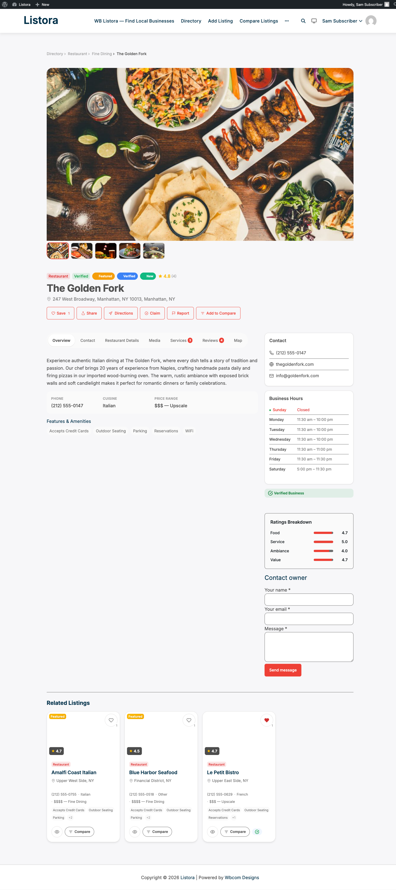

# Contact Form

> **Availability:** Free + Pro. When Pro's [Lead Forms](lead-forms.md) feature is enabled, it replaces this Free contact form.

A "Contact owner" form on every listing detail page. Visitors send a private message to the listing owner; the owner gets an email; no personally-identifying data is stored on the site. Honeypot + Akismet + per-IP and per-listing rate limits in front of every submission - and when Pro's [Lead Forms](lead-forms.md) feature is on, this Free surface automatically stands down so the two never render together.



## What it is

A minimal contact-owner surface for sites that don't need full Pro lead capture:

- Renders inline on every listing detail page (after the fields, before reviews) - no shortcode or block placement required.
- Three required inputs: **name**, **email**, **message**. Plus a hidden honeypot field bots can't resist filling.
- Submits to `POST /listora/v1/listings/{id}/contact-form` with a per-listing nonce.
- Anti-spam pipeline runs before any email is dispatched: honeypot rejection, [keyword blacklist + URL density + Akismet](spam-protection.md), per-IP rate limit (3 messages per hour per listing), per-listing daily cap (default 20 - configurable via `wb_listora_contact_form_per_listing_daily_cap` filter).
- Owner receives a plain-text email at their WordPress account email. `Reply-To` is set to the sender so a one-click reply goes straight back to the visitor - without exposing the owner's email to the sender on the page.
- Self-suppresses for the listing owner viewing their own page (no "contact yourself" affordance).
- **Coupling rule:** when Pro's `lead_form` feature toggle is ON, `should_render()` returns false and the Free form hides - Pro's analytics-enriched lead form takes over with the same UX shape. Set the `wb_listora_render_contact_form` filter to `true` to force the Free form on top of Pro (rarely useful).

## How you use it

### As an admin / site operator

1. Activate WB Listora - the contact form is on by default.
2. Confirm your site's outgoing email works. Try **Settings → Notifications → Send Test Email** with the "New listing submitted" template - if that arrives, the contact form's `wp_mail()` will too.
3. Tune the per-listing daily cap if needed: 20 is right for most directories. Reduce for low-traffic high-value listings, raise for high-volume vendors.
4. Listing owners get messages at their **profile email** (WordPress account email). Encourage them to keep that current.

### As a visitor

1. Open any listing detail page.
2. Scroll past the fields tab to **Contact owner**.
3. Enter your name, your email, and a message of any length.
4. Submit. The page shows "Your message has been sent to the listing owner." inline.
5. The owner replies directly to your email address - replies do NOT route back through the site.

### As a listing owner

1. New messages arrive at the email address on your WP profile.
2. Subject format: `New message from {sender} about {your listing title}`.
3. Hit reply in your mail client - your reply goes straight to the visitor's email (we set `Reply-To`).
4. The site itself never stores the visitor's name / email / message text. If you need a record, save the email in your mail archive.

## Anti-spam layers

The form runs every submission through the same anti-spam pipeline as listings, reviews, and claims:

| Layer | What it catches | Configurable |
|---|---|---|
| **Honeypot** (`hp` field) | Bots that fill every input. Silent reject - bots think they won. | (no setting - built in) |
| **Per-IP rate limit** | 3 messages per hour per listing per IP. Returns HTTP 429. | (no setting - built in) |
| **Per-listing daily cap** | 20 messages per listing per day across all IPs. Returns HTTP 429. | `wb_listora_contact_form_per_listing_daily_cap` filter |
| **Keyword blacklist** | Banned words from Settings → Security → Banned Words. | Settings → Security |
| **URL density cap** | Submissions over the per-event URL limit. | Settings → Security |
| **Akismet** | Spam content check via the Akismet API. Falls open on outage. | Akismet plugin |

See [Spam Protection](spam-protection.md) for the layered defence and [Rate Limiting](rate-limiting.md) for the per-IP windows.

## Settings & options

| Setting | Default | Where |
|---|---|---|
| Per-listing daily cap | 20 | `wb_listora_contact_form_per_listing_daily_cap` filter |
| Per-IP cap | 3 / hour / listing | (no setting - built in) |
| Email subject template | `New message from %s about %s` | (translatable string) |
| Reply-To header | Sender's email | (filterable via `wb_listora_contact_form_email_headers`) |
| Render gate | On when Pro `lead_form` is OFF | `wb_listora_render_contact_form` filter |

## Developer hooks

```php
// Raise the per-listing daily cap for verified listings.
add_filter( 'wb_listora_contact_form_per_listing_daily_cap', function ( $cap, $listing_id ) {
if ( wb_listora_is_verified( $listing_id ) ) {
return 50;
}
return $cap;
}, 10, 2 );

// Add a BCC for compliance archiving.
add_filter( 'wb_listora_contact_form_email_headers', function ( $headers, $post ) {
$headers[] = 'Bcc: compliance@example.com';
return $headers;
}, 10, 2 );

// Force the Free form to render even when Pro's lead form is active.
add_filter( 'wb_listora_render_contact_form', '__return_true' );
```

After every successful send, `do_action( 'wb_listora_after_contact_form_submit', $listing_id, $context, $request )` fires - Pro's Audit Log + Analytics features listen here to record the event.

## Free / Pro coupling

| Scenario | What renders |
|---|---|
| Free only | Free contact form (this page) |
| Pro active, `lead_form` toggle ON (default) | Pro [Lead Forms](lead-forms.md) - analytics-enriched, custom fields, integrations |
| Pro active, `lead_form` toggle OFF | Free contact form (this page) |
| Pro active, `lead_form` ON, filter override | Both render (use carefully) |

## Related

- [Lead Forms (Pro)](lead-forms.md) - analytics-enriched replacement with custom fields, source attribution, integrations.
- [Spam Protection](spam-protection.md) - the multi-layer defence the contact form runs through.
- [Rate Limiting](rate-limiting.md) - per-IP sliding window windows on every write endpoint.
- [Email Templates](email-templates.md) - message template customization.
- [REST API](../developer-guide/rest-api.md) - `POST /listora/v1/listings/{id}/contact-form` endpoint reference.
