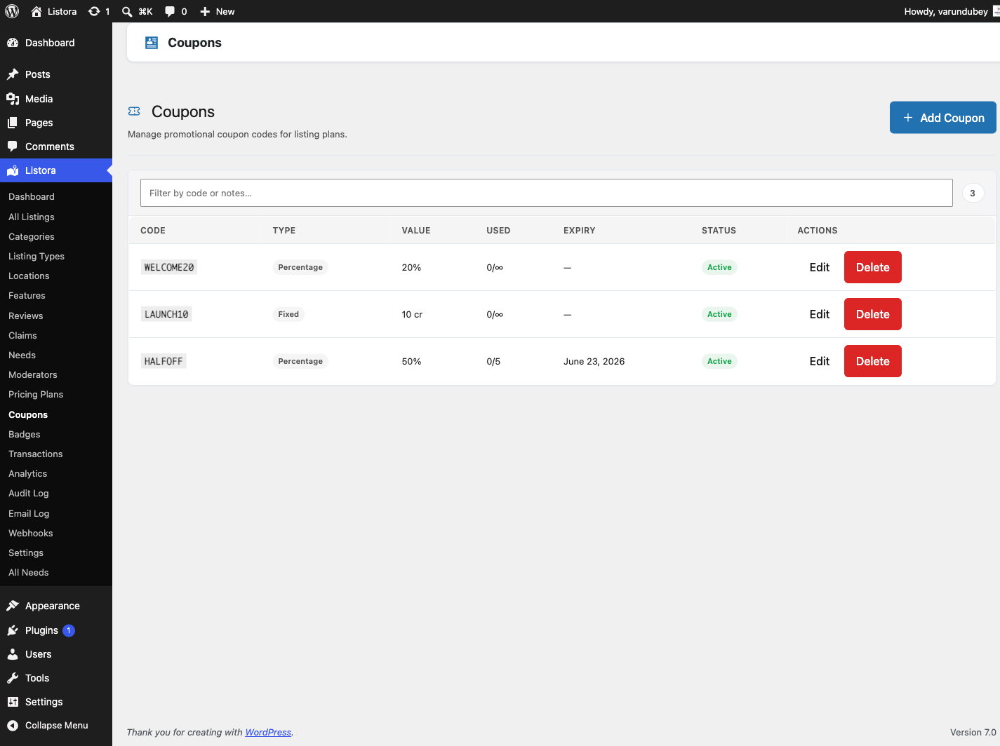

# Coupons

> **Availability:** Pro only. Requires [WB Listora Pro](../getting-started/activating-pro.md) and **Monetization** switched on in **Listora → Settings → Features**. Free sites do not have a coupon system.

## What it does

Coupons are discount codes that reduce the credit cost of a listing plan. A member enters a code on the plan step of the submission form. The discount is taken off the price charged when the listing is submitted.

## Why you'd use it

- Run limited-time promotions to drive listing submissions.
- Offer referral discounts or partner codes to specific groups.
- Restrict a coupon to specific plans so a 50% discount only applies to your premium tier.
- Set a per-member limit so one person cannot reuse a code.

## How to use it

### For site owners (admin steps)

Go to **Listora → Monetization → Coupons**. The list uses the shared admin table, so you can search codes and filter by view: **All**, **Active**, **Expired** and **Switched off**.

| Column | What it shows |
|--------|---------------|
| **Code** | The code, linked to its edit screen. |
| **Discount** | Written the way a member reads it: "20% off" or "10 credits off". A minimum plan cost shows underneath ("On plans of 20+ credits"). |
| **Applies to** | The names of the plans the coupon is limited to, or **All plans**. |
| **Used** | "3 of 50 used" when there is a total limit, or "3 used · no limit". A per-member limit adds a second line ("1 per member"). |
| **Expires** | The expiry date, or **Never**. |
| **Status** | **Active**, **Expired** (past its expiry date) or **Switched off**. |
| **Created** | The date the coupon was created. |

**Creating a coupon**

1. Click **Add Coupon**.
2. Fill in the fields:
   - **Coupon Code** - the code members enter, for example `LAUNCH50`. Codes are uppercased automatically and must be unique.
   - **Discount Type** - **Percentage off credits** or **Fixed credit amount**.
   - **Discount Value** - a percentage from 1 to 100, or a number of credits. It must be above zero.
   - **Usage Limit (total)** - how many times the code can be used by everyone. `0` is unlimited.
   - **Per-User Limit** - how many times one member can use it. `0` is unlimited.
   - **Expiry Date** - the last day the code works. Leave it empty for no expiry.
   - **Restrict to Plans** - tick the plans the code applies to. Leave all unticked to allow every plan.
   - **Minimum Plan Cost** - the plan must cost at least this many credits. `0` is no minimum.
   - **Status** - **Active** or **Inactive**. Inactive shows as **Switched off** in the list.
   - **Admin Notes** - internal notes members never see.
3. Click **Create Coupon**.

**Checking usage**

The **Used** column shows how often each code has been redeemed. Open a coupon and its **Usage Log** lists each redemption with the member, the plan, the discount and the date.

**Switching a coupon off**

Edit the coupon, set **Status** to **Inactive** and save. Members who enter the code see that it is no longer active.

**Deleting a coupon**

Use **Delete** in the row. Redemptions already made stay valid. The code cannot be used again.

### For members

1. On the **Choose your plan** step of the submission form, find **Have a coupon?**.
2. Type the code and click **Apply**.
3. If the code is valid for the selected plan, a message shows the discount, for example "Coupon applied! 20% off".
4. Continue and submit. The discounted price is the price charged.

A coupon applied on the plan step is taken off the amount charged when the listing is submitted. Saving the listing as a draft charges nothing and does not use up the coupon. A coupon can be used once for each listing.

## Tips

- Use uppercase codes. They are easier to share and Listora stores them in uppercase.
- For a launch promotion, set a short **Expiry Date** and a sensible **Usage Limit** rather than a permanent unlimited coupon.
- Restrict high-value coupons to your most expensive plan with **Restrict to Plans**.
- For a code meant for one person, set **Per-User Limit** to `1` and a small **Usage Limit**. Listora does not generate single-use codes, so make one coupon per recipient if you need that.
- To keep a coupon off free plans, set **Minimum Plan Cost** to at least `1`.

## Common issues

| Symptom | Fix |
|---------|-----|
| "Coupon code not found" | Check the spelling, and that the coupon exists in **Listora → Monetization → Coupons**. |
| "This coupon is no longer active." | The coupon is **Switched off**. Set its **Status** to **Active**. |
| "This coupon has expired." | The **Expiry Date** has passed. Edit the coupon to extend it. |
| "This coupon is not valid for the selected plan" | **Restrict to Plans** is set. The member must pick one of the listed plans. |
| "This coupon requires a plan costing at least N credits." | **Minimum Plan Cost** is set above the cost of the chosen plan. |
| "This coupon has reached its usage limit." | Raise **Usage Limit (total)** or create a new coupon. |
| "You have already used this coupon." | **Per-User Limit** has been reached for that member. |

## Related features

- [Pricing Plans](pricing-plans.md)
- [Credits and Plans](credits-and-plans.md)
- [Analytics](analytics.md)
