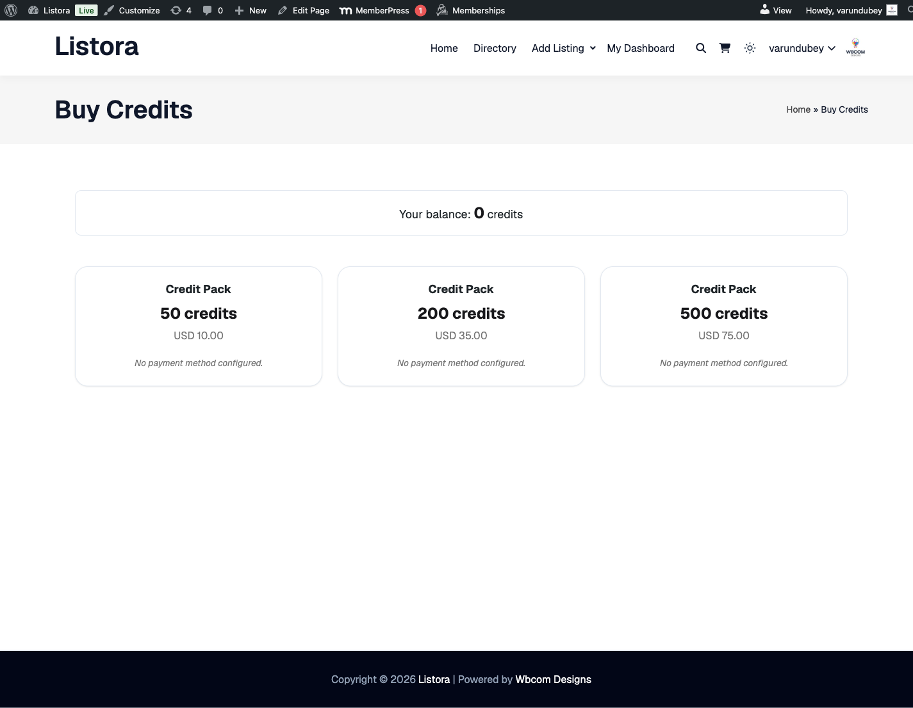
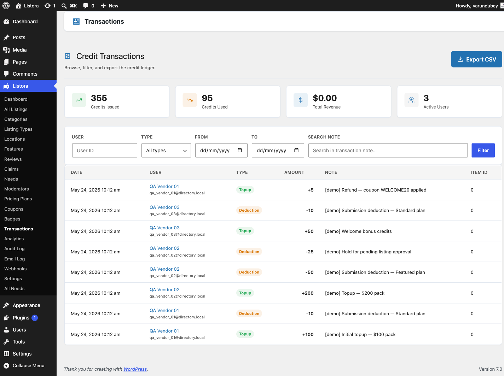

# Credits and Pricing Plans

> **Pro feature** - requires [WB Listora Pro](../getting-started/activating-pro.md). Free sites can use listing limits per role without a credit system.

## Monetization is opt-in by default (since 1.2.0)

On a fresh install of WB Listora Pro, the entire credit and pricing-plan system is **off by default**. Users can submit listings at no cost until you choose to enable it.

To switch it on, go to **Listora → Settings → Features** and enable the **Monetization** toggle. This single toggle activates the credit system, pricing plans, coupons, and the payment webhook receiver together.

**Upgrading from a version before 1.2.0?** Nothing changes for you. The toggle is automatically set to ON for existing installs to preserve your current setup.

**Why the submission form no longer shows a Plan step:**

If you installed WB Listora Pro for the first time and the "Choose a Plan" step is missing from the submission form, Monetization is off (the default). Enable the toggle in **Settings → Features** and the plan step appears immediately. See [Submission Settings](../settings/submission-settings.md) for other form controls.

## What it does

WB Listora Pro includes a credit-based payment system. Users purchase credits (via your payment provider of choice), and spend those credits to activate listing plans. Each plan determines how long a listing stays active, whether it gets featured placement, and what perks it includes.

## Why you'd use it

- Monetize your directory without a WooCommerce store - credits work with any payment gateway via webhook.
- Pricing plans give you flexible packaging: a free basic plan, a paid featured plan, and a premium plan can all coexist.
- Credits are reusable - users can top up once and submit multiple listings over time.
- The webhook-based topup system is payment-processor-agnostic: Stripe, PayPal, Paddle, or any custom solution works.

## How to use it

### For site owners (admin steps)

**Step 1: Set up the webhook**

1. Go to **Listora → Settings → Credits** and find the **Credit System** section.
2. Copy the **Webhook URL** and **Webhook Secret**.
3. In your payment platform (e.g., Stripe), create a webhook that fires on payment success and posts to that URL. Set the webhook secret as the HMAC key.
4. When a payment succeeds, the webhook credits the purchasing user automatically.

**Step 2: Configure the credits page**

1. Create a page on your site where users can purchase credits (e.g., an embedded payment form or a link to your payment platform).
2. Go to **Listora → Settings → Credits → Credit System** and set **Credits Page** to that page.
3. This page URL is used for "Buy Credits" links throughout the plugin (e.g., when a user can't afford a plan).

**Step 3: Create pricing plans**

1. Go to **Listora → Pricing Plans → Add New Plan**.
2. Fill in the plan settings:
- **Plan title** - the name shown to users (e.g., "Basic", "Featured", "Premium").
- **Plan Price (credits)** - credits required to purchase this plan. Set to `0` for a free plan.
- **Credit Cost** - credits deducted per listing submission on this plan.
- **Display Price** - optional label shown to users (e.g., "$29/month"). This is for display only; actual charging happens via your webhook.
- **Duration (days)** - how long the listing stays active. Set to `0` for permanent listings.
- **Featured Plan** - tick this to highlight the plan as recommended in the plan selection step.
- **Badge Text** - optional label on the plan card (e.g., "Most Popular", "Best Value").
- **Plan Perks** - checkboxes for: Mark listing as Featured, Priority support, Analytics dashboard access.
3. Publish the plan.
4. Repeat for each plan you want to offer.

**Step 4: Verify the plan selection step**

When a user submits a new listing, a **Choose a Plan** step appears in the submission form showing all published plans. Plans the user can't afford are greyed out with a "Buy Credits" link.

**Adding credits manually:**

Go to **Users → Edit User** and use the **Listora Credits** panel to add credits directly without a payment. Useful for comping credits to early adopters or resolving disputes.

### For end users (visitor/user-facing)

1. Go to the credits purchase page to buy credits.
2. When submitting a listing, the **Choose a Plan** step shows all available plans with their credit cost, duration, and perks.
3. Select a plan. If you have a coupon code, enter it in the coupon field - the credit cost adjusts immediately.
4. Your credit balance is shown on the plan selection screen. After submitting, the credit cost is deducted from your balance.
5. View your current balance and transaction history in **User Dashboard → Credits**.

## Tax, VAT and GST compliance (EU / UK / Australia and others)

Credits are a **digital service**. If you sell them to consumers in jurisdictions with consumption tax - EU/UK **VAT**, Australia/New Zealand **GST**, and similar - you are generally responsible for charging the correct tax at the buyer's location, issuing a compliant tax invoice, and (for business buyers in the EU) handling **reverse-charge** with a validated VAT ID. The rules, rates, thresholds, and invoice fields vary by country - **confirm your obligations with a tax advisor**. This page describes what the plugin does, not legal advice.

**Which purchase route you use determines whether tax and invoicing are handled:**

- **WooCommerce route (recommended when you owe VAT/GST).** Sell credits as a WooCommerce product and let WooCommerce + a tax extension (e.g. WooCommerce Tax / an EU-VAT plugin) and an invoice/PDF plugin do the work. WooCommerce then collects the billing address, applies the correct location-based VAT/GST rate, supports B2B VAT-ID reverse-charge, and issues compliant invoices. WB Listora's WooCommerce credit top-up consumes the completed Woo order, so the **tax and invoice are produced by your store**, configured the way you already run it. **This is the compliant path for tax-liable merchants today.**
- **Direct Stripe / PayPal gateways.** The built-in direct credit checkout charges a **flat credit price with no tax calculation, no billing-address or VAT-ID collection, and no invoice** - it is a fast, low-setup way to take payment, suitable where you have **no tax-collection obligation** (or where you handle tax/invoicing entirely outside the plugin). It does **not** make you EU-VAT or GST compliant on its own.

> **Rule of thumb:** if you are registered for (or required to register for) VAT/GST on digital sales to consumers, route credit purchases through **WooCommerce**. Use the direct Stripe/PayPal gateways only where you have no tax obligation on the sale.

Automatic tax calculation and invoicing on the direct gateways (e.g. Stripe Tax) is on the roadmap; until then, the WooCommerce route is the supported way to stay compliant.

## Receipts and refunds (since 1.2.0)

After a successful credit purchase, users receive a receipt email with a summary of what they bought. You can also retrieve a receipt link from the admin: **Listora → Transactions → (transaction row)**.

Refunds can be issued from your payment provider (Stripe, PayPal, etc.) using the standard refund flow. The webhook receiver picks up the refund event, deducts the refunded credits from the user's balance, and rolls back any listing plan that was activated with those credits (the listing returns to a paused state until the user tops up again).

## Tips

- Create a free plan (0 credits) alongside paid plans - this lets listing owners submit basic listings without buying credits, then upgrade to paid plans for featured placement.
- Set `Duration (days)` to `0` for the free plan and a finite number (e.g., 30, 90, or 365) for paid plans. This creates a natural renewal cycle.
- The webhook system is idempotent - duplicate webhook calls (e.g., Stripe retries) will not double-credit a user. Since 1.1.0 the event is recorded before the credit is granted, replayed events are ignored, and a webhook with no transaction id can no longer double-credit. Refunds deduct the real refunded amount, and a refund that arrives after a plan has activated rolls that plan back.
- Sort plans by setting a low **Sort Order** number for the plan you want shown first.
- If you use the Wbcom Credits SDK alongside other Wbcom plugins, all credit balances are unified - users see a single balance across all products.

## Common issues

| Symptom | Fix |
|---------|-----|
| Plan step not appearing in submission form | Confirm at least one plan is published under **Listora → Pricing Plans** |
| Credits not added after payment | Check the webhook URL and secret are entered correctly in your payment platform |
| User sees "Not enough credits" on all plans | The user's balance is 0 - direct them to the credits purchase page |
| Plan duration not applying | Confirm **Duration (days)** is set to a non-zero value on the plan |

## Related features

- [Coupons](coupons.md)
- [Analytics](analytics.md)
- [License Management](../getting-started/pro-license.md)
