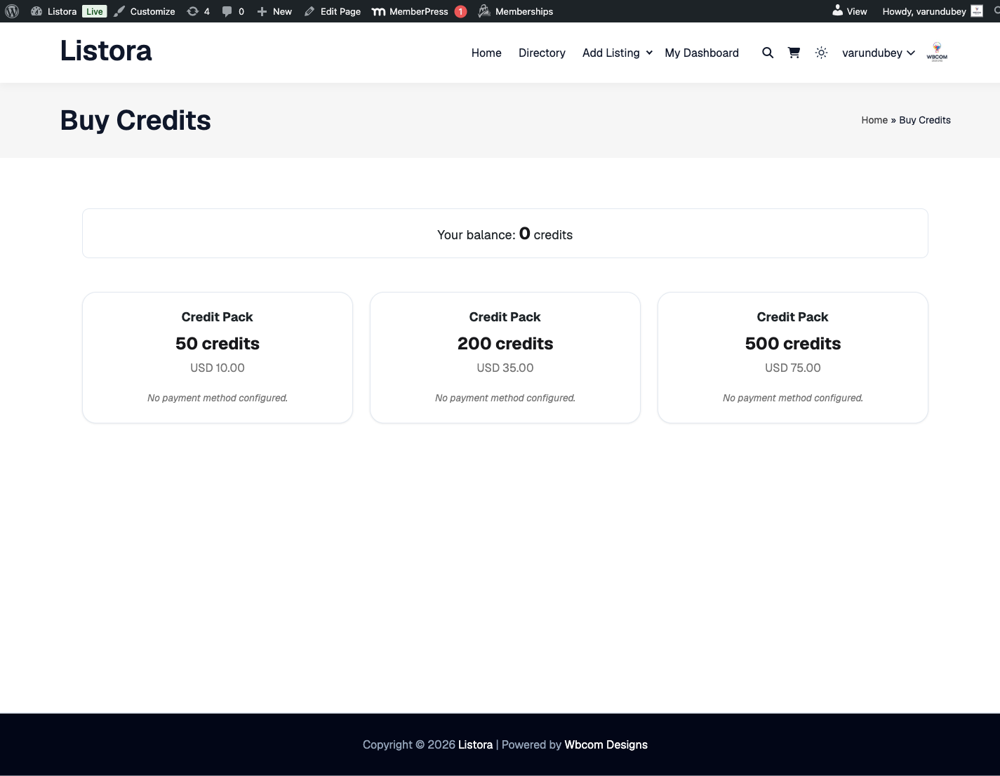
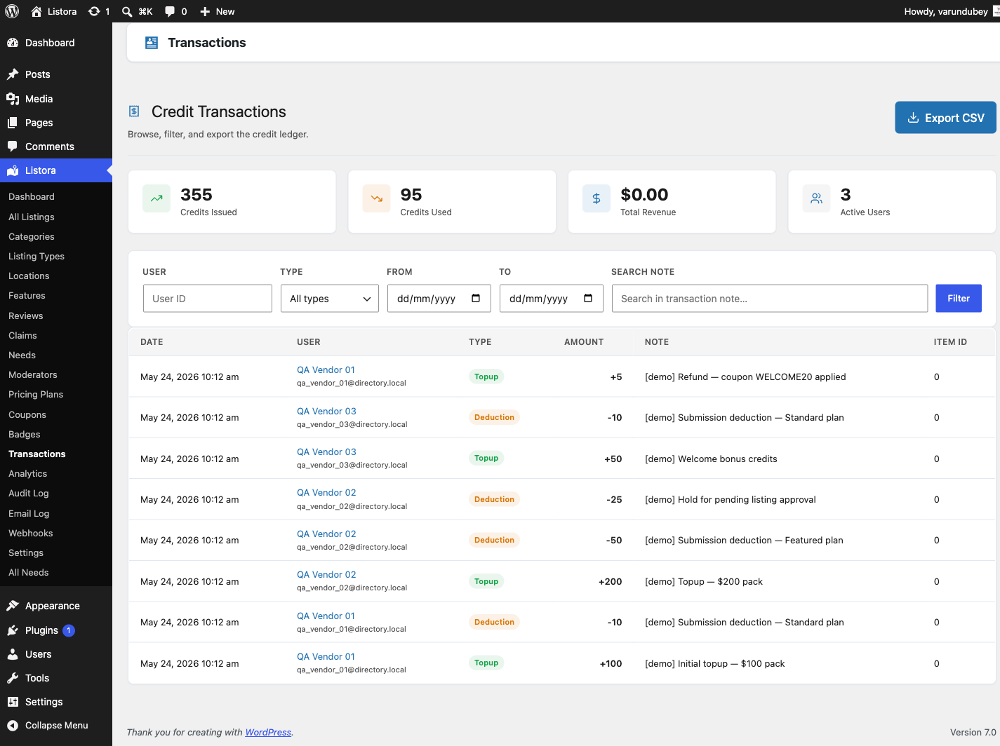

# Credits and Pricing Plans

> **Availability:** Pro only. Requires [WB Listora Pro](../getting-started/activating-pro.md). Free sites can use listing limits per role without a credit system.

## Monetization is opt-in by default (since 1.2.0)

On a fresh install of WB Listora Pro, the entire credit and pricing-plan system is **off by default**. Users can submit listings at no cost until you choose to enable it.

To switch it on, go to **Listora → Settings → Features** and enable the **Monetization** toggle. This single toggle activates the credit system, pricing plans, coupons, and the payment webhook receiver together.

**Upgrading from a version before 1.2.0?** Nothing changes for you. The toggle is automatically set to ON for existing installs to preserve your current setup.

**Why the submission form no longer shows a Plan step:**

If you installed WB Listora Pro for the first time and the "Choose a Plan" step is missing from the submission form, Monetization is off (the default). Enable the toggle in **Settings → Features** and the plan step appears immediately. See [Submission Settings](../settings/submission-settings.md) for other form controls.

**With Monetization off,** nothing can be bought, but nothing a member already has disappears.

- Members cannot start a credit purchase. This covers the Buy Credits page and credit products sold through WooCommerce, MemberPress or Paid Memberships Pro. Orders that were paid before you switched it off are still credited, and refunds still work.
- The **Buy Credits** page stays up and says credit purchases are not available right now, so an old link does not land on a 404.
- A member who already has credits or credit history keeps seeing their balance, history and receipts on their dashboard. Only the buying parts are hidden.
- The **Transactions** screen and the credit settings are hidden from you, because a site that does not sell credits has no use for them.

## What it does

WB Listora Pro includes a credit-based payment system. Users purchase credits (via your payment provider of choice), and spend those credits to activate listing plans. Each plan determines how long a listing stays active, whether it gets featured placement, and what perks it includes.

## Why you'd use it

- Monetize your directory without a WooCommerce store - credits work with any payment gateway via webhook.
- Pricing plans give you flexible packaging: a free basic plan, a paid featured plan, and a premium plan can all coexist.
- Credits are reusable - users can top up once and submit multiple listings over time.
- The webhook-based topup system is payment-processor-agnostic: Stripe, PayPal, Paddle, or any custom solution works.

## How to use it

### For site owners (admin steps)

There are two ways to sell credits, and you can run both at once.

| | Direct pack (Stripe / PayPal) | Mapped product (WooCommerce, PMPro, MemberPress) |
|---|---|---|
| Setup | Paste API keys, define packs. 5-10 min | Install and configure the other plugin, then map. 20-40 min |
| Tax / VAT invoices | No - flat price, no tax calculation | Yes, handled by that plugin |
| Recurring subscriptions | No, one-time packs | Yes |

**Where the settings are**

Go to **Listora → Settings → Credits**. The tab has five sub-tabs: **Pricing**, **Limits**, **Payments**, **Receipts** and **Needs**. **Pricing** and **Limits** are Free settings. Pro adds **Receipts** (the business details printed on receipts) and **Needs** (see [Needs Marketplace](needs-marketplace.md)). **Payments** holds the credit rate, your gateway keys and your packs and mappings. All sub-tabs share one form, so **Save Changes** saves every sub-tab, including the Stripe, PayPal and Needs settings.

**Step 1: Connect a payment path**

On the **Payments** sub-tab: If neither path is configured yet, the tab
opens on a **Connect a payment path** card that offers both and explains which
suits you.

*Direct packs:* enter your Stripe or PayPal keys in the gateway fields on that
same tab, then use **Add Direct Pack (Stripe / PayPal)** to define each pack -
credits, price, currency and an optional label. No other plugin needed.

Stripe keys are checked before they are saved. A publishable key must start with `pk_live_` or `pk_test_`, a secret key with `sk_live_` or `sk_test_`, and a webhook signing secret with `whsec_`. A key in the wrong format is refused with a message under that field, and none of the Stripe settings are saved until it is fixed. This catches a secret key pasted into the publishable field.

*Mapped products:* with WooCommerce, PMPro or MemberPress active, use
**Add New Mapping** to point one of their products or plans at a credit amount.
Buying that product credits the customer.

**The credit rate**

On the **Payments** sub-tab, **Credits granted per 1 USD paid** sets how many credits a member gets for each unit of your store currency paid through a payment webhook. The label shows your currency code, so it reads "per 1 EUR paid" on a euro site. The default is 1. A change applies to new payments only. Past payments keep the rate they were made at, so refunds stay correct.

If any pack grants a different number of credits than its price buys at this rate, a warning reads **Some packs do not match this rate.** and lists each pack, for example "Starter gives 100 credits for $10.00; the rate gives 10 credits". A member would get one amount from the pack and another from a webhook payment of the same price. Change the rate or the packs until they agree.

**Packs saved by the setup wizard**

Earlier versions of the setup wizard saved credit packs where nothing sold them. If your site has any, a notice at the top of **Listora → Settings** reads **Some credit packs are not on sale.** and names them. Choose:

- **Add as Direct packs** - turns them into Direct packs that go on sale once Stripe or PayPal is connected.
- **Remove them** - deletes them. This cannot be undone.

The setup wizard now creates Direct packs for Stripe and PayPal that go on sale once a gateway is connected, with credits that match your credit rate. The packs API and the Buy Credits page list only packs a member can actually buy.

**Step 2: Check the Active Mappings table**

Every pack and mapping you create appears in **Active Mappings**, showing the
provider, the product, the credits granted and the price.

- **Pricing** shows the real price for a direct pack. Mapped products show a dash:
  WooCommerce, PMPro and MemberPress do not report a price to Listora, so the
  price is the one set on the product itself.
- **Edit** changes a row in place. Use it rather than removing and re-adding -
  a customer part-way through checkout while the row is missing receives nothing.
- A direct pack is edited in the **Direct Pack** form, a mapped product in the
  **Mapping** form, because only a direct pack carries its own price and label.

**Step 3: The webhook (recommended, not required)**

The return from Stripe or PayPal claims the credits on its own, so a purchase
completes without a webhook. Adding one is still worth it: it syncs refunds and
credits the buyer even if they close the tab before the redirect lands.

1. Copy the **Webhook URL** and **Webhook Secret** from the Credits tab.
2. In Stripe or PayPal, create a webhook that fires on payment success and posts
   to that URL, using the secret as the HMAC key.

**Step 4: Set the Credits page**

**Listora → Settings → General → Pages** holds the **Buy Credits** page. Pro
creates it when you enable the feature; the setting is there so you can re-map it
or see its status. That URL is what every "Buy Credits" link points at.

**Step 5: Create pricing plans**

Go to **Listora → Monetization → Pricing Plans** and click **Add New**. Every field, the **Stop selling** option and how plan cards look are covered in [Pricing Plans](pricing-plans.md).

**Step 6: Verify the plan selection step**

When a user submits a new listing, a **Choose a Plan** step appears in the
submission form showing the plans available for the listing type they picked.
Plans the user can't afford are greyed out with a **Buy Credits** link.

**Adding credits manually:**

Go to **Users → Edit User** and use the **Listora Credits** panel to add credits directly without a payment. Useful for comping credits to early adopters or resolving disputes.

### For end users (visitor/user-facing)

1. Go to the Buy Credits page to buy credits. For a Stripe or PayPal pack, a **Billing details** form is shown above the packs. It asks once for name, email, address and country, for the receipt, and saves them to the member's account. Fill it in, then click the buy button on a pack.
2. When submitting a listing, the **Choose a Plan** step shows the plans available, each with its credit cost, duration and what is included.
3. Select a plan. If you have a coupon code, enter it in **Have a coupon?** and click **Apply**.
4. Your credit balance is shown on the plan selection screen. The plan is charged once, when you submit the listing. Saving a draft charges nothing.
5. View your balance and history in **Dashboard → Credits**.

If your balance is too low for a plan, the listing is saved as **Awaiting Credits** and goes through on its own after you buy credits. See [Pricing Plans](pricing-plans.md) for how charging works.

## Low balance alerts

**Where:** the **Low Balance Alert** field in Listora's credit settings. Default: 5 credits. Set it to `0` to switch the alert off entirely.

When a member's balance falls to the threshold, they are emailed once. The setting has existed for some time; until Pro 1.6.0 nothing acted on it, so the field promised an email that was never sent.

The alert is **once per crossing, not once ever**. The member is marked as notified when the mail goes out, and that mark is cleared as soon as their balance climbs back above the threshold. So a member who runs low, tops up, and later runs low again is warned both times - but a member sitting below the threshold for a month is not emailed every day. The email always states the balance in credits.

Requires Pro: the threshold is a Free setting because credits are a shared surface, but the notifier that sends the mail ships in Pro.

## Transactions

**Where:** **Listora → Monetization → Transactions**. The screen is hidden while Monetization is off.

It has two tabs: **Credits** (every credit movement) and **Payments** (what the gateway actually charged). The Payments tab lets you match a refund processed at the gateway against the payment it reverses, so the ledger and the gateway can be squared without exporting both.

**The Credits tab**

- **Tiles.** **Money received** (after refunds), **Credits spent**, **Credits added** and **Members with transactions**. The tiles follow the **Period** filter: **Last 7 days**, **Last 30 days**, **Last 90 days** or **Last 12 months**. With no period chosen they cover the last 30 days. Each tile says which period it covers.
- **Views.** **All**, plus one view for each kind of entry that exists: **Top-up**, **Refund**, **On hold**, **Hold released** and **Spent**. Each shows how many entries it holds.
- **Filters.** **Any time** (the period) and **Member name or email**. The search box searches notes.
- **Columns.** **Date** (click to sort), **Member**, **Type**, **Credits**, **For** and **Note**.
- **Hold released** is not a refund. It is credits that were reserved for a listing and then freed up. It carries its own neutral label, so it is not counted as money coming back.
- **For** shows the listing or need the credits were held or spent on, by title and linked to it, or **Deleted item** with its number if it has been removed.
- **Note** gives a plain reason, and a link to the WooCommerce order for a top-up that came from one.
- **Export CSV** downloads the filtered ledger. Amounts are in credits, with fractions kept (12.5 stays 12.5).

**Removing credits from a top-up**

A **Top-up** row that still has credits to take back has a **Remove credits** button. Use it when you have refunded the payment outside Listora, or to correct a mistake.

1. Click **Remove credits** on the row. A window opens.
2. Read the note at the top. It says that this takes the credits off the member's balance and pauses any listing they paid for, returning that listing's plan charge. It does **not** refund their payment. Refund the order in WooCommerce or your payment provider to return the money. If the top-up came from a WooCommerce order, **Open the order** links to it.
3. Set **Credits to remove**. It starts at the most you can remove and cannot go above it. The line under it says how much is available.
4. Add a **Reason (optional)**.
5. Read the warning. If listings bought with these credits will be paused, it says how many and how many plan credits come back. If the member has already spent the credits, it says "The member will then owe N credits."
6. Click **Remove credits**.

The row then shows **Credits removed** and offers no second removal. Credits already taken back by a WooCommerce refund cannot be removed again here. The window works on phones and tablets.

## Tax, VAT and GST compliance (EU / UK / Australia and others)

Credits are a **digital service**. If you sell them to consumers in jurisdictions with consumption tax - EU/UK **VAT**, Australia/New Zealand **GST**, and similar - you are generally responsible for charging the correct tax at the buyer's location, issuing a compliant tax invoice, and (for business buyers in the EU) handling **reverse-charge** with a validated VAT ID. The rules, rates, thresholds, and invoice fields vary by country - **confirm your obligations with a tax advisor**. This page describes what the plugin does, not legal advice.

**Which purchase route you use determines whether tax and invoicing are handled:**

- **WooCommerce route (recommended when you owe VAT/GST).** Sell credits as a WooCommerce product and let WooCommerce + a tax extension (e.g. WooCommerce Tax / an EU-VAT plugin) and an invoice/PDF plugin do the work. WooCommerce then collects the billing address, applies the correct location-based VAT/GST rate, supports B2B VAT-ID reverse-charge, and issues compliant invoices. WB Listora's WooCommerce credit top-up consumes the completed Woo order, so the **tax and invoice are produced by your store**, configured the way you already run it. **This is the compliant path for tax-liable merchants today.**
- **Direct Stripe / PayPal gateways.** The built-in direct credit checkout charges a **flat credit price with no tax calculation, no billing-address or VAT-ID collection, and no invoice** - it is a fast, low-setup way to take payment, suitable where you have **no tax-collection obligation** (or where you handle tax/invoicing entirely outside the plugin). It does **not** make you EU-VAT or GST compliant on its own.

> **Rule of thumb:** if you are registered for (or required to register for) VAT/GST on digital sales to consumers, route credit purchases through **WooCommerce**. Use the direct Stripe/PayPal gateways only where you have no tax obligation on the sale.

Automatic tax calculation and invoicing on the direct gateways (e.g. Stripe Tax) is on the roadmap; until then, the WooCommerce route is the supported way to stay compliant.

## Receipts and refunds (since 1.2.0)

Receipts cover credits **spent**. When a member uses credits on a listing plan, their dashboard **Credits** tab shows a **View receipt** link on that history row, which opens a printable receipt with your business details. A member can open only their own receipts; site admins can open anyone's. When credits are refunded, the refund email includes a receipt link that works without logging in.

Buying credits (a top-up) does not produce a Listora receipt or email yet. The payment provider's own receipt (Stripe or PayPal) covers the payment, and the top-up appears as a row in the member's credit history.

Refunds can be issued from your payment provider (Stripe, PayPal and so on), from WooCommerce, or with **Remove credits** on the **Transactions** screen. A refund of a credit purchase reverses everything that purchase bought:

- The refunded credits are taken off the member's balance, for the real refunded amount.
- Listings that those credits paid for are taken offline (paused), and their plan charge is returned.
- Only listings bought with the refunded credits are reversed, starting with the first listing paid after the purchase. Older listings paid from other credits stay live.
- The member gets one email saying how many credits were removed.

A paused listing waits for credits. When the member tops up, it is activated again, and goes live or to review depending on whether you moderate new listings. It does not stay in **Awaiting Credits**, and the member is not sent another activation email on every top-up.

## Tips

- Create a free plan (0 credits) alongside paid plans - this lets listing owners submit basic listings without buying credits, then upgrade to paid plans for featured placement.
- Leave **Listing duration** at `0` for the free plan to use your standard expiration, and set a number of days (for example 30, 90 or 365) on paid plans. This creates a natural renewal cycle.
- The webhook system is idempotent - duplicate webhook calls (e.g., Stripe retries) will not double-credit a user. Since 1.1.0 the event is recorded before the credit is granted, replayed events are ignored, and a webhook with no transaction id can no longer double-credit. Refunds deduct the real refunded amount, and a refund that arrives after a plan has activated rolls that plan back.
- Sort plans by setting a low **Sort Order** number for the plan you want shown first.
- If you use the Wbcom Credits SDK alongside other Wbcom plugins, all credit balances are unified - users see a single balance across all products.

## Common issues

| Symptom | Fix |
|---------|-----|
| Plan step not appearing in submission form | Confirm Monetization is on, and that at least one plan is published and **On sale** under **Listora → Monetization → Pricing Plans** |
| Credits not added after payment | Check the webhook URL and secret are entered correctly in your payment platform |
| User sees "Not enough credits" on all plans | The user's balance is 0 - direct them to the credits purchase page |
| Plan duration not applying | A plan with **Listing duration** `0` uses your standard expiration from **Settings → General**. Set a number of days on the plan to override it. |
| A member cannot buy credits | Check Monetization is on and at least one pack is on sale. Direct packs also need a connected Stripe or PayPal gateway. |
| A top-up looks too large or small | Check **Credits granted per 1 USD paid** and the **Some packs do not match this rate.** warning. |
| Stripe settings did not save | A key is in the wrong format. The message under the field says what it should start with. |

## For developers: the credits API

- `GET /listora/v1/credits` returns the signed-in member's `balance`, a `history` of ledger entries and their coupon redemptions. `history` pages with `page` and `per_page` (default 20, up to 100), and the totals are in the standard `X-WP-Total` and `X-WP-TotalPages` headers. Each entry's `amount` is in credits, and `type_label` is the readable name shown on the dashboard, such as "Hold released".
- `GET /wbcom-credits/v1/wb-listora/balance` and `/history` carry `balance_units` (`credits`, or `minor` when the ledger is in money mode). On sites that sell credits for money they also carry `balance_money` (the amount in major units) and `currency`. A bare 10000 therefore cannot be mistaken for 10,000 credits.
- The `/balance` route also returns `can_buy`, which is `false` while Monetization is off. Use it to decide whether to show a buy button.
- `GET /listora/v1/credit-packs` lists only the packs a member can buy, the same ones as the Buy Credits page.
- `GET /listora/v1/dashboard/responses` returns the signed-in business's own quotes, paged the same way.

## Related features

- [Pricing Plans](pricing-plans.md)
- [Needs Marketplace](needs-marketplace.md)
- [Pro Emails](pro-emails.md)
- [Coupons](coupons.md)
- [Analytics](analytics.md)
- [License Management](../getting-started/pro-license.md)
