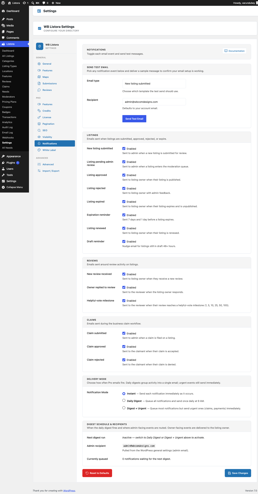

# Draft Reminder

Built into WB Listora **Free**.

Recover incomplete listing submissions automatically. When someone starts the Add Listing wizard, saves a draft, and walks away without finishing — the plugin sends a friendly reminder email 24 hours later with a one-click link back to where they left off. Twice-daily cron sweeps catch every stale draft; opt-out per user is respected.

## What it is

Listing submission is multi-step (Type → Basics → Details → Media → Preview → Submit). Real submitters get interrupted, switch tabs, lose focus. Without nudging, a meaningful share of started drafts are never completed.

Draft Reminder is a tiny, reliable recovery system:

- **Cron event** — `wb_listora_draft_reminder_cron` runs **twice daily** via Action Scheduler (group `wb-listora`).
- **Sweep logic** — queries `wp_posts` for `listora_listing` rows with `post_status = 'draft'` that haven't been emailed yet, are older than the threshold (default 24h), and belong to a non-anonymous author.
- **Per-user state** — each emailed draft is marked with a `_listora_draft_reminder_sent` meta flag, so a user gets one reminder per draft (not a daily stream).
- **Send path** — fires `do_action( 'wb_listora_draft_reminder', $post_id )` for each candidate; `Notifications::draft_reminder()` listens, builds the template variables, and sends `templates/emails/draft-reminder.php` via the same email infrastructure as every other notification.
- **Personalized CTA** — the email's "Continue your listing" button deep-links to `/add-listing/?edit={post_id}` so the wizard resumes at the same step.
- **Opt-out aware** — respects the user's per-event notification preference (`should_send( 'draft_reminder', $user_id )`); users who disabled drafts in their profile don't get a reminder.
- **Anonymous-author safety** — drafts saved by anonymous submitters (no logged-in user) are skipped; there's no email to send.

The whole feature is one cron + one email template + a 50-line listener — Grade-A simplicity.

## How you use it

### As a site owner — no configuration needed

Draft Reminder is on by default. To verify:

1. **Check the cron is scheduled:** WP Admin → Tools → Site Health → Info → Cron Events → look for `wb_listora_draft_reminder_cron` (Action Scheduler runs it twice daily).
2. **Trigger a test reminder:** save a logged-in test user's listing as a draft; in Listora → Settings → Notifications, click **Send Test → Draft Reminder**. The reminder fires immediately to the user's email.
3. **Customize the template:** copy `wb-listora/templates/emails/draft-reminder.php` to your theme at `{theme}/wb-listora/emails/draft-reminder.php` and edit; the override wins. See [Email Templates](email-templates.md).

### As a listing owner — what you see

If you start a submission and don't finish:
1. Within 24 hours, you receive an email titled "Your listing is almost ready" (or your site's customized variant).
2. The body summarizes what you'd entered (title, type, optional description excerpt) so you remember the context.
3. The "Continue your listing" button opens `/add-listing/?edit={id}` — the wizard resumes at the step you left off.
4. Once you finish OR delete the draft, no further reminders for that draft.
5. To opt out of all draft reminders: visit your dashboard → Profile → Email preferences → uncheck **Draft reminders**.

## Settings & options

| Setting | Location | Default | Notes |
|---|---|---|---|
| Feature | (always on) | On | Free — no toggle needed |
| Cron event | `wb_listora_draft_reminder_cron` | Twice daily | Action Scheduler, group `wb-listora` |
| Reminder threshold | 24 hours after draft saved | (system) | Filterable via `wb_listora_draft_reminder_threshold` |
| Per-draft cap | 1 reminder per draft | (system) | `_listora_draft_reminder_sent` meta key gates re-sends |
| Per-user opt-out | Dashboard → Profile → Email prefs | Opted-in by default | Honored by `should_send()` |
| Template | `wb-listora/templates/emails/draft-reminder.php` | — | Theme overridable per the [Email Templates](email-templates.md) standard |

Developer hooks:

- `wb_listora_draft_reminder` (action) — fires per candidate; listen for custom routing (Slack, in-app notification, SMS, etc.).
- `wb_listora_draft_reminder_threshold` (filter) — change the 24-hour threshold (in seconds).
- `wb_listora_draft_reminder_query_args` (filter) — modify the candidate query (e.g. exclude admins, limit to specific types).
- `wb_listora_email_content_draft_reminder` (filter) — modify the rendered HTML (subject/body/tone) without theme override.

## Related

- [Submitting a Listing](frontend-submission.md) — the wizard whose drafts this feature recovers.
- [Email Templates](email-templates.md) — the unified email system this template lives in.
- [User Dashboard](user-dashboard.md) — where users opt out of draft reminders + see/edit their drafts.
- [Developer Reference: Hooks](../developer-guide/hooks-reference.md) — the underlying action + filter signatures.
