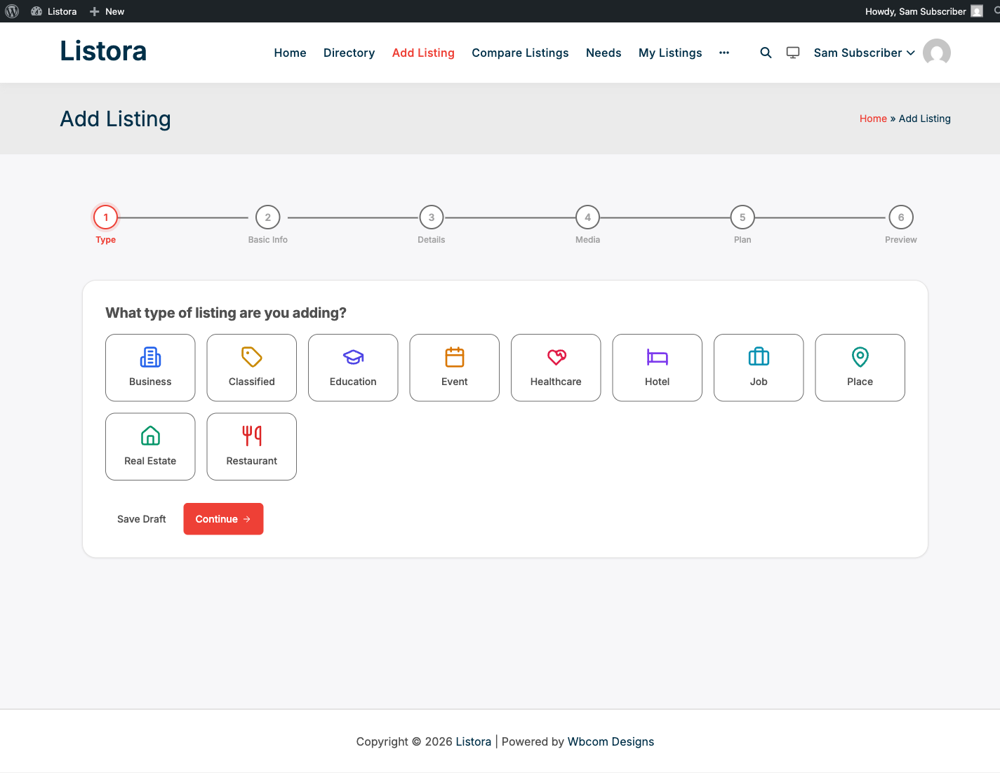

# Duplicate Check

Built into WB Listora **Free**.

Prevent duplicate listings from polluting your directory before they're even submitted. When a listing owner types a title + picks a type during submission, the wizard quietly checks if a similar listing already exists - and if it does, shows a "Review duplicates" step with side-by-side cards so the owner can claim the existing listing instead of creating a duplicate.

## What it is

Duplicate listings are the single biggest source of customer-support pain in directories: when the same restaurant or service shows up three times because three different users submitted it, search-relevance suffers, reviews are split, and moderators end up manually merging records.

Duplicate Check intercepts that at submission time:

- **REST endpoint** - `POST /listora/v1/submission/check-duplicate` runs a fast, scoped query against the `search_index` table for listings matching the title + listing type, optionally weighted by geographic proximity if the owner has set lat/lng.
- **Submission wizard integration** - the wizard fires the endpoint after the Basics step. If matches come back, a **Duplicate Review** step is inserted ahead of the rest of the form.
- **Side-by-side display** - each potential duplicate shows as a card with title, type badge, address, and two actions: **Claim this listing** (jumps the owner into the claim flow for that existing record) or **It's a different business** (continues submitting their new listing).
- **Geographic weighting** - when both submission lat/lng AND the existing listing's lat/lng are known, matches within ~250m boost their score; matches further away score lower so a "Mario's Pizza" in Brooklyn doesn't suppress a new "Mario's Pizza" in Queens.
- **Title similarity** - uses MySQL `MATCH AGAINST` on the FULLTEXT search-index `title` column, with a configurable minimum similarity threshold.

Why this matters: directories that rely on moderator merge-after-the-fact never catch up. Duplicate Check shifts the prevention to the submitter, who's the only person with full context ("is this my business or a different one with the same name?").

## How you use it

### As a site owner - no configuration needed

Duplicate Check is on automatically. To verify it's working:

1. Open `/add-listing/` in an incognito window (or as a test user).
2. Pick a listing type that already has at least one listing.
3. In the Basics step, type the exact title of an existing listing.
4. Advance to the next step. If a match was found, the wizard inserts a "Review possible duplicates" step.

If no duplicate step appears even on an exact-title match, check that the `search_index` table is populated (Listora → Tools → Rebuild Search Index).

### As a listing owner - what you see

When the wizard finds a possible duplicate:

1. A new step appears: **"We found a similar listing - is this yours?"**
2. Each candidate appears as a card with title, type, address, and an existing-listing screenshot.
3. **If it's your business** - click **Claim this listing**. The wizard switches into the [Business Claims](business-claims.md) flow; the existing listing is reassigned to you once an admin approves the claim.
4. **If it's a different business** - click **It's a different business** and continue submitting. The duplicate-check step disappears.
5. **Override required for admins** - admins can always proceed past the duplicate-check step (e.g. legitimately re-listing for a chain franchise).

## Settings & options

| Setting | Location | Default | Notes |
|---|---|---|---|
| Endpoint | `POST /listora/v1/submission/check-duplicate` | Always on | Public-write endpoint, nonce-protected |
| Similarity threshold | Hardcoded MySQL `MATCH AGAINST` weight | (system) | Tunable via `wb_listora_duplicate_threshold` filter |
| Geo radius (boost) | Hardcoded 250m | (system) | Tunable via `wb_listora_duplicate_geo_radius_meters` filter |
| Max matches shown | 3 | - | Tunable via `wb_listora_duplicate_max_matches` filter |

Developer hooks:

- `wb_listora_duplicate_threshold` (filter) - increase or decrease how strict the title match needs to be.
- `wb_listora_duplicate_geo_radius_meters` (filter) - change the boost radius (250m default).
- `wb_listora_duplicate_max_matches` (filter) - return more or fewer candidates.
- `wb_listora_duplicate_check_results` (filter) - modify the candidate list before showing in the wizard (filter out admins' own listings, etc.).

## Related

- [Business Claims](business-claims.md) - the flow Duplicate Check routes owners into when they recognize their own listing.
- [Submitting a Listing](frontend-submission.md) - the full wizard Duplicate Check intercepts.
- [Search & Filters](search-and-filters.md) - uses the same `search_index` table, so a well-indexed directory powers both search AND duplicate prevention.
- [Developer Reference: REST API](../developer-guide/rest-api.md) - `/submission/check-duplicate` endpoint shape.
