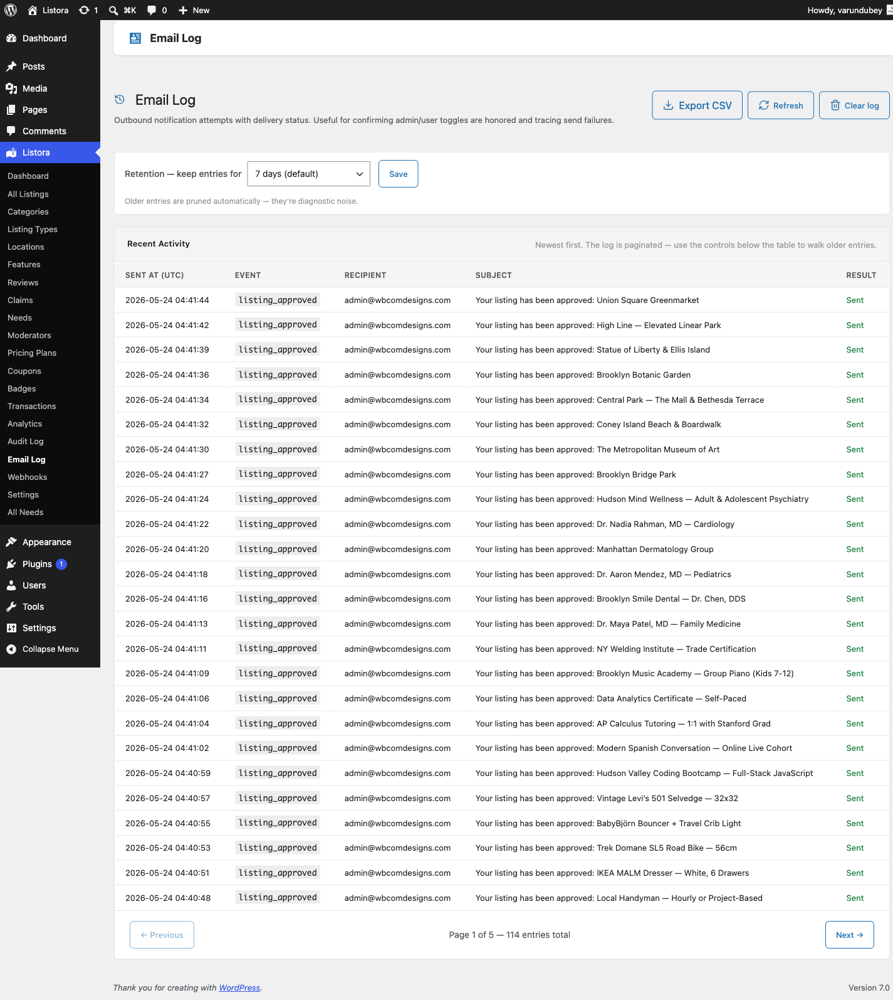

# Email Log

Built into WB Listora **Free**.

A standalone admin page that records every outbound notification Listora attempts to send - listing approvals, review notifications, claim updates, contact-form messages, verification emails. Each entry shows the recipient, the event, the delivery status (sent / queued / failed), and the timestamp. Useful for confirming admin / user toggles are honoured and tracing send failures without having to dig through `wp_mail()` debug logs.



## What it is

A persistent record of every Listora notification attempt:

- **Per-row data:** event type (e.g. `listing_approved`), recipient email, listing context, delivery status, error message (if failed), exact timestamp.
- **Auto-pruned** by a daily cron - older entries are diagnostic noise and disappear automatically once the retention window passes.
- **CSV exportable** for compliance archives or external analysis. The export REST endpoint streams the full log within the current retention window.
- **Clearable** - bulk delete every entry from the page (e.g. before a compliance audit window where you only want fresh sends recorded).

The log captures the **send attempt**, not delivery confirmation. A row marked `sent` means `wp_mail()` accepted the message - your mail provider (SMTP plugin / SES / Postmark) is responsible for downstream delivery. If you need delivery + open + click tracking, layer a transactional email service on top.

## Where it lives

**WP Admin → Listora → Email Log** (`?page=listora-email-log`)

Requires the `manage_listora_settings` capability.

## How you use it

### Verify your email setup

1. Go to **Settings → Notifications → Send Test Email**.
2. Pick any template, send to your own address.
3. Switch to **Email Log** and **Refresh** - the test send should appear with status `sent` and timestamp seconds ago.
4. If the row shows `failed`, the error column tells you why (SMTP credential, blocked sender, etc.).
5. If no row appears, the event isn't firing - check Notifications tab toggles first.

### Trace a customer "I didn't get the email" report

1. Open Email Log.
2. Filter by the customer's email address (use browser find-in-page on the recipient column) and the rough time.
3. Found row → `sent` means it left your server (the issue is on their side: spam folder, mail provider). Found row → `failed` means our send failed (check the error). No row → the event didn't fire (check the per-event toggle on Notifications tab + the underlying transition log).

### Configure retention

The retention dropdown at the top of the page accepts:

- **7 days** - minimal noise, good for high-volume directories
- **15 days** - default for most installs
- **30 days** - useful when audit / compliance windows need a longer trail
- **0 (lifetime)** - keep everything. Diagnostic only; not recommended for high-volume sites without separate log rotation.

Older entries are pruned automatically by the `wb_listora_email_log_prune` cron event (daily).

### Export the log

Click **Export CSV** at the top of the page. The download streams the current retention window: recipient, event, status, timestamp, error (if any), listing ID (if applicable). The URL carries a one-time `wp_create_nonce( 'wp_rest' )` that expires after use.

### Clear the log

Click **Clear log** to delete every entry. Useful before testing a new SMTP plugin so you have a clean slate. Cannot be undone.

## How it interacts with the rest of the system

- **Settings → Notifications** controls which events FIRE - Email Log records whichever events successfully reached `wp_mail()`. Toggle an event off → no email AND no log entry.
- **Digest Notifications (Pro)** bundles individual events into a single send per day / week per recipient. The log records the digest send itself (`digest_listings`, `digest_reviews`) not the individual events bundled into it.
- **Audit Log (Pro)** records every state transition that *triggered* an email. Email Log records the SEND ATTEMPT. The two complement each other: Audit answers "did this thing happen?", Email Log answers "did the email go out?".
- **Webhooks (Pro)** fire independently of email events. A webhook delivering does NOT create an Email Log row.

## Permissions

| Capability | Who has it by default | What it gates |
|---|---|---|
| `manage_listora_settings` | Administrator | View + clear log, export CSV, change retention |

Custom roles can be granted access via the [Capabilities reference](../developer-guide/capabilities.md).

## Equivalent WP-CLI

There is no `wp listora email-log` command. The log uses a custom table; query it directly if you need scripted access:

```bash
wp db query "SELECT recipient, event, status, sent_at FROM wp_listora_email_log ORDER BY sent_at DESC LIMIT 50"
```

Or use the REST endpoint:

```
GET /wp-json/listora/v1/settings/notifications/log
GET /wp-json/listora/v1/settings/notifications/log/export
POST /wp-json/listora/v1/settings/notifications/log/retention
```

See the [REST API reference](../developer-guide/rest-api.md) for full route + parameter details.

## Related

- [Notifications Settings](../settings/notifications-settings.md) - turn individual events on / off.
- [Email Templates](email-templates.md) - customize subject / body per event.
- [Audit Log (Pro)](audit-log.md) - every state transition (sent OR not).
- [Digest Notifications (Pro)](digest-notifications.md) - bundled daily / weekly emails.
