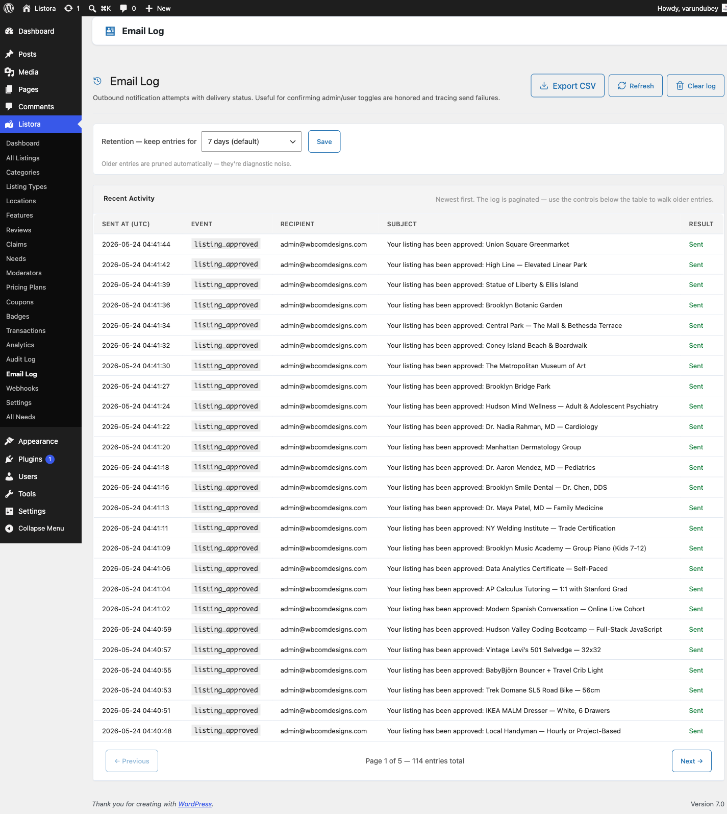

# Email Log

> **Availability:** Free + Pro. Pro's own emails (credits, plans, Needs) are recorded here too.

**Listora > Tools > Email Log** records every email Listora sends: who it went to, whether it was accepted for delivery, and exactly what it said. Use it to confirm that an email setting works and to answer "I never got the email" without digging through server logs.



## What it shows

Each row is one email, in a table that works like the other [admin lists](admin-menu-and-lists.md):

| Column | What it shows |
|---|---|
| **Sent** | Date and time the email was sent. Click the header to sort. |
| **Email** | The name of the email (for example **Listing approved**) and its subject. A **Resent** badge marks an email sent again from this screen. |
| **To** | The recipient address. |
| **Result** | **Sent**, or **Failed** with the error message. |

**Sent** means WordPress handed the email to your mail system. It does not prove the email reached the inbox. If you need delivery and open tracking, add a transactional email service on top.

Above the table, the **All**, **Sent** and **Failed** links filter by result and show how many emails are in each. You can also search subjects, pick one email type from **Any email**, or type a **Recipient email**.

Pages are numbered, with 20, 50 or 100 rows per page.

## Read what was sent

Click **Details** on a row to open the full email exactly as the member received it, with the recipient and subject above it. The message is shown in a sealed frame, so its links and styles cannot affect your admin screen.

Emails sent before the log started keeping full messages show no **Details** button.

## How to use it

### Check that email works

1. Go to **Listora > Settings > Notifications**.
2. In **Send a test email**, pick an email and your address, then click **Send test email**.
3. Open **Listora > Tools > Email Log**. The test appears at the top.
4. If the **Result** says **Failed**, the error tells you why, for example a blocked sender or bad SMTP login.
5. If no row appears, that email is switched off on the Notifications tab.

### Trace a missing email

1. Open the Email Log and type the member's address in **Recipient email**, then click **Apply**.
2. A row marked **Sent** means your site sent it, so look at spam folders and the mail provider.
3. A row marked **Failed** means the send failed. Read the error in the **Result** column.
4. No row means the email never fired. Check that the email is on in **Settings > Notifications**.

### Send an email again

1. Find the row.
2. For a failed email, click **Resend**. For one that was sent, open the **...** menu and choose **Send again**.
3. Confirm. The same message goes to the same address again, and the new attempt appears at the top of the log with a **Resent** badge.

### Change how long entries are kept

Use **Keep entries for** at the top of the page, pick a period and click **Save**:

- **7 days**
- **15 days**
- **30 days**
- **90 days (default)**
- **1 year**
- **Forever**

Older entries are removed every day, and also right away when you save a shorter period. With **Forever**, entries stay until you clear the log. Full messages take space, so a busy site should not keep them forever.

### Export the log

Click **Export CSV** in the page header. The file lists the time, email, recipient, subject, result and error for every entry that is still kept.

### Clear the log

Click **Clear log** and confirm. Every entry is deleted. Emails that were already sent are not affected. This cannot be undone.

## How it relates to other settings

- **Settings > Notifications** decides which emails are sent. An email that is switched off is not sent and does not appear here.
- **Digest Notifications (Pro)** bundles emails into one daily or weekly message. The log records the digest, not the emails inside it.
- **Webhooks (Pro)** send to other systems, not by email, so they do not appear here.

## Permissions

Viewing, resending, exporting, clearing and changing retention need the `manage_listora_settings` capability, which administrators have. See [Capabilities & Roles](../developer-guide/capabilities.md).

## For developers

Emails are stored in the `email_log` table. Add-ons that send their own email can record it with `wb_listora_log_email()`, which takes the event key, recipient, subject, a success flag, an error message, the HTML body and the headers. REST routes:

```
GET  /wp-json/listora/v1/settings/notifications/log
GET  /wp-json/listora/v1/settings/notifications/log/export
POST /wp-json/listora/v1/settings/notifications/log/retention
```

There is no WP-CLI command for the log. See the [REST API reference](../developer-guide/rest-api.md) and the [hooks reference](../developer-guide/hooks-reference.md).

## Related

- [Notifications Settings](../settings/notifications-settings.md) - turn emails on and off, edit templates.
- [Email Templates](email-templates.md) - customise the subject and message of each email.
- [Admin Menu and Lists](admin-menu-and-lists.md) - how the table behaves.
- [Digest Notifications (Pro)](digest-notifications.md) - bundled daily or weekly emails.
