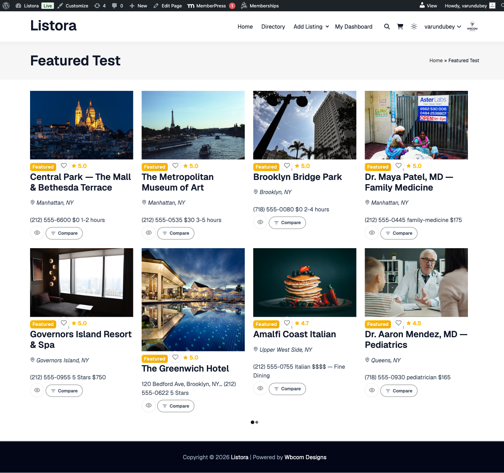

# Featured Listings

Built into WB Listora **Free** (Featured block + auto-fill behavior) with a Pro upgrade path (`Featured_Metabox` for admin one-click feature + Pro pricing-plan featured flag + credit-gated rotation).

A dedicated block to surface your best content — featured listings (admin-marked or plan-driven) at the top of the page, with a carousel option for hero layouts. Falls back to top-rated when no manually-featured listings exist, so the block is never empty.

## What it is

Most directories need a way to put a thumb on the scale — surface paid premium listings, editorially-promoted picks, or hot new businesses. Featured Listings is that surface, with a graceful empty-state fallback.

The system has three independent inputs that combine cleanly:

1. **Manual feature flag** (Free) — admins flag any listing via the `Featured` checkbox in the Edit Listing screen (`Featured_Metabox`); a `_listora_is_featured` post-meta key controls the badge + Featured-block inclusion.
2. **Pricing-plan featured flag** (Pro) — Pricing Plans (Pro) can mark a plan's listings as automatically featured (`featured = true` in the plan record). Listings on that plan are featured for the plan's duration.
3. **Auto-fill fallback** — when the Featured block requests 6 listings but only 3 are manually-featured, the remaining 3 fill with top-rated listings of the same type, so the block is never empty.

How it renders:

- **Grid mode** — N tiles in a responsive grid (1/2/3/4 cols depending on viewport).
- **Carousel mode** — horizontal scroller with snap-to-card on mobile.
- **Featured badge** — every card carries a "Featured" pill rendered via the canonical `.listora-badge--featured` token; same look as the search-grid badge.
- **Modernized surface** — uses `--listora-radius-xl` + `--listora-shadow-md` + `--listora-bg-elevated` — identical to other list-container surfaces (light + dark inversion automatic).
- **Hook surface** — `do_action( 'wb_listora_before_featured_listings' )`, `apply_filters( 'wb_listora_featured_query_args', $args )`, `do_action( 'wb_listora_after_featured_listings' )` — Pro hooks `wb_listora_featured_query_args` to inject credit-gated rotation when the Featured feature is on.

## How you use it

### As a site owner — place the block

1. **Edit a page** — typically your homepage or a "Featured" landing page.
2. **Insert** the **Listora Featured** block.
3. **Inspector controls:**
   - **Listing Type** — restrict to one type (e.g. featured Restaurants only).
   - **Sort** — `featured` (manual flag first, then top-rated) or `top-rated` (skip the featured flag entirely).
   - **Count** — how many listings to show (default 6).
   - **Layout** — grid or carousel.
   - **Show empty-state** — what to render when zero matches found.
4. **Manually feature a listing:** WP Admin → Listora → All Listings → edit a listing → in the right sidebar metabox, tick **Featured**. Save. The listing now appears in the Featured block.

### As a Pro user — credit-gated featured rotation

In Pro, the Featured feature ([credit-system + pricing-plans](pricing-plans.md)) introduces:

- A "Featured" perk on certain pricing plans — listings on those plans are featured for the plan's duration automatically.
- A daily Action Scheduler job `wb_listora_pro_expire_featured` that demotes listings whose featured-from-plan period has ended.
- A `Featured::feature_listing()` API used by both manual and credit-gated paths so rotation logic is shared.

## Settings & options

| Setting | Location | Default | Notes |
|---|---|---|---|
| Block | Editor → Insert → Listora Featured | — | Server-rendered |
| Manual feature flag | Edit Listing → sidebar metabox → Featured | Off | Free |
| Auto-fill fallback | (system) | Top-rated | Fills the count gap when manually-featured listings are fewer than the requested count |
| Pro: featured plan perk | Pricing Plan edit → Featured | Off per plan | When on, listings on the plan are featured automatically |
| Pro: rotation cron | `wb_listora_pro_expire_featured` | Daily | Action Scheduler |

Developer hooks:

- `wb_listora_before_featured_listings` / `wb_listora_after_featured_listings` (actions).
- `wb_listora_featured_query_args` (filter) — Pro extends via this to enforce credit-gated rotation.
- `wb_listora_featured_card_data` (filter) — modify per-card data before rendering.

## Related

- [Pricing Plans (Pro)](pricing-plans.md) — plans with the "Featured" perk auto-feature listings.
- [Listing Categories (Free)](listing-categories.md) — pair with Featured for a "Browse by Category" + "Editor's Picks" homepage.
- [Search & Filters](search-and-filters.md) — sort-by-featured is also available in the main grid (not just the dedicated block).
- [Developer Reference: Hooks](../developer-guide/hooks-reference.md) — full Featured hooks list.
