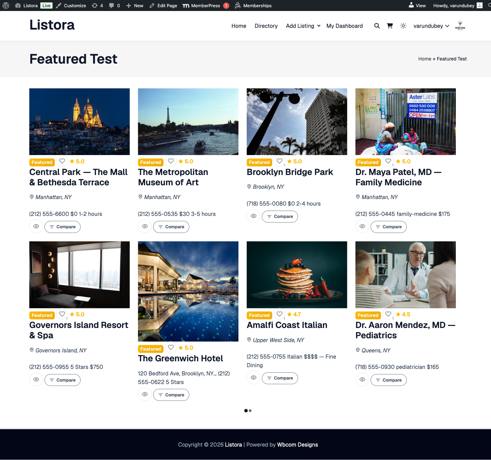

# Featured Listings

> **Availability:** Free + Pro. Free ships the Featured block, the `Featured_Metabox` admin one-click feature + `_listora_is_featured` meta + auto-fill fallback. Pro adds the pricing-plan featured flag + credit-gated rotation.

A dedicated block to surface your best content - featured listings (admin-marked or plan-driven) at the top of the page, with a carousel option for hero layouts. With **Sort by Featured** it shows only featured listings. When there are none it shows its empty state instead of filling the space with ordinary listings.

## What it is

Most directories need a way to put a thumb on the scale - surface paid premium listings, editorially-promoted picks, or hot new businesses. Featured Listings is that surface, with a graceful empty-state fallback.

The system has these inputs:

1. **Manual feature flag** (Free) - admins flag any listing via the `Featured` checkbox in the Edit Listing screen (`Featured_Metabox`); a `_listora_is_featured` post-meta key controls the badge + Featured-block inclusion.
2. **Pricing-plan featured flag** (Pro) - Pricing Plans (Pro) can mark a plan's listings as automatically featured (`featured = true` in the plan record). Listings on that plan are featured for the plan's duration.
3. **No filler** - the block shows only listings that are featured, even if that is fewer than **Count**. Filling the gap with top-rated listings made every card look featured. Developers who want the old behaviour can return `true` from the `wb_listora_featured_backfill` filter.

How it renders:

- **Row of cards** - the cards per row follow **Columns** and shrink on smaller screens. Extra cards sit in the same row and scroll sideways.
- **Carousel arrows** - when there is more than one page of cards, **Previous** and **Next** arrows appear beside the title, and dots appear under the cards. An arrow moves by a whole page of cards, however many columns are showing, and the dots jump to a page. When everything fits on one page there are no arrows or dots.
- **Featured badge** - every card carries a "Featured" pill rendered via the canonical `.listora-badge--featured` token; same look as the search-grid badge.
- **Modernized surface** - uses `--listora-radius-xl` + `--listora-shadow-md` + `--listora-bg-elevated` - identical to other list-container surfaces (light + dark inversion automatic).
- **Hook surface** - `do_action( 'wb_listora_before_featured_listings' )`, `apply_filters( 'wb_listora_featured_query_args', $args )`, `do_action( 'wb_listora_after_featured_listings' )` - Pro hooks `wb_listora_featured_query_args` to inject credit-gated rotation when the Featured feature is on.

## How you use it

### As a site owner - place the block

1. **Edit a page** - typically your homepage or a "Featured" landing page.
2. **Insert** the **Listora Featured** block.
3. **Inspector controls:**
- **Listing Type** - restrict to one type (e.g. featured Restaurants only).
- **Sort By** - **Featured** (only featured listings), **Newest** or **Rating**.
- **Count** - how many listings to show (default 8).
- **Columns** - how many cards per row (1 to 6, default 4).
- **Title** - an optional heading. It is hidden when it just repeats the page title.
4. **Manually feature a listing:** WP Admin → Listora → All Listings → edit a listing → in the right sidebar metabox, tick **Featured**. Save. The listing now appears in the Featured block.

### As a Pro user - credit-gated featured rotation

In Pro, the Featured feature ([credit-system + pricing-plans](pricing-plans.md)) introduces:

- A "Featured" perk on certain pricing plans - listings on those plans are featured for the plan's duration automatically.
- A daily Action Scheduler job `wb_listora_expire_featured` that demotes listings whose featured-from-plan period has ended.
- A `Featured::feature_listing()` API used by both manual and credit-gated paths so rotation logic is shared.

## Settings & options

| Setting | Location | Default | Notes |
|---|---|---|---|
| Block | Editor → Insert → Listora Featured | - | Server-rendered |
| Manual feature flag | Edit Listing → sidebar metabox → Featured | Off | Free |
| Backfill with top-rated | `wb_listora_featured_backfill` filter | Off | Return `true` to fill empty slots with top-rated listings |
| Pro: featured plan perk | Pricing Plan edit → Featured | Off per plan | When on, listings on the plan are featured automatically |
| Expiration cron (Free) | `wb_listora_expire_featured` | Daily | Action Scheduler - demotes listings whose featured period has ended (manual + plan-driven both share this) |

Developer hooks:

- `wb_listora_before_featured_listings` / `wb_listora_after_featured_listings` (actions).
- `wb_listora_featured_query_args` (filter) - Pro extends via this to enforce credit-gated rotation.
- `wb_listora_featured_card_data` (filter) - modify per-card data before rendering.

## Related

- [Pricing Plans (Pro)](pricing-plans.md) - plans with the "Featured" perk auto-feature listings.
- [Listing Categories (Free)](listing-categories.md) - pair with Featured for a "Browse by Category" + "Editor's Picks" homepage.
- [Search & Filters](search-and-filters.md) - sort-by-featured is also available in the main grid (not just the dedicated block).
- [Developer Reference: Hooks](../developer-guide/hooks-reference.md) - full Featured hooks list.
