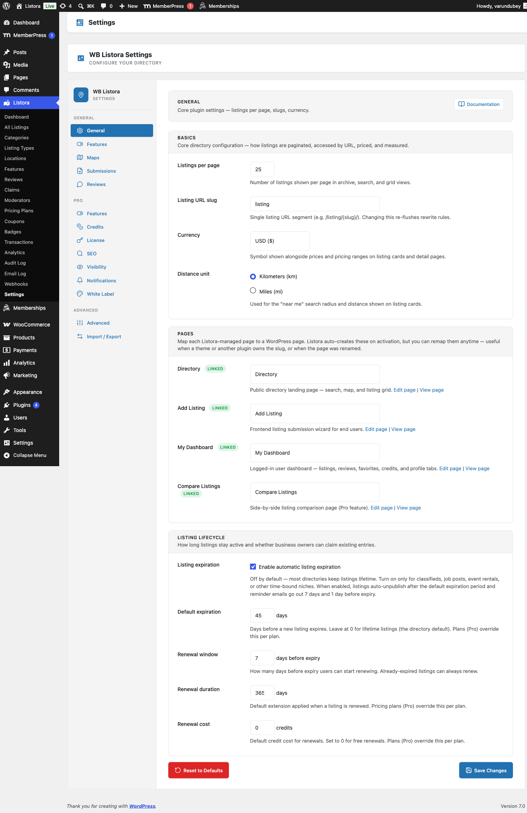

# Import & Export

Built into WB Listora **Free**.

Bulk-import listings from CSV, JSON, or GeoJSON files, and bulk-export your directory in the same formats. Plus competitor migrators for the four most common WordPress directory plugins (GeoDirectory, Directorist, BDP, ListingPro) — read their data straight from the database and convert to Listora listings, no manual export step required.



## What it is

Three integrated flows live under one Settings tab:

### 1. Universal file importers (CSV / JSON / GeoJSON)

- **CSV importer** (`Csv_Importer`) — pick a file, map source columns to Listora fields in a visual mapper, optionally skip the header row, preview the first 10 rows, run the full import. Defaults to `skip_first_row = true` for CSV.
- **JSON importer** — accepts an array of listing objects with title/type/lat/lng/fields keys.
- **GeoJSON importer** — accepts a standard FeatureCollection; each feature becomes a listing with geometry → `lat`/`lng` + properties → fields.

Each importer:
- Streams the file (10MB+ files run without exhausting memory)
- Validates required fields before writing
- Reports per-row errors so partial imports don't fail silently
- Writes one batch at a time (default 100 listings/batch)

### 2. Competitor migrators (database-direct)

The four most common WordPress directory plugins are supported with database-direct readers — no need to export from the source plugin first:

| Source plugin | Migrator class | What it reads |
|---|---|---|
| **GeoDirectory** | `Geodirectory_Migrator` | `gd_place_detail` + custom post types + taxonomies |
| **Directorist** | `Directorist_Migrator` | `at_biz_dir` posts + Directorist meta keys |
| **Business Directory Plugin (BDP)** | `Bdp_Migrator` | BDP custom tables + WP posts |
| **ListingPro** | `Listingpro_Migrator` | `listing` post type + ListingPro meta |

All four extend a common base (`Migration_Base`) so the conversion logic (terms, addresses, custom fields) is shared. Each migrator's mapping decisions are documented at `audit/architecture/competitor-schemas/{slug}.md` in the plugin repo — every field's destination is verified, no guessing.

### 3. CSV exporter

- `Csv_Exporter` produces a CSV of the full directory or any filtered slice (by type, by category, by date range, by status). Includes core fields + custom fields + lat/lng.
- One-click export from the admin tab; WP-CLI equivalent for scripting: `wp listora export --type=restaurant --output=file.csv`.

## How you use it

### Import a CSV

1. **Listora → Settings → Tools** tab (or **Import/Export** depending on settings layout).
2. Click **Choose File** → pick your CSV. (For files >10MB, use the WP-CLI command instead.)
3. **Listing Type** — pick which type to assign rows to (or leave blank if rows include their own `type` column).
4. **Field mapping** — for each source column, pick the destination Listora field. The mapper auto-detects exact-name matches; only unmatched columns need manual selection.
5. **Preview** first 10 rows.
6. **Run import.** Progress bar shows N of M rows; errors per row report inline.

### Migrate from a competitor

1. Install the source plugin in the same WordPress (don't delete it yet).
2. **Listora → Settings → Tools → Migrate** → pick the source plugin.
3. The migrator runs in batches; progress bar shows N of M source rows. Existing Listora listings (matched by title + lat/lng) are not duplicated by default.
4. After migration completes, verify a sample of listings on the front-end.
5. Deactivate the source plugin once you're confident migration is complete.

### WP-CLI alternative

```bash
# Import
wp listora import file.csv --type=restaurant --batch-size=200

# Export
wp listora export --type=restaurant --output=restaurants.csv
wp listora export --status=publish --output=full-directory.csv

# Migrate
wp listora migrate --from=geodirectory --dry-run    # preview only
wp listora migrate --from=geodirectory              # run for real
```

WP-CLI is recommended for >10K rows since it bypasses the admin UI's PHP `max_execution_time` constraint.

## Settings & options

| Tool | Class | Notes |
|---|---|---|
| CSV import | `Csv_Importer` | Streaming, batched, header-skip default on |
| JSON import | `Json_Importer` | Array of listing objects |
| GeoJSON import | `Geojson_Importer` | FeatureCollection |
| CSV export | `Csv_Exporter` | Full or filtered |
| GeoDirectory migrator | `Geodirectory_Migrator` | DB-direct |
| Directorist migrator | `Directorist_Migrator` | DB-direct |
| BDP migrator | `Bdp_Migrator` | DB-direct |
| ListingPro migrator | `Listingpro_Migrator` | DB-direct |

Developer hooks:

- `wb_listora_import_row` (filter) — transform a row before persisting; useful for data cleanup, custom field mapping, conditional rejection.
- `wb_listora_export_row` (filter) — transform a row before writing to CSV/JSON.
- `wb_listora_get_migrators` (filter) — register a custom competitor migrator. See [Migrate from another plugin](#related) for details.

## Related

- [From GeoDirectory](../migrate-from-geodirectory.md)
- [From Directorist](../migrate-from-directorist.md)
- [From Business Directory Plugin](../migrate-from-business-directory-plugin.md)
- [From ListingPro](../migrate-from-listingpro.md)
- [WP-CLI Commands](../developer-guide/wp-cli-commands.md)
- [Developer Reference: Hooks](../developer-guide/hooks-reference.md)
