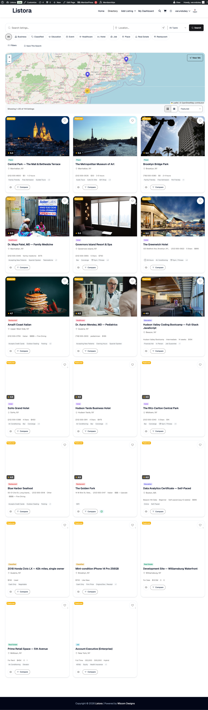

# Infinite Scroll

> **Pro feature** — requires [WB Listora Pro](../getting-started/activating-pro.md).
Replace the paginated grid with **infinite scroll** or **load-more button** UX on listing grids — keeps visitors in flow, never breaks scroll position, never requires a click to advance. Choose the mode globally (pagination / load-more / infinite scroll) from Settings; works with every listing-grid block on the site.

## What it is

Pagination is the safest default — clear, accessible, screen-reader friendly. But for high-engagement directory browsing (restaurants on a Friday night, real estate, events), endless scroll mirrors how visitors actually browse on phones.

Infinite Scroll is a **drop-in mode swap** for the existing listing-grid block:

- **Three modes** — `pagination` (default), `load_more` (button at the end of the grid that fetches the next page), `infinite_scroll` (automatic fetch when the grid bottom enters the viewport).
- **One global setting** controls all listing-grid blocks site-wide; per-block override is on the roadmap.
- **REST-driven** — uses the existing `GET /listora/v1/listings` endpoint with cursor pagination so the n-th page is O(1) (not O(n) like OFFSET).
- **Filter `wb_listora_grid_output`** is how the feature replaces the pagination markup with the infinite-scroll trigger / load-more button. Free's grid remains unchanged.
- **Card markup injection** — the response includes a pre-rendered `card_html` field (added via `inject_card_html`) so the client doesn't have to re-render the card template, just append the HTML.
- **Sentinel element + IntersectionObserver** — when in `infinite_scroll` mode, a sentinel `
` appears at the grid bottom; an observer fires when it enters the viewport and triggers the fetch.
- **A11y-aware** — pagination remains the default precisely because infinite scroll breaks keyboard-only navigation and the screen-reader experience. Pick the mode appropriate for your audience.

## How you use it

### As a site owner — choose your pagination mode

1. **Enable the feature:** Listora → Settings → Features → **Infinite Scroll** (default: **off** per product design — pagination is the safe default).
2. **Settings → Search → Pagination Mode** — radio choice between:
   - **Pagination** (numbered pages) — best for accessibility.
   - **Load More** (button at the end of the grid) — middle ground; keyboard-reachable.
   - **Infinite Scroll** (automatic) — best for mobile flow; weakest for accessibility.
3. **Save.** The change takes effect site-wide; refresh any directory page to see the new mode.

### As a visitor — what changes

| Mode | What you see |
|---|---|
| Pagination | Numbered pagination at the bottom of the grid (`1 2 3 …`) — Free default. |
| Load More | A "Load more listings" button at the bottom — click to fetch + append the next page. Scroll position preserved. |
| Infinite Scroll | Listings auto-append as you scroll. A subtle loader spins near the bottom while fetching. Use the browser's "scroll to top" if you want to go back. |

For accessibility, every mode preserves: `aria-live` updates for screen readers when new cards load; focus management on the next-page first card after Load More; ESC interrupts an active scroll-load.

## Settings & options

| Setting | Location | Default | Notes |
|---|---|---|---|
| Feature toggle | Settings → Features → Infinite Scroll | **Off** | Off by default; pagination is the safer accessibility floor |
| Pagination mode | Settings → Search → Pagination Mode | `pagination` | Three modes: `pagination` / `load_more` / `infinite_scroll` |
| Cards per fetch | (uses `per_page` from grid block) | 12 | Configurable per block in the editor |
| REST source | `GET /listora/v1/listings?cursor=…` | — | Cursor pagination — O(1) past page 1000 |

Developer hooks:

- `wb_listora_pro_pagination_type` (filter) — programmatically override the mode (e.g. force load-more for one specific block).
- `wb_listora_pro_infinite_scroll_threshold_px` (filter) — fire the next fetch when the sentinel is N pixels from entering the viewport (default 200).
- `wb_listora_grid_output` (filter, Free) — the hook this feature uses to swap the pagination markup. Other extensions can hook the same filter.

## Related

- [Search & Filters](search-and-filters.md) — the underlying grid + search.
- [Advanced Search (Pro)](advanced-search.md) — works with all three pagination modes.
- [Developer Reference: REST API](../developer-guide/rest-api.md) — cursor pagination contract on `/listings`.
