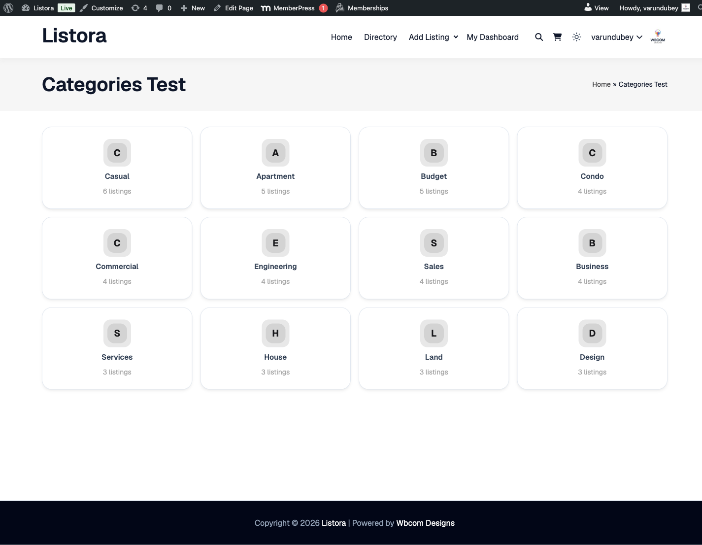

# Browse by Category

> **Availability:** Free + Pro.

Insert a Categories block on any page to give visitors a beautiful, image-and-icon-led category grid - each tile links to a filtered directory view scoped to that category. Tiles render with type colors, listing counts, and an empty-state CTA when no listings exist yet.

## What it is

A directory homepage often needs a "browse" surface in addition to a search surface. The Categories block is that - a row or grid of category tiles that visitors click to jump into a pre-filtered listing view.

Each tile shows:

- **The category icon** (Lucide icon, configurable per category in the admin)
- **The category name** (taxonomy term)
- **A colored tint** sourced from the category's `--cat-color` (set per term in the admin) - tile background is a soft 10% tint of the color; on hover the tile lifts with a `-2px` translate and a primary border (matches the modernized card surface).
- **The listing count** in that category - server-rendered so accurate at page load.
- **An empty-state path** - when a tile has zero listings, it links to the directory home instead of an empty results page.

Hook surface for developers:

- `do_action( 'wb_listora_before_categories_grid' )` and `wb_listora_after_categories_grid` fire around the block - hook your own banners, ads, or CTAs.
- `apply_filters( 'wb_listora_category_card_data', $card_data, $term_id )` lets you modify per-tile data before rendering (e.g. customize the link, swap the icon, override the count).

The block is **server-rendered** (no client-side fetch) and reuses the same `--listora-card-border` / `--listora-radius-xl` / `--listora-shadow-md` tokens as the other modernized list-container surfaces - automatically dark-mode-aware via the theme bridge.

## How you use it

### As a site owner - place the block

1. **Edit a page** (your homepage, a "Browse" landing page, etc.).
2. In the block editor, search for **Listora Categories** and insert it.
3. **Inspector controls:**
- **Listing Type** - restrict tiles to one type's categories (e.g. show Restaurant categories only).
- **Layout** - grid (default) or row (horizontal scroll).
- **Columns per row** - 2, 3, 4, 5, or 6 (responsive - collapses to 1 on mobile).
- **Show count** - toggle the listing-count badge per tile.
- **Sort** - alphabetical or by listing count (descending).
4. **Configure category colors + icons** in the admin: WP Admin → Listora → Categories → edit a term → set Color + Icon (Lucide picker).

### As a visitor - what you see

1. The Categories block renders as a grid of colored tiles.
2. Click a tile → land on the directory with that category pre-filtered (`/listings/?category={slug}`).
3. The grid + map + count badge update; you can stack the category filter with search keywords or other facets.
4. From the filtered view, click the category chip at the top to clear the filter.

## Settings & options

| Setting | Location | Default | Notes |
|---|---|---|---|
| Block | Editor → Insert → Listora Categories | - | Server-rendered, no client JS needed for tiles |
| Per-category color | WP Admin → Listora → Categories → edit term | (auto-assigned) | Drives the tile tint + hover border |
| Per-category icon | WP Admin → Listora → Categories → edit term | (none) | Lucide icon picker |
| Per-block columns | Inspector | 4 | Responsive: collapses to 1 at 640px |
| Sort | Inspector | Alphabetical | Or by listing count desc |
| Show count | Inspector | On | Hide the count badge per block if desired |

Developer hooks:

- `wb_listora_before_categories_grid` / `wb_listora_after_categories_grid` (actions) - hook before/after the grid.
- `wb_listora_category_card_data` (filter) - modify per-tile data (name, link, count, color, icon, image_url).
- `wb_listora_categories_query_args` (filter) - modify the `get_terms()` args (filter out specific categories, change ordering).

## Related

- [Search & Filters](search-and-filters.md) - clicking a category tile navigates to the search with the category pre-filtered.
- [Listing Types](../getting-started/listing-types.md) - categories are scoped per listing type; the block's "Listing Type" control filters which categories appear.
- [Featured Listings](featured-listings.md) - pair Categories with Featured for a strong homepage layout.
- [Developer Reference: Hooks](../developer-guide/hooks-reference.md) - full categories hook signatures.
