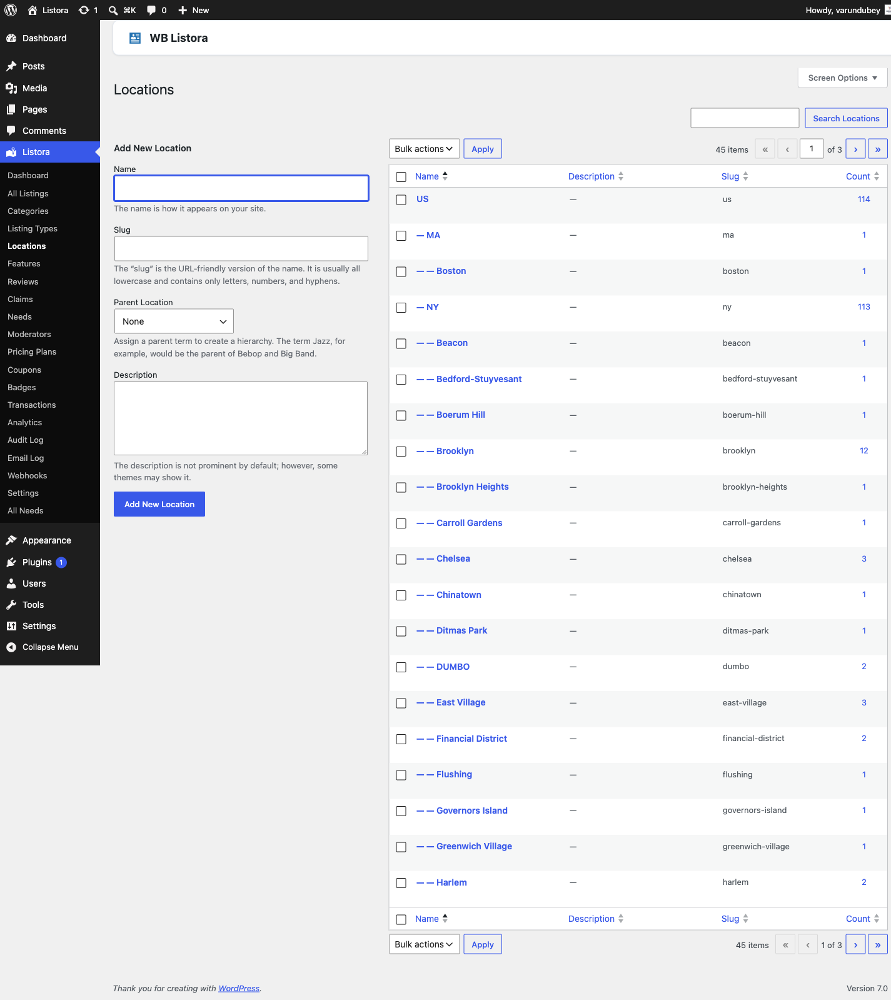

# Locations

Built into WB Listora **Free**.

Hierarchical geographic taxonomy that maps every listing to the place it lives — Country → State → City → Neighborhood, as deep as you need. Locations get their own admin page (Listora → Locations), their own pretty URL (`/listing-location/new-york/manhattan/`), their own WP-core REST endpoint (`/wp-json/wp/v2/listing-locations`), and they auto-populate the location facet on every search and grid block.



## What it is

Locations is the `listora_listing_location` taxonomy — same shape as WordPress's built-in `category` (hierarchical, parent/child, slug-based URLs), specialized for directory geography:

- **Hierarchical** so you can nest as deep as the site needs. Single-city directory? One level. Country-wide directory? Three or four (Country → State → City → Neighborhood).
- **Public** with its own archive URL — `/listing-location/{slug}/` shows every listing in that location (and its children).
- **REST-exposed** at `/wp-json/wp/v2/listing-locations` (WordPress core REST) and surfaced in Listora's own search facets at `/wp-json/listora/v1/search?location[]={term-id}`.
- **Searchable** via the Locations facet in `listing-search` block — appears as a chip list or dropdown depending on the block's settings.
- **Distinct from physical address.** A listing's `address` / `lat` / `lng` meta fields drive map markers and Near Me search. The `listora_listing_location` term assigned to the listing drives taxonomy navigation and search facets. Most listings carry both; they answer different customer questions.

## How you use it

### Build your location tree

1. **Admin → Listora → Locations.**
2. **Add the top level first** — typically Country or State. Leave Parent set to None.
3. **Add children with the Parent dropdown set** to the parent term you just created. Repeat until you've covered the geography customers will browse.
4. **Bulk-import via WP-CLI** when you have hundreds of terms:
   ```bash
   wp term create listora_listing_location "Manhattan" --parent=42
   ```
5. Or import a CSV via the [Listings Import](import-export.md) — the `listora_listing_location` column accepts comma-separated term slugs.

### Assign locations to a listing

- **Wizard** — the Locations field appears as a tag picker (autocomplete with suggestions) in step 2 of the submission wizard. Customers can pick existing terms only; new terms must come from an admin.
- **Admin** — the standard WP taxonomy metabox on every listing's edit screen.
- **REST** — `POST /listora/v1/submissions` accepts `listora_listing_location: [12, 34]` (term IDs) in the payload.

### Browse / search by location

- **Archive page** — `/listing-location/new-york/` automatically renders the term archive with every listing tagged to that term OR any of its children. Skin via your theme's `taxonomy-listora_listing_location.php` template, or via `wb_listora_locate_template( 'taxonomy.php' )`.
- **Search facet** — the `listing-search` block's Locations facet uses the same term tree. Selecting "New York" matches every child (Manhattan, Brooklyn, etc.) without having to enumerate them.
- **Permalink slug** — customizable in **Settings → General → Slugs → Location archive base** (default `listing-location`).

## Permissions

| Capability | Who has it | What it gates |
|---|---|---|
| `manage_listora_types` | Admin, custom roles via [Capabilities](../developer-guide/capabilities.md) | Create / edit / delete Location terms in admin |
| `edit_listora_listings` | Admin, Editor, Author, Contributor, Subscriber | Assign existing Location terms during submission |

Customers cannot add new Location terms from the frontend wizard — only assign existing ones. That keeps the geography tree clean. If you need open user-submitted locations (rare in a directory), filter `wb_listora_submission_can_create_terms` to `true`.

## Settings & options

| Setting | Default | Where |
|---|---|---|
| Archive permalink base | `listing-location` | Settings → General → Slugs |
| Show location facet on search | On | Listing Search block → Inspector → Filters |
| Default location display on card | None | Listing Card block → Inspector → Display |
| Hierarchical search behavior | Include children | (filter `wb_listora_search_location_children`) |

## Developer hooks

- `wb_listora_location_terms` — filter the term list shown in the submission wizard's autocomplete.
- `wb_listora_search_location_children` — control whether selecting a parent term includes child terms in search results (default true).
- `wb_listora_rest_prepare_listing` — modify what location data appears in the REST listing response.
- See the [Hooks reference](../developer-guide/hooks-reference.md) for the full list.

## Related

- [Listing Categories](listing-categories.md) — what your listings are.
- [Search & Filters](search-and-filters.md) — how the Locations facet appears on listing-search.
- [Google Maps (Pro)](google-maps.md) — combine taxonomy locations with map-based discovery.
- [Capabilities & Roles](../developer-guide/capabilities.md) — control who can edit Location terms.
- [REST API](../developer-guide/rest-api.md) — `/listora/v1/search?location[]=...` endpoint.
