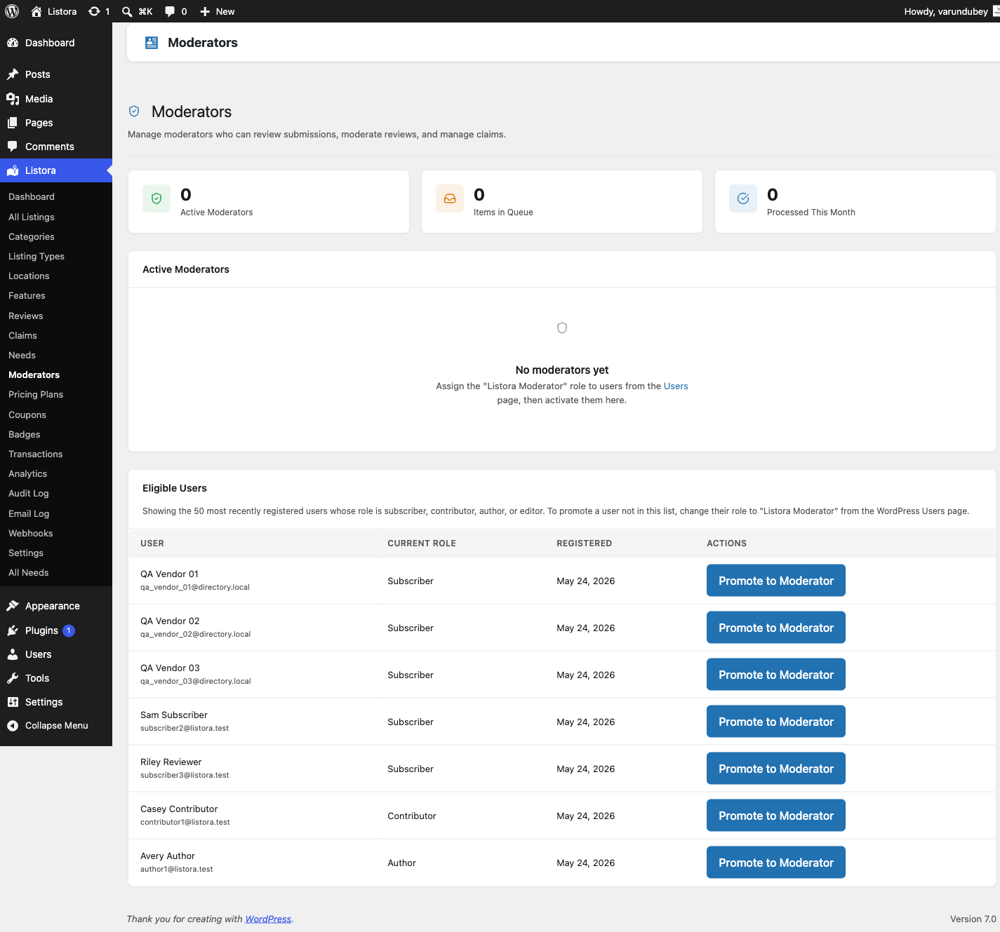

# Moderators

> **Availability:** Pro only. Requires [WB Listora Pro](../getting-started/activating-pro.md). Free sites manage moderation entirely through the administrator role.

## What it does

The Moderators feature adds a **Listora Moderator** WordPress role. People with this role can approve listings, moderate reviews, manage claims and moderate needs without full access to your site. New submissions are handed to active moderators in turn, round-robin.

## Why you'd use it

- Delegate content moderation to trusted people without giving them administrator access.
- Spread the review workload across a team.
- Moderators cannot change settings, delete listings or manage listing types. The role is limited to moderation.
- Round-robin assignment shares new items evenly.

## How to use it

### For site owners (admin steps)

Go to **Listora → Moderation → Moderators**. The tiles at the top show **Active moderators**, **Paused**, **Items waiting in queues** and **Done this month**.

**Adding a moderator**

1. In the **Add a moderator** card, search for a member by name or email and click **Find**. Administrators and existing moderators are not listed.
2. Click **Make moderator** next to the member and confirm. Their role is replaced by **Listora Moderator** and they start receiving new items straight away.

You can also change a user's role to **Listora Moderator** from **Users → Edit User**.

**Managing moderators**

The list shows each moderator's **Status** (**Active** or **Paused**), **In their queue**, **Done this month**, **Role** and **Since**. Use the search box to find one by name or email, and the views **All**, **Active** and **Paused** to filter.

| Action | What it does |
|--------|--------------|
| **Pause** | The moderator keeps their role and their current queue but gets no new items until you activate them again. Use this for leave. |
| **Activate** | Puts a paused moderator back into the rotation. |
| **Remove moderator role** | The person becomes a subscriber. Items in their queue stay assigned to them until you reassign them. |
| **Reassign their queue to…** | A bulk action. Pick the moderator who should take over, then apply it to the selected moderators. The receiving moderator is emailed. |

The bulk actions skip your own account, administrators, and a reassignment with no active moderator to receive the queue. The notice after a bulk action says how many were skipped.

The list paginates and searches across all users, so it stays usable on a site with thousands of members. Queue sizes are counted in one query, and stay accurate above 500 items.

**What moderators can do**

| Permission | Moderator |
|-----------|-----------|
| View all listings | Yes |
| Edit listings (not delete) | Yes |
| Approve and reject listings | Yes |
| Moderate reviews | Yes |
| Manage claims | Yes |
| Approve, reject, correct and close needs | Yes |
| Delete listings | No |
| Delete needs | No |
| Change settings | No |
| Manage listing types | No |
| View analytics | No |
| Manage other moderators | No |

Moderators reach the Needs screen from **Listora → Moderation → Needs**. See [Needs Marketplace](needs-marketplace.md).

**Round-robin assignment:** When a listing, review or claim is submitted, it is assigned to the next active moderator in the rotation. Paused moderators are skipped.

**Moderator column in All Listings:** The **Moderator** column on **Listora → Listings** is hidden until your site has an active moderator, because until then every row would read **Unassigned**. You can show it any time from **Screen Options**.

**Deactivating Pro:** Deactivating WB Listora Pro does not change anyone's role. Your moderators keep the role, so a troubleshooting deactivation is safe. Removing the plugin through **Uninstall** removes the role and reassigns its members.

### For end users (visitor/user-facing)

The Moderator role is for your team. Visitors and members do not interact with moderators directly. Moderators sign in to the WordPress admin to do their work.

## Tips

- Keep at least two active moderators so submissions are covered when one is away.
- Use **Pause** for leave instead of changing the person's role. Their queue is kept.
- Brief your moderators on your content standards before you add them. The plugin provides the tools and your team provides the judgment.
- Administrators have the `manage_listora_moderators` capability. Use it to control which administrators can add and manage moderators.

## Common issues

| Symptom | Fix |
|---------|-----|
| A moderator cannot see the Listora menu | Check the user's role is **Listora Moderator** and that WB Listora Pro is active. |
| Round-robin is not distributing evenly | Check the **Status** column. **Paused** moderators receive nothing. |
| A moderator deleted a listing | The Moderator role cannot delete listings. The person probably has a second role, such as Editor, that allows it. |
| **Moderator** column is missing in All Listings | It is hidden until there is an active moderator. Turn it on in **Screen Options** if you want it sooner. |

## Related features

- [Needs Marketplace](needs-marketplace.md)
- [Business Claims](business-claims.md)
- [Reviews System](reviews-system.md)
- [Digest Notifications](digest-notifications.md)
