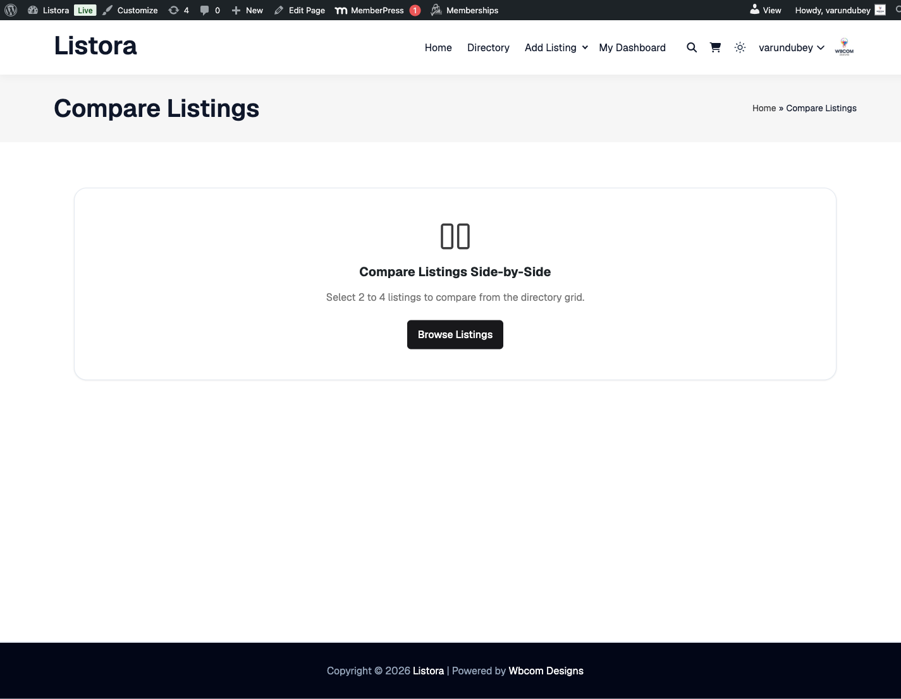

# Needs Marketplace

> **Availability:** Pro only. Requires [WB Listora Pro](../getting-started/activating-pro.md). Free sites support standard listing submission from businesses outward.

## What it does

The Needs Marketplace is a reverse directory: instead of businesses posting listings, members post what they are looking for. A need might be "Looking for a caterer for 200 guests in Austin, budget $5,000." Businesses with a matching listing are told about it and send a quote. The member picks the quote they like.

## Why you'd use it

- Creates a two-sided marketplace: members bring demand, businesses bring offers.
- Businesses see real requests they can answer, matched to their listing type and area.
- A member who posts a need is a motivated buyer, so each need is a qualified lead.
- Urgency and deadline help businesses decide which requests to answer first.
- You can charge credits for each quote, which turns every response into a paid lead.

## The two pages

Needs is off until you turn it on. Go to **Listora → Settings → Features** and switch on **Reverse Listings (Post a Need)**. Pro then registers two pages. You can see and re-map them under **Listora → Settings → General → Pages**.

| Page | Default address | What it shows |
|------|-----------------|---------------|
| **Browse Needs** | `/needs/` | The grid of open needs, with search, type and urgency filters. |
| **Post a Need** | `/post-need/` | The form members use to post or edit a need. |

Both pages take the full page width, so your theme's blog sidebar does not appear beside them. The same applies to the Buy Credits and Compare pages.

Turning Needs on or off refreshes the site's addresses for you. You do not need to re-save Permalinks.

## How to use it

### For members (posting a need)

1. Open the **Post a Need** page and sign in if asked.
2. Fill in the form:
   - **Title** - a short description of what you need.
   - **Description** - the details, timing and any limits.
   - **What kind of business do you need?** - the listing type. Businesses of this kind are told about your request.
   - **Speciality (optional)** - narrows the request to one category of that type.
   - **Location** - a city or area. Leave it empty to reach businesses anywhere on the site.
   - **Phone (optional)** - shared only with the business whose quote you accept, along with your email.
   - **Budget Range** - a minimum and a maximum, plus a unit: **Fixed price**, **Per hour** or **Per day**. Amounts use your site's currency symbol.
   - **Deadline** - the date you need it by.
   - **Urgency** - **Flexible**, **Normal** or **Urgent**.
3. Click **Submit Need**. The request waits for review and appears on the Browse Needs page once approved.

The **Budget Range** and **Deadline** fields are on by default. You can hide either one in the Post a Need block's settings in the block editor.

**What a need card shows**

Each card on the Browse Needs page shows the title, the listing type by name, the location (or **Any location**), how long ago it was posted, the budget with its unit (for example "$18 - $25 per hour"), the deadline with the time left, the urgency, the number of responses and the poster's name. The response count is counted from the responses that exist, so it goes down if a response is removed. A deadline within three days is highlighted.

### For members (managing your needs)

Open **Dashboard → My Needs**. Each request shows its status: **Awaiting review**, **Open**, **Fulfilled**, **Closed** or **Expired**.

While a request is **Awaiting review** or **Open** you can:

- **Edit** - opens the Post a Need form with your request filled in. If businesses have already quoted, they are told once that the request changed. An edit does not send an open request back to review.
- **Close request** - stops new quotes. Businesses that quoted are told and their waiting quotes are closed.
- **Delete** - removes a request that has no quotes. If businesses have already quoted, **Delete** closes the request instead, so they keep a record of what they paid for.
- **View responses** - lists the quotes. Use **Accept** or **Reject** on each one.

Accepting a quote marks the other waiting quotes as not chosen and closes the request.

A request that has ended (fulfilled, closed or expired) can no longer be edited by its author.

### For businesses (responding to a need)

1. Open **Browse Needs** and click a request.
2. In the response panel, pick the listing to **Respond with**, write **Your message**, and add a **Quote amount** if you want to.
3. Click **Submit Quote**.

You need at least one published listing to respond, and you cannot respond to your own need. Each listing can respond to a need once.

If you set a cost per response (see below), the panel tells you how many credits the quote will use from your balance. If your balance is too low it shows a **Buy credits** link next to the warning. The same link appears under the error if a send is refused for lack of credits. After a paid quote is sent, the confirmation says how many credits were charged and the balance notice disappears.

A quote is only delivered if its credit charge goes through. Two quotes sent at the same moment cannot take your balance below zero.

**When your quote is accepted**

Your quote shows **Accepted**, and the response panel shows a **Contact the buyer** box with the buyer's name, email and, if they gave one, phone number. You also get an email with the same details. Nobody else sees the buyer's contact.

**My Responses**

**Dashboard → My Responses** lists the quotes you have sent, 20 to a page, with a status of **Pending**, **Accepted**, **Not chosen** or **Request closed**. It also shows **Needs matching your listings** that you have not quoted on yet.

### For site owners (settings)

Go to **Listora → Settings → Credits → Needs** (the **Needs** sub-tab appears while Needs is on). The settings are saved with the tab's **Save Changes** button.

| Setting | What it does | Default |
|---------|--------------|---------|
| **Credits per response** | Credits charged when a business sends a quote. `0` keeps quoting free. | 0 |
| **Active needs per buyer** | The most pending plus open needs one member can have at once. `0` is unlimited. | 0 |
| **Requests without a deadline expire after** | Days after which an open request with no deadline expires. `0` keeps such requests open until the buyer closes them. | 30 |
| **Match vendors within** | Distance in km around a request's location. | 25 |

**How matching works**

When you approve a request, Listora emails the owners of published listings of the same listing type. If the request has a location, only listings within the match distance are chosen, best rated first, up to 50 listings. If it has no location, listings of that type anywhere on the site are chosen.

A request's location is turned into map coordinates when the member submits the form. If Pro's Google Maps is active, Google does this; otherwise OpenStreetMap does. If the lookup fails, the request is still posted and matched site-wide. When Google fills in an address, it also fills the country code, so listings are filed under one country however the country name was spelled.

**Expiry**

A daily job expires open requests that are past their deadline, and requests with no deadline once they are older than the setting above. When a request expires or is closed, its waiting quotes are closed, and the buyer and the businesses that quoted are told.

### For site owners (moderating needs)

Go to **Listora → Moderation → Needs**. The screen uses the shared admin table. The views are **Awaiting review**, **Open**, **Closed** and **All**, with a search box and a sortable **Posted** column. The tiles show how many requests are waiting, open and closed, how many quotes were sent and the share of decided quotes that were accepted.

For each request you can:

- **Approve** - publishes it and tells matching businesses.
- **Reject…** - opens the full request with a **Note to the member (optional)**. The note is emailed to the member with the rejection so they can fix the request and post again.
- **Close** - ends an open request, closes its waiting quotes and tells the businesses.
- **Back to review** - takes an open request off the public list.
- **Edit** - opens the request in the editor. The **Request details** box lets you correct the listing type, location, budget, deadline, urgency and status, and shows the buyer's phone. The **Quotes** box lists every quote with its vendor, listing, message, status and date.
- **View on site** - opens the public page.

If another moderator has already handled a request, the screen says so and leaves it as it was.

Needs also appear in the **Needs attention** list on the Listora dashboard as "posted needs to review".

**Moderators** can approve, reject, correct and close needs. Only administrators can delete them. See [Moderators](moderators.md).

## Need statuses

| Status | Meaning |
|--------|---------|
| Awaiting review | Posted, not yet approved. Nobody else can see it. |
| Open | Taking quotes. |
| Fulfilled | The buyer accepted a quote. |
| Closed | The buyer or a moderator closed it with no quote chosen. |
| Expired | Past its deadline or its default lifetime. |

## Tips

- Set **Urgency** to **Urgent** on your own need to make it stand out. Urgent cards carry a highlighted badge.
- Businesses: answer urgent needs first. Time-sensitive buyers favour fast replies.
- Review needs promptly. A long review queue discourages members from posting.
- Set **Credits per response** above 0 only once you are happy with how many matching businesses a typical request reaches.
- Needs are stored as the `listora_need` post type, so the standard WordPress tools work on them.

## Common issues

| Symptom | Fix |
|---------|-----|
| Browse Needs or Post a Need page shows a 404 | Confirm **Reverse Listings (Post a Need)** is on in **Listora → Settings → Features** and the page is mapped under **Listora → Settings → General → Pages**. |
| **Post a Need** form does not appear | The visitor must be signed in. Check that Pro is active and Needs is on. |
| Need stuck in Awaiting review | Go to **Listora → Moderation → Needs** and approve it. |
| A business did not get the match email | Check that its listing is published, has the same listing type, and is within the match distance of the request. Check **Listora → Tools → Email Log** and your site's email setup. |
| A business cannot send a quote | It needs a published listing and enough credits if you charge per response. |

## Related features

- [Credits and Plans](credits-and-plans.md)
- [Moderators](moderators.md)
- [Pro Emails](pro-emails.md)
- [Lead Forms](lead-forms.md)
- [Search and Filters](search-and-filters.md)
