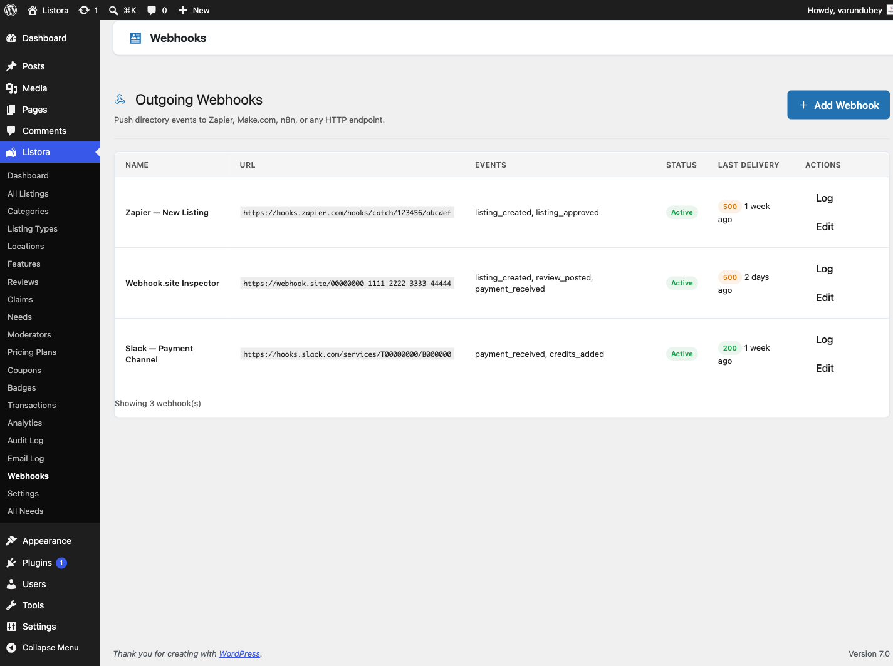

# Outgoing Webhooks

> **Availability:** Pro only. Requires [WB Listora Pro](../getting-started/activating-pro.md).
Send real-time HMAC-signed HTTP POSTs to external systems (Zapier, n8n, Make, Slack, your CRM, custom services) whenever something happens in your directory - a new listing is published, a review is posted, a claim is approved, a coupon is redeemed. Webhooks are queued via Action Scheduler, retried on failure, signed for authenticity, and individually toggleable per endpoint per event.



## What it is

If you've ever wanted "when a new business listing is approved, post a message in Slack" or "when a review hits 5 stars, push the listing into our HubSpot pipeline" - that's what Outgoing Webhooks is for. It turns WB Listora into a first-class event source for the rest of your stack.

Under the hood:

- **Endpoints are stored as a custom post type** (`wb_listora_webhook`) so each subscription has its own admin row, status, last-delivery log, and individually selectable event subscriptions.
- **Every event is HMAC-SHA256 signed** with a per-endpoint secret in the `X-Listora-Signature` header, plus a timestamp + nonce for replay protection - your receiver verifies authenticity before processing.
- **Deliveries run on Action Scheduler** (`wb_listora_pro_deliver_webhook` job, group `wb-listora-pro`), so a slow receiver never blocks your site. Failed deliveries retry with exponential backoff.
- **Delivery logs persist** with response code, body excerpt, duration, attempt count - pruned automatically via `wb_listora_pro_webhook_log_cleanup` cron.
- **REST routes** are registered (in `wb_listora_rest_api_init`) so you can also create + manage webhooks programmatically.

Events available out of the box are read from the **[automation trigger registry](automation-triggers.md)** since 1.6.0 - 25 triggers in Free plus 9 Pro ones, listed in full on that page. The event checkboxes on an endpoint are built from that registry, so every event offered is one that can actually be delivered. Before this, the list was hand-maintained here and had drifted: `coupon_redeemed` and `need_posted` were being dispatched with no way to subscribe, so every dispatch was discarded.

A sample of what is available:

| Event | Fires when |
|---|---|
| `listing_created` | A listing is created via REST submission |
| `listing_updated` | A listing's fields are edited |
| `listing_status_changed` | Status transitions (pending → publish, publish → expired, etc.) |
| `listing_expired` | Listing's expiration date passes (cron-driven) |
| `review_submitted` | A new review is posted |
| `review_updated` | A review is edited (or moderation status changes) |
| `claim_submitted` | A business-claim request is submitted |
| `claim_updated` | A claim is approved / rejected / reassigned |
| `coupon_redeemed` | A discount code is used at submission |
| `need_posted` | (Needs Marketplace) A need is posted publicly |

## How you use it

### As a site owner - set up a webhook

1. **Enable the feature:** Listora → Settings → Features → **Outgoing Webhooks** (on by default).
2. **Open the webhook admin:** Listora menu → **Webhooks**.
3. **Add a new endpoint:**
- Name - e.g. "Slack: #new-listings"
- URL - the receiver URL (`https://hooks.slack.com/services/…`, your Zap, etc.)
- Secret - a long random string; share it with the receiver
- Events - tick the events this endpoint should subscribe to
- Status - Active
4. **Save.** The endpoint is live.
5. **Test:** edit a listing on your site → save → check the Delivery Log row for that endpoint. You should see a 2xx response code.

### As a developer - verify HMAC signatures

The receiver should:
1. Read the `X-Listora-Signature` header.
2. Recompute `hash_hmac('sha256', $raw_body, $secret)` and compare with the header value using a constant-time comparison.
3. Reject the request if the signatures don't match.
4. Reject if the `X-Listora-Timestamp` is more than ~5 minutes off (replay protection).
5. Process the JSON body. Top-level keys: `event`, `timestamp`, `site_url`, `version`, `id`, `data`.
   - `version` is the schema version of `data`. Pin your parser to it; a payload shape change ships as a new version rather than mutating this one.
   - `id` is a UUID per delivery per subscriber, and a **retry reuses it** - use it to make your receiver idempotent.
   - `data` is built from the same serializers the REST API uses, so a listing here is the shape `GET /listora/v1/listings/{id}` returns. `version` and `id` were added in 1.6.0; the original four keys are frozen.

Example PHP verification:
```php
$body = file_get_contents( 'php://input' );
$signature = $_SERVER['HTTP_X_LISTORA_SIGNATURE'] ?? '';
$expected = hash_hmac( 'sha256', $body, $your_secret );
if ( ! hash_equals( $expected, $signature ) ) {
http_response_code( 401 );
exit;
}
$payload = json_decode( $body, true );
// ... process $payload ...
```

## Settings & options

| Setting | Location | Default | Notes |
|---|---|---|---|
| Feature toggle | Settings → Features → Outgoing Webhooks | On | |
| Endpoint CRUD | Listora → Webhooks | - | One row per receiver |
| Per-endpoint events | (per row) | None until ticked | Subscribe each endpoint to specific events only |
| HMAC secret | (per row) | Required | Used for `X-Listora-Signature` |
| Retry policy | (system) | Exponential backoff via Action Scheduler | Retries on non-2xx responses |
| Log retention | `wb_listora_pro_webhook_log_cleanup` cron | 30 days | Old delivery rows are pruned |

Developer filters:

- `wb_listora_pro_webhook_payload` - modify the payload before signing/sending.
- `wb_listora_pro_webhook_headers` - add custom headers to outgoing requests.
- `wb_listora_pro_webhook_request_args` - modify the `wp_remote_post()` args (e.g. timeout, sslverify).

## Related

- [Automation Triggers](automation-triggers.md) - the catalogue of every event you can subscribe to, and its payload schemas.
- [Payment Webhooks](payment-webhooks.md) - the *inbound* side: how WB Listora accepts payment webhooks from Stripe/PayPal/Paddle.
- [BuddyPress Integration (Pro)](buddypress-integration.md) - another way to react to listing events, but routed into BP activity streams + notifications.
- [Developer Reference: REST API](../developer-guide/rest-api.md) - webhooks are also manageable via REST.
- [Developer Reference: Hooks](../developer-guide/hooks-reference.md) - the underlying `wb_listora_*` events these webhooks listen to.
