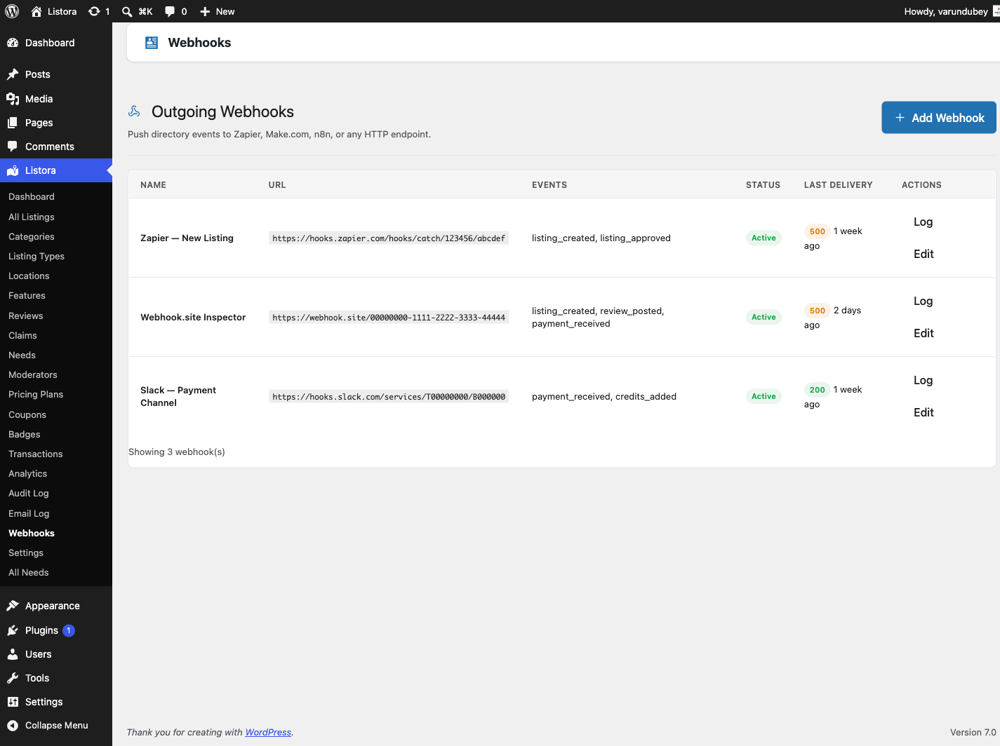

# Outgoing Webhooks

> **Availability:** Pro only. Requires [WB Listora Pro](../getting-started/activating-pro.md).
Send real-time HMAC-signed HTTP POSTs to external systems (Zapier, n8n, Make, Slack, your CRM, custom services) whenever something happens in your directory - a new listing is published, a review is posted, a claim is approved, a coupon is redeemed. Webhooks are queued via Action Scheduler, retried on failure, signed for authenticity, and individually toggleable per endpoint per event.



## What it is

If you've ever wanted "when a new business listing is approved, post a message in Slack" or "when a review hits 5 stars, push the listing into our HubSpot pipeline" - that's what Outgoing Webhooks is for. It turns WB Listora into a first-class event source for the rest of your stack.

Under the hood:

- **Endpoints are stored as a custom post type** (`listora_webhook`) so each subscription has its own row, status, delivery log and event subscriptions.
- **Every delivery is signed** with HMAC-SHA256 using the endpoint's secret. The signature is sent in the `X-Listora-Signature` header as `sha256=` followed by the hex digest. Your receiver checks it before processing.
- **Deliveries run on Action Scheduler** (`wb_listora_pro_deliver_webhook` job, group `wb-listora-pro`), so a slow receiver never blocks your site.
- **A failed delivery is retried.** There are four attempts in all, spaced 1 minute, 5 minutes and 30 minutes apart.
- **Delivery logs persist.** Each webhook keeps its latest 50 log entries with the response code, a body excerpt and the attempt number. A daily job (`wb_listora_pro_webhook_log_cleanup`) trims older entries.
- **REST routes** are registered (in `wb_listora_rest_api_init`) so you can also create and manage webhooks programmatically.

Events available out of the box are read from the **[automation trigger registry](automation-triggers.md)** since 1.6.0 - 25 triggers in Free plus 9 Pro ones, listed in full on that page. The event checkboxes on an endpoint are built from that registry, so every event offered is one that can actually be delivered. Before this, the list was hand-maintained here and had drifted: `coupon_redeemed` and `need_posted` were being dispatched with no way to subscribe, so every dispatch was discarded.

A sample of what is available:

| Event | Fires when |
|---|---|
| `listing_created` | A listing is created via REST submission |
| `listing_updated` | A listing's fields are edited |
| `listing_status_changed` | Status transitions (pending → publish, publish → expired, etc.) |
| `listing_expired` | Listing's expiration date passes (cron-driven) |
| `review_submitted` | A new review is posted |
| `review_updated` | A review is edited (or moderation status changes) |
| `claim_submitted` | A business-claim request is submitted |
| `claim_updated` | A claim is approved / rejected / reassigned |
| `coupon_redeemed` | A discount code is used at submission |
| `need_posted` | (Needs Marketplace) A need is posted publicly |

## How you use it

### As a site owner - set up a webhook

1. **Enable the feature:** **Listora → Settings → Features → Outgoing Webhooks**. It is off until you turn it on.
2. **Open the webhook admin:** **Listora → Tools → Webhooks**.
3. **Add a new endpoint.** Click **Add Webhook** and fill in:
   - **Name** - for example "Zapier - New Listings".
   - **Payload URL** - the receiver address (your Zap, Make scenario, n8n workflow and so on).
   - **Secret (HMAC)** - a long random string. A new webhook starts with one generated for you. Share it with the receiver.
   - **Events** - tick the events this endpoint should receive.
   - **Status** - **Active** or **Paused**.
4. **Click Save Webhook.** The endpoint is live.
5. **Test it.** In the list, use **Send test** on the row. The test goes through the normal delivery path and is logged. Open **Delivery log** to see the response.

Each row also has **Edit**, **Pause** or **Resume**, and **Delete**. Deleting a webhook deletes its delivery log. The receiving service is not told.

### Webhook health

The **Status** column tells you whether a webhook is working.

| Status | Meaning |
|---|---|
| **Active** | Delivering normally. |
| **Failing: 3 attempts in a row** | Three delivery attempts in a row have failed. The number goes up with each further failure. A single successful delivery clears it. |
| **Paused: kept failing** | Ten deliveries in a row failed, each after all its retries, so Listora paused the webhook and stopped sending to that address. |
| **Paused** | You paused it yourself. |

A delivery spans about 37 minutes of retries, so a short outage on the receiving side does not pause a webhook.

When Listora pauses a webhook it emails the site's administration email address (**Settings → General** in WordPress). The email names the webhook, says how many deliveries failed, and links to the delivery log. Fix the receiver, then click **Resume** on the row. Resuming clears the failure count.

The email appears in **Listora → Tools → Email Log**. See [Pro Emails](pro-emails.md).

### As a developer - verify HMAC signatures

The receiver should:
1. Read the `X-Listora-Signature` header. Its value is `sha256=` followed by the hex digest.
2. Recompute `hash_hmac('sha256', $raw_body, $secret)` and compare it with the part after `sha256=`, using a constant-time comparison.
3. Reject the request if the signatures do not match.
4. Optionally check `X-Listora-Timestamp` (Unix seconds) and reject old requests. The timestamp is sent as a header and is not part of the signed content.
5. Use `X-Listora-Delivery` to avoid processing the same delivery twice. It carries the same `id` as the body, and a retry reuses it. `X-Listora-Event` names the event.
6. Process the JSON body. Top-level keys: `event`, `timestamp`, `site_url`, `version`, `id`, `data`.
   - `version` is the schema version of `data`. Pin your parser to it; a payload shape change ships as a new version rather than mutating this one.
   - `id` is a UUID per delivery per subscriber, and a **retry reuses it** - use it to make your receiver idempotent.
   - `data` is built from the same serializers the REST API uses, so a listing here is the shape `GET /listora/v1/listings/{id}` returns. `version` and `id` were added in 1.6.0; the original four keys are frozen.

Example PHP verification:
```php
$body = file_get_contents( 'php://input' );
$signature = $_SERVER['HTTP_X_LISTORA_SIGNATURE'] ?? '';
$expected = 'sha256=' . hash_hmac( 'sha256', $body, $your_secret );
if ( ! hash_equals( $expected, $signature ) ) {
http_response_code( 401 );
exit;
}
$payload = json_decode( $body, true );
// ... process $payload ...
```

## Settings & options

| Setting | Location | Default | Notes |
|---|---|---|---|
| Feature toggle | **Listora → Settings → Features → Outgoing Webhooks** | Off | |
| Endpoint list | **Listora → Tools → Webhooks** | - | One row per receiver |
| Per-endpoint events | (per row) | None until ticked | Subscribe each endpoint to specific events only |
| HMAC secret | (per row) | Generated for a new webhook | Used for `X-Listora-Signature` |
| Retry policy | (system) | 4 attempts: now, then +1 min, +5 min, +30 min | Retries on a non-2xx response or a network error |
| Request timeout | (system) | 10 seconds | Per attempt |
| Failing label | (system) | After 3 failed attempts in a row | Cleared by one successful delivery |
| Auto-pause | (system) | After 10 failed deliveries in a row | Emails the administration address |
| Log retention | `wb_listora_pro_webhook_log_cleanup` job | Latest 50 entries per webhook | Older entries are pruned daily |

Developer hooks:

- `wb_listora_pro_before_outgoing_webhook` (filter) - return a `WP_Error` to stop an event from being sent to any webhook.

## Related

- [Automation Triggers](automation-triggers.md) - the catalogue of every event you can subscribe to, and its payload schemas.
- [Payment Webhooks](payment-webhooks.md) - the *inbound* side: how WB Listora accepts payment webhooks from Stripe/PayPal/Paddle.
- [BuddyPress Integration (Pro)](buddypress-integration.md) - another way to react to listing events, but routed into BP activity streams + notifications.
- [Developer Reference: REST API](../developer-guide/rest-api.md) - webhooks are also manageable via REST.
- [Developer Reference: Hooks](../developer-guide/hooks-reference.md) - the underlying `wb_listora_*` events these webhooks listen to.
