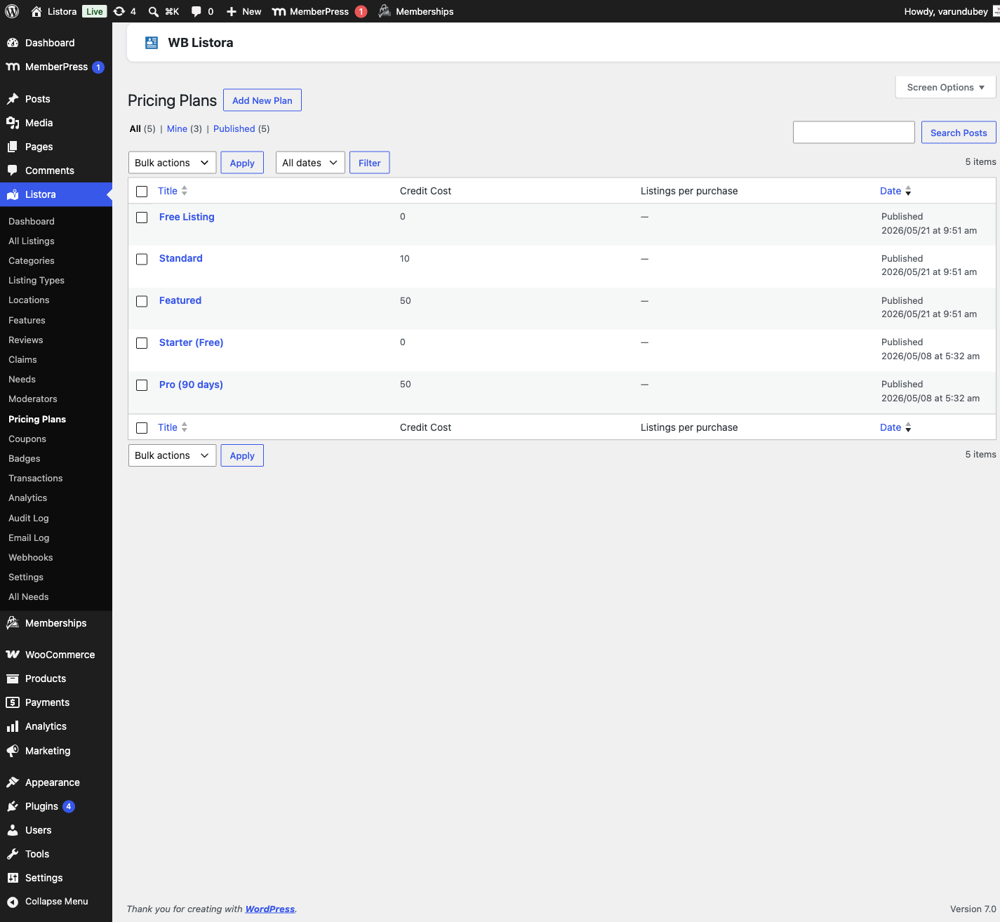

# Pricing Plans

> **Pro feature** - requires [WB Listora Pro](../getting-started/activating-pro.md).
Define listing tiers (Free, Starter, Premium, Featured, etc.) with their own credit costs, durations, featured placement, expiration behavior, and perks. Listing owners pick a plan at submission; the plan controls how the listing renders, how long it lives, and what it costs.

## What it is

A directory doesn't monetize uniformly - a basic free listing is fine for indexing, but premium placements, longer visibility, and featured slots need to be paid. Pricing Plans is the data model that makes that possible.

Each plan is stored as a **`listora_plan` custom post type** so plans are versioned, ordered, taxonomy-filterable, and editable in the WordPress admin like any other content. A plan record carries:

- **Name + description** - what the submitter sees at checkout.
- **Credit cost** (`_listora_plan_credits` meta) - how many credits activating this plan deducts from the owner's balance (see [Credits & Pricing Plans](credits-and-plans.md) for the credit system).
- **Duration in days** - how long the listing stays published before reverting to `listora_expired` status.
- **Featured flag** - whether listings on this plan appear in the Featured Listings (Free) (docs in progress) carousel.
- **Listing-type scoping** - restrict a plan to specific listing types (e.g. a "Hotel Premium" plan only available to Hotel submissions).
- **Listing-cap** - optional hard limit on how many active listings one user can have on this plan.

How activation works (the Hold/Commit pattern, since v1.5.0):

1. Submission lands; if the user picked a paid plan, the controller calls `Credits::hold($cost)` to reserve the credits without deducting.
2. Listing meta + plan perks + status are written.
3. `Credits::deduct()` commits the hold → real ledger debit.
4. If any step fails, `Credits::cancel_hold()` releases the reservation - the ledger always shows either `hold + deduct` OR `hold + cancel_hold`, never an orphan debit.

If the owner's balance is short at submission, the listing saves with status `listora_payment` ("Awaiting Credits") and the response carries a `paused: true` flag - the dashboard shows a Recovery row + "Buy Credits" CTA so they top up and the listing self-resumes.

## How you use it

### As a site owner - create a plan

1. **Ensure Pro is enabled** with `pricing_plans` toggle on (it's an always-on infrastructure feature, defaulted to on).
2. **WP Admin → Listora → Pricing Plans → Add New.**
3. Fill in:
- **Title** - what users see (e.g. "Premium 30-Day").
- **Description** - optional pitch line shown at plan selection.
- **Credit Cost** - number of credits this plan deducts. Set to `0` to make it a free plan.
- **Duration (days)** - how long the listing stays published. Set to `0` for unlimited (rarely useful - expirations are how directories stay fresh).
- **Featured** - tick if listings on this plan should appear in featured carousels.
- **Listing Types** - pick which types can use this plan (leave empty to allow all types).
- **Listing Cap** - optional max active listings per user on this plan.
4. **Publish.**
5. **Order plans:** plans appear in the submission picker in `menu_order` ascending - drag to reorder in the Pricing Plans admin list.

### As a listing owner - picking a plan at submission

1. Start a listing submission (`/add-listing/`).
2. At the **Choose your plan** step, see the available plans for the listing type you selected, each with its cost, duration, and perks.
3. Click a plan → continue submitting. The plan's credit cost is deducted on publish.
4. If balance is insufficient, the listing saves as "Awaiting Credits" - top up via [Buy Credits](credits-and-plans.md), and the listing auto-publishes once balance covers the plan.

## Settings & options

| Setting | Location | Default | Notes |
|---|---|---|---|
| Feature toggle | Always-on infrastructure | On | Disable only by removing Pro |
| Plan CPT | `listora_plan` (`wp-admin/edit.php?post_type=listora_plan`) | - | Standard WP CPT - supports drafts, scheduled publish, etc. |
| Canonical cost meta key | `_listora_plan_credits` | - | Since v1.5.0 (was `_listora_plan_credit_cost` pre-release) |
| Hold/commit credit pattern | (system) | On | Prevents orphan debits |
| Paused-listing recovery | Dashboard → My Listings | - | "Awaiting Credits" rows show buy-credits CTA |

Developer hooks worth knowing:

- `wb_listora_pro_plan_cost` (filter) - modify the credit cost of a plan at activation time (e.g. apply a coupon).
- `wb_listora_pro_plan_perks` (filter) - modify the perks array applied to a listing on plan activation.
- `wb_listora_pro_listing_paused` (action) - fires when a submission lacks credits and pauses; listeners can email the owner, queue a webhook, etc.
- `wb_listora_pro_listing_resumed` (action, 4 args) - fires when a top-up auto-resumes a paused listing.

## Related

- [Credits & Pricing Plans (Pro)](credits-and-plans.md) - the credit balance system + Buy Credits page that pair with plans.
- [Coupons (Pro)](coupons.md) - discount the credit cost of a plan at submission time.
- [Analytics (Pro)](analytics.md) - measure conversion from plan tier to engagement.
- [Audit Log (Pro)](audit-log.md) - records every plan activation + credit transaction.
