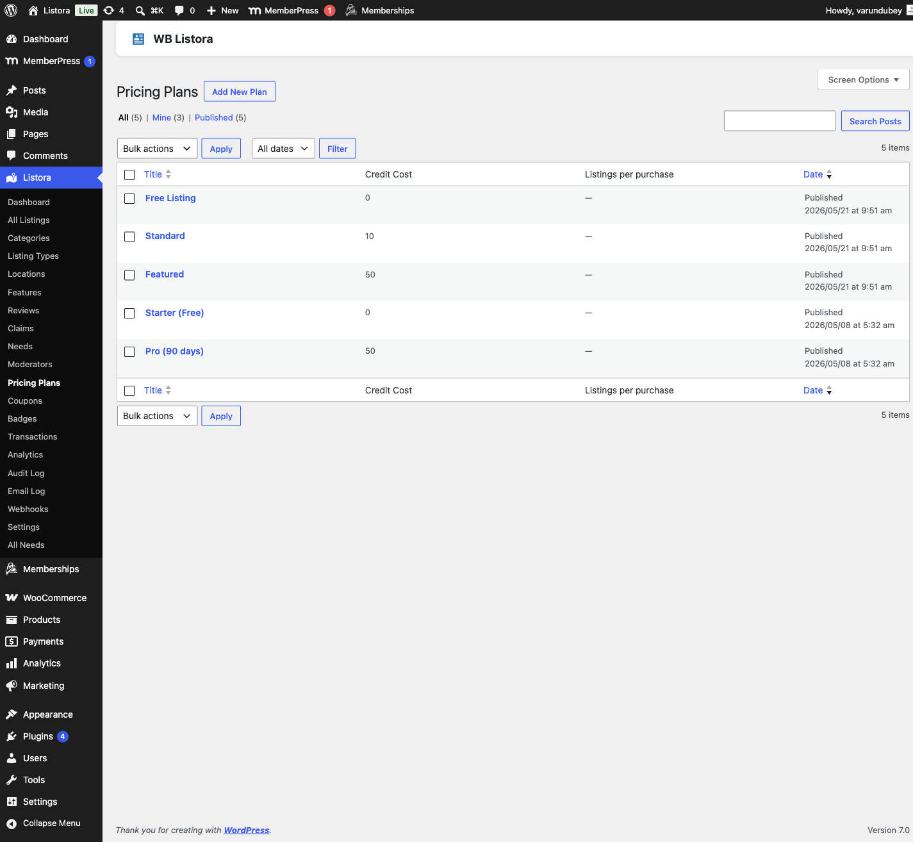

# Pricing Plans

> **Availability:** Pro only. Requires [WB Listora Pro](../getting-started/activating-pro.md) and **Monetization** switched on in **Listora → Settings → Features**.

Pricing Plans define your listing tiers (Free, Starter, Premium, Featured and so on) with their own credit cost, duration, featured placement and extras. A member picks a plan when submitting a listing. The plan controls what the listing costs, how long it stays live, and what it includes.

## What it is

A directory does not monetize evenly. A basic free listing is fine for indexing, while premium placement, longer visibility and featured slots can be paid. Pricing Plans is how you set that up.

Each plan is a **`listora_plan`** post, so you manage plans in the WordPress admin like any other content. A plan carries:

- **Title and description** - what members see when they choose.
- **Plan Cost (credits)** - the credits taken when the plan is activated for a listing.
- **Listing duration** - how many days the listing stays live before it expires.
- **Listing types and categories** - which parts of the directory the plan is offered for.
- **Featured placement** - whether the listing is marked Featured while it is on the plan.
- **What's included** - the points shown on the plan card.

## How charging works

1. A member submits a listing and picks a plan.
2. Listora checks the author's credit balance and the charge is taken in one step. Two listings activated at the same moment cannot take the balance below zero.
3. If the balance covers the plan, the listing goes live, or to review if you moderate new listings.
4. If the balance is short, the listing is saved as **Awaiting Credits**. The member sees a **Buy Credits** link. When they top up, the listing is activated on its own, and goes live or to review as above.

A few rules apply to every charge:

- **A draft is never charged.** Saving a draft takes no credits. The plan is charged once, when the listing is submitted.
- **A listing that has already paid for its plan is not charged again.**
- **The listing's author pays.** If an administrator verifies or submits a listing for a member, the plan is charged to that member, not to the administrator.
- **A coupon applied on the plan step is taken off the price charged.** See [Coupons](coupons.md).
- **A plan that is not published counts as no plan.** A listing is not parked in **Awaiting Credits** for a plan that does not exist.

## Listings need a plan outside the Add Listing page too

Where a listing type sells plans, a member cannot send a listing to review without one from anywhere other than the Add Listing page. This covers the block editor, the Classic Editor, Quick Edit, Bulk Edit, WP-CLI and the WordPress REST API.

What the member sees:

- The listing is saved as a **draft** and a notice says it was not sent to review. The notice links to **Go to Add Listing**, where a plan can be chosen.
- In the block editor, a refused **Submit for Review** keeps the author's work. The listing is saved as a draft, and the message appears with a link to where the plan can be paid for.
- In Bulk Edit, the "updated" message says the listings were saved but not sent to review.
- A listing that is **Awaiting Credits** keeps its status, and the notice links to **Buy credits**.
- An **Expired** listing keeps its status, and the notice links to the member's listings so they can renew it.

Administrators and moderators are not held to this. If you want authors to publish from wp-admin while still selling plans on the front end, return `false` from the `wb_listora_pro_require_plan_on_admin_save` filter.

## How you use it

### As a site owner: create a plan

1. Go to **Listora → Monetization → Pricing Plans** and click **Add New**.
2. Add a title and a description.
3. In **Plan Settings**, fill in:
   - **Listing types** - the types the plan is offered for. Select none for every type. Hold Ctrl (Cmd on Mac) to pick more than one, and use **Clear selection** to start again.
   - **Categories** - limit the plan to listings in certain categories. A plan set to a parent category also covers its child categories. Select none for every category.
   - **Plan Cost (credits)** - `0` makes it a free plan.
   - **Display Price** - an optional label such as "$29/month". It is for display only. The member pays in credits.
   - **Listing duration** - days the listing stays live. Leave it at `0` to use your standard listing expiration from **Settings → General → Default expiration**. Listings never expire when that is `0` too. Set a number of days for plans that should run for a fixed period.
   - **Auto-renew** - renews the listing from the member's credit balance when its duration ends. If the balance is short, the listing pauses instead of expiring and returns when they top up. It needs a listing duration above zero.
   - **Free trial** - days a member gets free on their first activation of this plan.
   - **Max Renewals** - the most times a listing on this plan can be renewed. `0` is unlimited.
   - **Listings per purchase** - sells a bundle, for example one charge for five listings. Leave it at `1` for one charge per listing.
   - **Sort Order** - lower numbers appear first on the plan step.
   - **Featured Plan** - highlights the plan card as the recommended one.
   - **Badge Text** - a short label on the plan card, such as "Most Popular" or "Best Value".
   - **Plan Perks** - **Mark listing as Featured** marks listings on this plan as Featured. This is enforced when the plan is activated.
   - **What's included** - one point per line. Each line shows on the plan card with the duration and the Featured placement that Listora adds itself. Listora does not enforce these points, so list only what you really provide.
4. Click **Publish**.

The Pricing Plans list shows each plan's cost, duration, what it includes, the types it covers, how many listings use it, and whether it is **On sale** or **Not on sale**.

### Taking a plan off sale

To stop offering a plan without touching the listings that already use it:

1. Hover over the plan in the list and click **Stop selling**.
2. The plan shows **Not on sale** and disappears from the plan step for new listings.
3. Listings already on the plan keep it.

Click **Sell again** to offer it once more.

### As a member: picking a plan

1. Start a listing at the Add Listing page.
2. On the **Choose your plan** step, you see the plans offered for the type you picked. Each card shows its cost in credits (or **Free**), how long the listing stays live, and what is included.
3. Pick a plan. The picked card shows a check mark.
4. Continue and submit. The credits are taken when you submit.

On the plan cards:

- **Credits only.** A card shows the cost in credits. The **Display Price** is not printed on the card, so there is only one price to read.
- **Most popular badge.** The **Badge Text** shows only on a plan the member can afford. A plan they cannot afford shows **Not enough credits.** with a **Buy Credits** link instead.
- **Layout.** The cards sit in three columns on wide screens, two on tablets and one on phones.
- **Duration.** A plan with a duration of `0` shows your standard expiration period, or **Never expires** when none is set. The card matches what the listing actually does.

If the balance is short at submission, the listing saves as **Awaiting Credits** and the member tops up through [Buy Credits](credits-and-plans.md). The listing then goes through on its own.

## Settings and options

| Setting | Location | Default | Notes |
|---|---|---|---|
| Monetization | **Listora → Settings → Features** | Off on new installs | Turns on credits, plans, coupons and the payment webhook receiver together. |
| Plans | **Listora → Monetization → Pricing Plans** | - | The `listora_plan` post type. |
| Plan cost key | `_listora_plan_credits` | - | The meta key holding a plan's cost. |
| What's included key | `_listora_plan_highlights` | - | One point per line. |

Developer hooks:

- `wb_listora_pro_plan_cost` (filter) - change a plan's credit cost at activation time.
- `wb_listora_pro_plan_perks` (filter) - change the perks applied to a listing when a plan activates.
- `wb_listora_pro_require_plan_on_admin_save` (filter) - return `false` to let authors send listings to review from wp-admin without a plan.
- `wb_listora_pro_listing_paused` (action) - fires when a submission lacks credits and pauses.
- `wb_listora_pro_listing_resumed` (action) - fires when a top-up resumes a paused listing.

## Related

- [Credits and Plans](credits-and-plans.md) - the credit balance, Buy Credits and Transactions.
- [Coupons](coupons.md) - discount a plan's cost at submission.
- [Analytics](analytics.md) - measure how plan tiers perform.
- [Audit Log](audit-log.md) - records plan activations and credit changes.
