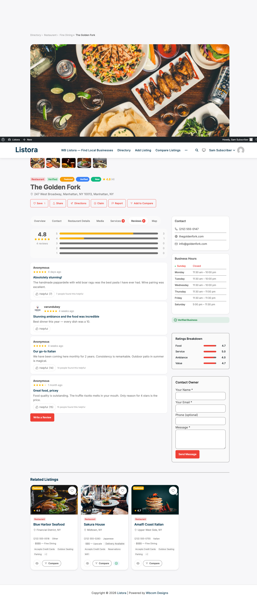

# Reviews System

> **Availability:** Free + Pro. 1-5 star ratings, written reviews, helpful votes, owner replies, and the report-a-review workflow are Free. Pro adds [Multi-Criteria Reviews](multi-criteria-reviews.md) (per-aspect stars) and [Photo Reviews](photo-reviews.md) (reviewers attach images).

## What it does

WB Listora includes a full review system. Visitors rate listings with 1-5 stars, write a review, vote on helpful reviews, report inappropriate ones, and read owner replies - all on the listing detail page without leaving the page.

## Why you'd use it

- Star ratings and reviews build social proof for listed businesses.
- Owner replies show businesses are engaged, which keeps the directory active.
- Helpful votes surface the most useful reviews at the top.
- Moderation tools let you maintain quality without deleting all reviews manually.

## How to use it

### For site owners (admin steps)

1. Go to **Listora > Settings > Reviews** to configure:
- **Auto-approve** - publish immediately or hold for moderation.
- **Minimum length** - the minimum number of characters in a review (0 allows star-only reviews).
- **One review per listing** - prevent duplicate reviews from the same user.
- **Enable replies** - let listing owners answer reviews in public.
2. To moderate held reviews, go to **Listora > Moderation > Reviews**:
- Use **All**, **Pending**, **Approved** and **Rejected**. The list opens on **Pending** when something is waiting.
- Search by listing or review text. Filter by **Any rating**, **Any listing type**, **Any time**, **Owner reply**, or **Reported or not**.
- Bulk approve, reject or delete using the checkboxes and **Bulk actions**.
- Click **Details** on a row to see the whole review, the stars given for each criterion (for listing types with rating criteria), visitor reports, and the owner reply, before you approve or reject it.
- **Reply** is available only on approved reviews. A pending or rejected review is not public, so it cannot be answered. When owner replies are switched off in **Settings > Reviews**, the Details panel says so.
- Open the **Reported by visitors** filter to see reviews that were flagged.
- If another moderator already decided a review, Listora says so and leaves it as it was.

See [Admin Menu and Lists](admin-menu-and-lists.md) for how the list works.

### For end users (visitor/user-facing)

**Submitting a review:**
1. Navigate to a listing detail page and click **Write a Review**.
2. Select a star rating (1-5).
3. Write your review title and text.
4. If the listing type has multi-criteria ratings enabled (<Badge>Pro</Badge>), rate each criterion separately.
5. Click **Submit**. Depending on moderation settings, your review appears immediately or after admin approval.

If your review is waiting for approval, the listing tells you: **You have already submitted a review for this listing. It is waiting for moderation and will appear once approved.** The review form stays closed until the site team decides, so you do not write it twice.

**Editing a review:** If the site allows it, you can edit your review by clicking **Edit** next to your existing review.

**Deleting a review:** Click **Delete** on your own review to remove it.

**Helpful votes:** Click **Helpful** on any review to upvote it. The most helpful reviews rise to the top.

**Reporting a review:** Click **Report** to flag a review as inappropriate. Admins see flagged reviews in **Listora > Moderation > Reviews**.

**Owner reply:** If you own a listing, navigate to the listing's detail page or your **User Dashboard → Reviews** tab and click **Reply** next to any review. Your reply appears below the review, labelled "Owner Response." Only published (approved) reviews can be replied to.

## Tips

- Enable **One review per listing** to prevent review manipulation - users can update their existing review instead of submitting duplicates.
- Use **Auto-approve** only if your directory has a small, trusted user base. For public directories, manual moderation is safer.
- Encourage listing owners to reply to reviews - directories with active owner replies see more review submissions.
- Multi-criteria reviews (Pro) let you define custom rating aspects per listing type. For example, restaurants get Food, Service, Ambiance, and Value; hotels get Rooms, Cleanliness, Service, Location, and Value. See [Multi-Criteria Reviews](multi-criteria-reviews.md).
- Photo reviews (Pro) let reviewers upload images. See [Photo Reviews](photo-reviews.md).

## Common issues

| Symptom | Fix |
|---------|-----|
| Review form not visible | Verify the **Listing Reviews** block is on the detail page template, or that the **Listing Detail** block is present |
| Reviews stuck in Pending | Go to **Listora > Moderation > Reviews** and approve them manually, or enable auto-approve |
| Owner can't see the Reply button | Confirm the user is the listing author or has the `moderate_listora_reviews` capability |
| "One review per listing" not working | Clear your site cache - the duplicate check uses a database query that caching may bypass |

## Related features

- [Blocks Overview](blocks-overview.md)
- [User Dashboard](user-dashboard.md)
- [Business Claims](business-claims.md)
