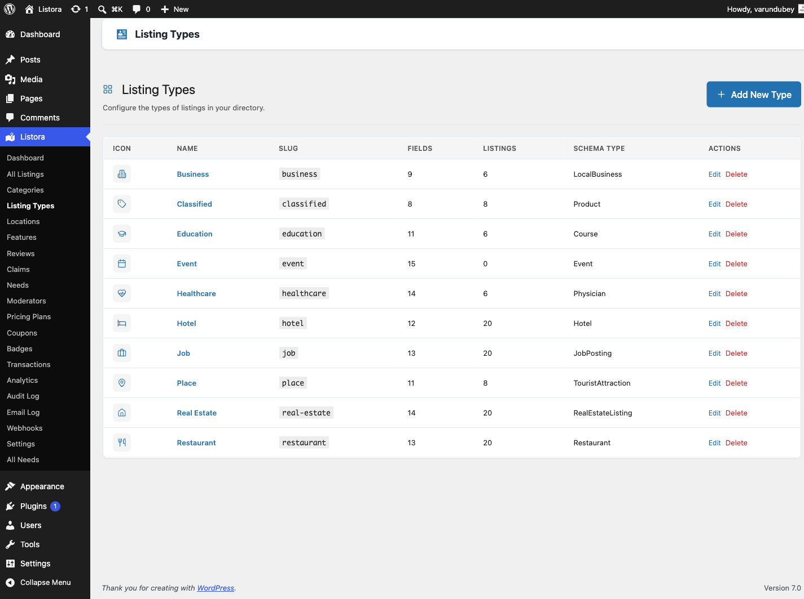

# Listing Type Editor

> **Availability:** Free + Pro.

The admin page where you create, edit, and delete listing types - Restaurant, Hotel, Real Estate, Job, Event, anything else your directory needs. Each type has its own icon, schema mapping, and custom field set. The Type Editor is distinct from the [Listing Types getting-started guide](../getting-started/listing-types.md): the guide explains the CONCEPT; this page is the admin SURFACE where you manage them.



## What it is

Listora ships with the listing-type system as a first-class concept: every `listora_listing` post belongs to exactly one type, and that type determines:

- Which **custom fields** appear in the submission wizard.
- Which **Schema.org type** the JSON-LD on the detail page emits.
- Which **default icon** appears on cards / map markers.
- Which **filterable fields** show up as facets on the search block.
- Whether members can see and use it at all (**Active** or **Draft**).
- Which **demo pack** seeds matching listings when you run `wp listora demo seed --pack={slug}`.

The Type Editor is where you configure all of that. It's the "schema-design" surface for the directory.

## Where it lives

**WP Admin → Listora → Listing Types** (`?page=listora-listing-types`)

Requires the `manage_listora_types` capability.

## The list view

Each row shows the type's icon and name, its **Status**, how many **Fields** it has, how many **Listings** use it, and the Schema.org type under **Search engines see**. Badges next to the name flag things worth a look:

- **Default** marks the type that new submissions start with.
- **No categories** means members can submit this type but its listings will not be filed under any category.
- **None yet** in the Fields column means the type has no fields.

Actions on each row:

- **Edit** opens the editor for that type.
- **Delete...** (behind the **...** menu) opens a panel that explains what will happen. See [Delete a type](#delete-a-type).

**Add New Type** in the page header opens an empty editor.

### Draft and Active

Every type is either **Active** or **Draft**. A **Draft** type is hidden from members while you set it up: it does not appear in the directory's type chips, the Add Listing form or the Browse Categories block, and members cannot submit it. Staff who can manage types still see it. A new type starts as **Draft**. Switch it to **Active** under **Type settings > Status** when it is ready.

## The editor

The editor is one page. The fields you build take the main area. Below them sit three cards, and **Type settings** is in the sidebar. Click **Save Type** at the top to save everything, and **Back to Types** to leave. If you leave with unsaved changes, the browser asks you to confirm.

### Fields

Fields are organised in groups. A group is a section on the form, such as Contact Info or Hours.

- **Add Group** adds a section. Use **Rename group** or **Delete group** on a group's header.
- **Add Field** adds a field to a group.
- Each field row shows its type and whether it is required or shown on the card. **Edit field**, **Delete field**, **Move up** and **Move down** are always visible on the row, so you do not need to hover to find them.

**Edit field** opens the field's settings:

| Setting | What it does |
|---|---|
| **Label** | The name members see. |
| **Key** | The internal name. Keep it unique within the type. |
| **Type** | The kind of input: text, number, select, date, business hours, gallery, map location, and so on. |
| **Placeholder** and **Help text** | Hints shown on the form. |
| **Options** | The choices, for choice fields. |
| **Required** | The form will not submit without it. |
| **Searchable** | The field's value is searched by keyword search. |
| **Filterable** | The field appears as a filter in the search block. |
| **Show on Card** | The field's value appears on the listing card. |

Deleting a field removes it from the form. Values already saved on listings stay in the database, so adding the same field back brings them back.

### Categories and Features

Two cards sit under the fields.

- **Categories**: the categories this type offers. Leave every box unticked to offer all of them.
- **Features & Amenities**: the features this type offers. **None ticked means every feature is offered**, so existing types are unaffected until you narrow one. This stops a Jobs page offering classified-ad amenities.

Each card has one search box (**Find a category** or **Find a feature**) and a **Selected only** tick box, with a count such as "3 of 40 selected". With many categories you search and tick instead of scrolling a long list. Ticking **Selected only** never blocks saving.

### Review criteria

**Review criteria** sets what reviewers rate this type on, instead of the generic Quality, Service and Value. Use **+ Add Criterion** and give each a key and a label. Leave it empty to use the defaults.

### Type settings

| Setting | What it does |
|---|---|
| **Status** | **Active: members can submit and browse it** or **Draft: hidden from members**. |
| **Name** | The label shown everywhere, such as "Restaurant". |
| **Slug** | Generated from the name and cannot be changed after the type is created. |
| **Icon** and **Color** | Shown on cards, chips and map pins. The icon picker offers the icons the front end can draw. |
| **Schema.org Type** | The type search engines see in the listing's structured data. Pick the closest match. |
| **Map enabled**, **Reviews enabled**, **Frontend submission**, **Services enabled** | Turn those features on or off for this type. Saved services are hidden, not deleted, when you turn services off. |
| **Default for new submissions** | Pre-selects this type on the Add Listing form. Only one type is the default at a time, so turning it on here turns it off elsewhere. Ignored if Frontend submission is off. |
| **Listing expires after (days)** | 0 means never. |

## How you use it

### Add a new type

1. Click **Add New Type**.
2. Fill in **Name**, then pick an **Icon**, **Color** and **Schema.org Type**.
3. Under **Fields**, click **Add Group**, then **Add Field** to build the form. For a coworking space you might add "Hot Desk Rate" and "24/7 Access".
4. Tick the categories and features this type offers.
5. Leave **Status** on **Draft** while you test, then switch it to **Active**.
6. Click **Save Type**.

### Edit an existing type

Click **Edit** on a row, make your changes and click **Save Type**.

### Delete a type

1. On the list, open the **...** menu on the row and choose **Delete...**.
2. If no listings use the type, click **Delete type**. Its fields and settings are deleted.
3. If listings use it, the panel says how many and asks where they go. Choose a type under **Move listings to**, then click **Move listings and delete type**.

Moved listings keep their details. Fields the new type does not have are hidden, not deleted. Moving happens before the delete, so no listing is ever left without a type. After deleting, the page tells you how many listings were moved.

Developers: the REST route `DELETE /listora/v1/listing-types/{slug}` answers 409 with `listora_type_has_listings` when listings use the type and `reassign_to` is missing.

### Use a type from CLI

```bash
wp listora listing-types
```

Outputs a table of every registered type with field counts. Useful for verifying after CSV imports.

## How types map to demo packs

Each type has an optional matching demo pack at `demo/{slug}-pack.php`. Listora ships packs for: restaurant, hotel, real-estate, job-board, general, classified, education, healthcare, place. Seed any pack via `wp listora demo seed --pack={slug}` - see [WP-CLI Commands](../developer-guide/wp-cli-commands.md).

## Permissions

| Capability | Who has it | What it gates |
|---|---|---|
| `manage_listora_types` | Administrator (custom roles via [Capabilities](../developer-guide/capabilities.md)) | View Type Editor, create / edit / delete types and their fields |

This cap is the gate for the **entire** taxonomy admin surface - Categories, Locations, Features all check it too. If you grant `manage_listora_types` to a custom role, that role gets full type-system access.

## Related

- [Listing Types (getting started)](../getting-started/listing-types.md) - concept-level overview.
- [Custom Fields](../developer-guide/custom-fields.md) - programmatic field definition + override hooks.
- [Listing Categories](listing-categories.md) - taxonomy WITHIN a type.
- [Capabilities & Roles](../developer-guide/capabilities.md) - who can manage types.
- [WP-CLI Commands](../developer-guide/wp-cli-commands.md) - `wp listora listing-types` for the CLI inventory.
