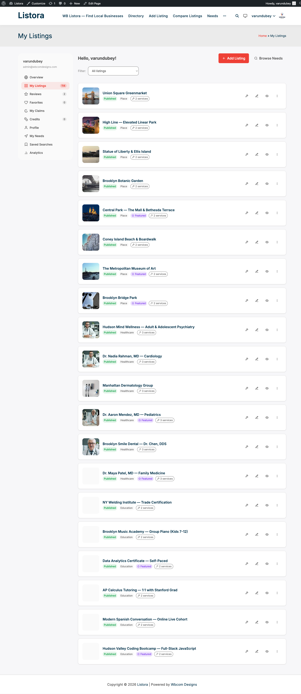

# User Dashboard

> **Availability:** Free + Pro. Free tabs: **Overview**, **My Listings**, **Reviews**, **My Claims**, **Favorites**, **Profile**. The **Credits** tab shows when Pro is active and credits are on sale, or when the member already has a balance or history. Pro also adds [Saved Searches](saved-searches.md), **My Needs** and **My Responses** (see [Needs Marketplace](needs-marketplace.md)).

## What it does

The User Dashboard gives listing owners a self-service frontend panel to manage everything related to their presence in your directory - listings, reviews, favorites, claims, credits, and profile - without needing access to the WordPress admin.

## Why you'd use it

- Business owners update their own listing details 24/7, reducing support requests.
- Claimants track their claim status without emailing you.
- Users view all their activity in one place, improving retention.
- The dashboard respects permissions - users only see their own data.

## How to use it

### For site owners (admin steps)

1. The Setup Wizard creates a **Dashboard** page automatically. If you skipped the wizard, create a new page and add the **User Dashboard** block.
2. Make sure the page is not restricted to logged-in users by your theme or a membership plugin - WB Listora handles its own login redirect.
3. Go to **Listora → Settings → General** to confirm the Dashboard Page is set correctly.

### For end users (visitor/user-facing)

Log in and go to the Dashboard page. The navigation on the left (a row of tabs on small screens) is grouped:

| Group | Tabs |
|---|---|
| **Listings** | **Overview**, **My Listings**, **Reviews**, **My Claims** |
| **Marketplace** | **Favorites**, plus Pro tabs such as My Needs |
| **Account** | **Credits** (when available), **Profile** |

Each item is a real link, so a member can bookmark a tab or open it in a new tab. Counts sit beside the tab name.

#### Overview tab

**Next steps** comes first. It lists what the member can act on right now, each as a link that opens the right place:

- listings that are paused and need credits to go live
- listings waiting for the member to verify their email
- listings awaiting review by the site team
- expired listings that can be renewed
- claims awaiting a decision
- a low credit balance

Below it are clickable stat cards:

| Card | What it shows |
|------|---------------|
| **Active** | Published listings |
| **Pending** | Listings awaiting review |
| **Reviews** | Reviews the member wrote and reviews left on their listings |
| **Saved** | Favorited listings |
| **Claims** | Claims made, with how many are pending |

Clicking a card opens the matching tab. When the site limits listings per role, a **Your Listings** panel shows the member's limit and how many they have left.

#### My Listings tab

- Every submission is listed with a status badge: **Published**, **Pending Review**, **Draft**, **Expired**, **Rejected** or **Deactivated**.
- **Search my listings** finds a listing by name. **All statuses** narrows the list to one status. **Any expiry** narrows it to **Active**, **Expiring soon** or **Expired**. Click **Apply** to filter and **Clear** to start over.
- The list shows 20 listings per page, with numbered pages below it. Filters and search apply across every page, not just the one on screen.
- Click **Edit** to update any field, image or description. The edit form opens inline within the dashboard.
- Click **Add New** to start a new listing without leaving the dashboard.
- Click **Renew Now** on a listing that can be renewed. Use **More** to **Renew**, **Deactivate** or **Reactivate** a listing.
- Each listing row shows a **Services** link. The Services manager opens as a modal dialog: press Esc, click the backdrop, or click the X button to close it (see [Services per Listing](services-per-listing.md)).

#### Reviews tab

- **Reviews I've Written** lists the member's own reviews. A review that is still waiting is labelled **Awaiting approval**, and one the site team did not publish is labelled **Not published**. Reviews marked as spam are not listed.
- **Reviews on My Listings** lists reviews left on the member's listings. Click **Reply** to answer one, or **Edit reply** to change an answer. The reply button follows **Settings > Reviews > Enable replies**.
- The count on the **Reviews** card and tab matches the reviews listed here, and the mobile app shows the same number.
- Both lists are paged.

#### Favorites tab

- See listings you've saved.
- Click the listing title to visit it, or **Remove** to unsave. The card disappears and the count updates straight away.

#### My Claims tab

- See every claim you've submitted, with a status pill: **Pending**, **Approved**, or **Rejected**.
- **Pending** claims show an information message while your claim is under review.
- **Approved** claims show an **Edit Listing** button - click it to start managing that listing immediately.
- **Rejected** claims show the rejection reason if one was provided.

#### Credits tab

The tab appears when the site sells credits, and also stays for any member who has a balance or a history, even if sales are paused.

- **Credit Balance** shows the balance as `10` or `12.5`, not `10.00`. A member with a negative balance sees how many credits they owe and that paid actions are paused until they top up.
- **Buy Credits** shows the packs on sale. When purchases are off, the page says so instead of showing an error.
- **Transaction History** pages through every transaction, not just the latest. Each row has a date, a **Type**, an **Amount** and a note. The types read:

| Type | Meaning |
|---|---|
| **Top-up** | Credits were added. |
| **Refund** | Credits were given back. |
| **On hold** | Credits are set aside for something waiting for approval. |
| **Hold released** | The set-aside credits were released, usually just before they are spent. |
| **Spent** | Credits were used, for example on a listing or an upgrade. |

#### Profile tab

- **Profile photo** shows the member's photo with a **Change photo** button. WordPress draws the photo from Gravatar, or from the community profile when BuddyPress is active, so the button opens whichever one owns it in a new tab. There is no separate upload here.
- Update display name, email, name, phone (private, never shown on listings), website and bio. Changes apply to the WordPress user account.
- **Social Links** adds the platforms you want to show.
- **Email Notifications** has one switch per email, grouped as **My listings**, **Reviews**, **Claims**, **Credits and plans** and **Needs**. Everything is on until the member switches it off. Click **Save Changes** to apply.
- **Blocked Members** lists members the member has blocked, with an **Unblock** button.

## Tips

- Pin the dashboard URL in your navigation menu so users can find it easily.
- Set the Dashboard page to **Wide** template or **Full Width** in your theme for the best layout.
- If a user's listing is expired, the **My Listings** tab shows a **Renew** button - make sure your expiration settings are configured under **Listora → Settings → Submissions**.
- The Credits tab only appears when Pro is active and credits are on sale, or when the member already has a balance or history. A Free-only site does not show it.
- Stat card click-through only works when the matching tab has content. Empty states show a CTA to add a listing or save a favorite.

## Common issues

| Symptom | Fix |
|---------|-----|
| Dashboard shows a login form instead of content | Verify the Dashboard page uses the **User Dashboard** block, not a shortcode from another plugin |
| "My Claims" tab is missing | Business Claims must be switched on under **Listora > Settings > Features** |
| Stats show 0 even though listings exist | Clear your site cache - stat cards are cached for 60 seconds |
| User can see other users' listings | Check no third-party plugin is removing the `edit_listora_listings` capability |

## Related features

- [Business Claims](business-claims.md)
- [Favorites](favorites.md)
- [Frontend Submission](frontend-submission.md)
- [Services per Listing](services-per-listing.md)
