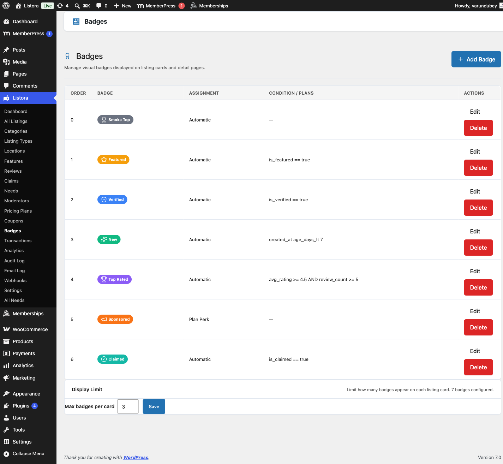

# Verification Badges

> **Availability:** Pro only. Requires [WB Listora Pro](../getting-started/activating-pro.md). Free sites can approve claims but cannot award verification badges.

This page covers two things that work together. The **Verified** badge marks a listing you have vetted. **Badges** are small labels such as "Top rated" or "New" that Listora gives to listings by a rule, by plan or by hand. Jump to [Badges](#badges-labels-on-listing-cards) for the second.

## What it does

Verification badges let you mark individual listings as verified businesses. A badge appears on the listing card in search results and on the listing detail page. Visitors see at a glance that this business has been vetted by the directory.

## Why you'd use it

- Verified badges build trust with visitors making decisions about which business to contact.
- Listings with badges stand out in the search grid, increasing click-through.
- Awarding badges gives business owners an incentive to keep their listing information accurate.
- You control which listings earn a badge - verification is always a manual, admin decision.

## How to use it

### For site owners (admin steps)

Verification badges are managed from the WordPress admin listing edit screen.

**Awarding a verification badge:**

1. Go to **Listora → Listings** and open the listing you want to verify.
2. In the right sidebar, find the **Verification** box.
3. Check **Verified Business** to award the badge.
4. Click **Update** to save.

The box also shows the listing's **Claim status** (**Claimed** or **Not claimed**). That is read-only. Claims are approved from **Listora → Moderation → Claims**.

The badge appears immediately on the listing card and detail page.

**Removing a badge:**

1. Open the listing in the admin.
2. Uncheck **Verified Business** in the **Verification** metabox.
3. Click **Update**.

**Search filter:** Visitors can filter search results to show only verified listings. The `verified_only=true` parameter is supported in the search REST API.

### For end users (visitor/user-facing)

Verification is managed entirely by the site owner - there is no self-service verification flow. Visitors see the badge on:

- **Listing cards** in the search grid.
- **Listing detail pages** near the listing title.

## Badges (labels on listing cards)

Badges are small coloured labels on listing cards and listing pages. Use them for things like **Top rated**, **New**, **Featured partner** or **Hotel**. A badge can be given three ways:

- **Listings that match a rule, automatically** - for example every listing rated 4.5 or higher.
- **Listings on chosen plans** - every listing on the plans you tick.
- **Listings I give it to by hand** - you tick it on the listing's edit screen.

### Managing badges

Go to **Listora → Listing Types → Badges**. The list shows each badge as it looks on a card, **Who gets it** in plain words, and **Listings with it**.

- **Who gets it** reads like a sentence. A rule badge shows "Automatically: Rated 4.5 or higher and 10 or more reviews". A plan badge shows "Listings on Premium, Featured". A manual badge shows "Listings you give it to, on the listing edit screen".
- **Listings with it** is how many published listings hold the badge right now. It shows a dash when a rule uses something Listora does not keep in its search index, because that count is worked out per listing when it is shown.

**Putting badges in order**

Badges show in list order when a listing has more than one. Drag a row to move it, or use **Move up** and **Move down** in the row's actions. The new order is saved right away and the page reloads.

**Badges per listing card**

Under the list, **Badges per listing card** has a **Show up to** field. A card shows at most that many badges, in list order, from 1 to 10. The default is 3. The listing page always shows all of them.

### Creating a badge

1. Click **Add Badge**.
2. Fill in:
   - **Label** - the text on the badge, such as `Top rated`.
   - **Icon** - the name of any icon from the Lucide set, such as `star`, `trophy` or `shield-check`.
   - **Colours** - a **Background** and a **Text** colour. If the text would be hard to read on the background, Listora darkens or lightens it. The **Preview** updates as you change these.
   - **Who gets it** - choose how the badge is given (see the three ways above).
3. For a rule badge, build the rule under **The rule**. A listing gets the badge when every line is true.
   - Click **Add a line**, pick **What to check**, **How to compare** and a value.
   - **Reads as:** shows the whole rule in plain English as you build it, so you can check it says what you mean.
   - Click the remove icon on a line to delete it.
4. For a plan badge, tick the plans under **Plans that include it**. Plans are created under **Listora → Monetization → Pricing Plans**.
5. Click **Save badge**. Listings show the change right away.

**What a rule can check**

| What to check | How to compare | Value |
|---------------|----------------|-------|
| **Average rating** | is at least, is more than, is at most, is less than, is, is not | a number |
| **Number of reviews** | is at least, is more than, is at most, is less than, is, is not | a number |
| **Added in the last…** | (a number of days) | days |
| **Featured** | is, is not | yes or no |
| **Verified** | is, is not | yes or no |
| claimed by its owner | is, is not | yes or no |
| **Listing type** | is, is not | a listing type |

For example, "rated 4.5 or higher and 10 or more reviews" is two lines: **Average rating** is at least `4.5`, and **Number of reviews** is at least `10`.

**Giving a badge by hand**

Open the listing in the admin. In the **Badges** box in the sidebar, tick the manual badges you want. The box also lists the badges the listing already has from rules and plans.

**Deleting a badge**

Use **Delete** in the row. Listings showing the badge lose it straight away.

### Badges tips

- Put the badge you most want seen at the top of the list, since a card shows only the first few.
- Add a **Verified** line to a rule if you want a badge that follows the **Verified Business** checkbox.

## Good to know

Badge pill icons are rendered on the server. They used to be drawn in the browser by a script that did not run on the front end, so a correctly configured badge showed its label with a blank space where the icon belonged. If you configured badges before 1.6.0 and gave up on the icons, they work now with no change on your side.

## Tips

- Establish a verification policy before awarding badges. For example: "We verify businesses that have been claimed and have a physical address confirmed by the owner."
- Verify listings after a claim is approved: approve the claim, then open that listing and tick **Verified Business** in the same session.
- Verified and claimed are separate. A listing can be claimed without being verified, and verified without being claimed. Only verification is set here. Claiming is managed through the claims workflow.
- To filter search results to verified listings only via URL, append `?verified_only=1` to your directory page URL (requires the search block to respect this parameter).
- To see how many listings are verified, create a badge with the rule **Verified** is **yes** and read its **Listings with it** count.

## Common issues

| Symptom | Fix |
|---------|-----|
| **Verification** box not visible | Confirm WB Listora Pro is active and the **Verification System** feature is on in **Listora → Settings → Features** |
| Badge not appearing on listing card | Clear your site and page cache after saving. Check the card is not already showing its limit under **Badges per listing card**. |
| **Badges** screen missing | Confirm **Custom Badges** is on in **Listora → Settings → Features** |
| "Verified only" search filter not working | Confirm the `verified_only` parameter is supported in your version - check the REST API docs |

## Related features

- [Business Claims](business-claims.md)
- [Pricing Plans](pricing-plans.md)
- [Analytics](analytics.md)
- [User Dashboard](user-dashboard.md)
