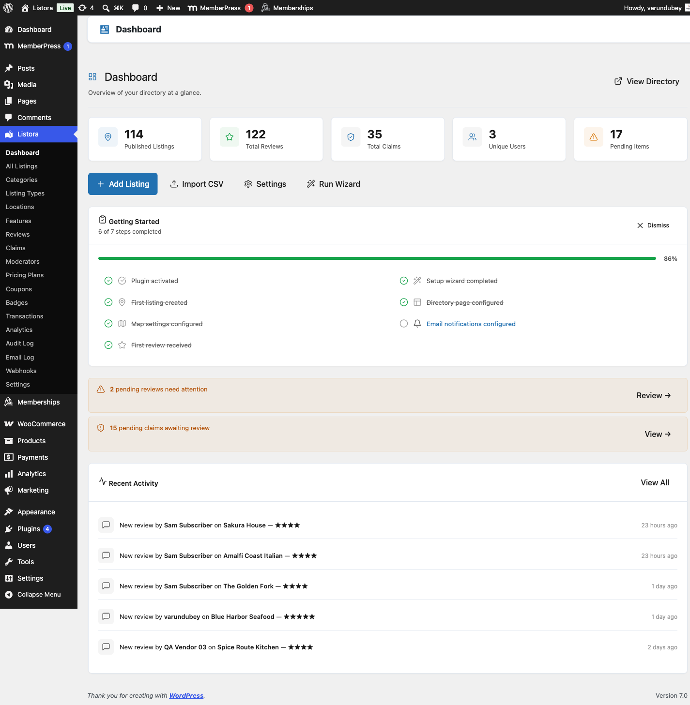
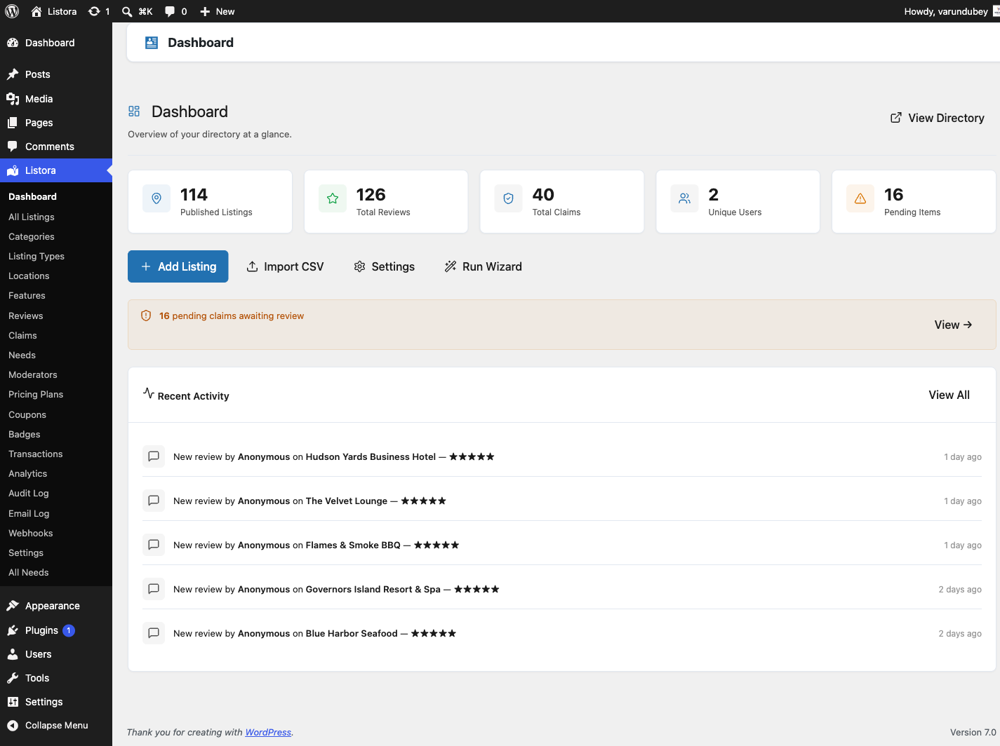

## Installation & Activation

### Requirements

- WordPress 6.4 or higher
- PHP 7.4 or higher
- MySQL 5.7+ or MariaDB 10.3+

### Install the plugin

WB Listora is distributed from wbcomdesigns.com. Both the free plugin and Pro
come from the same downloads page, so searching the plugin directory from inside
WordPress will not find it.

1. Download the plugin ZIP from the [Listora downloads page](https://wbcomdesigns.com/downloads/listora/)
2. Go to **Plugins > Add New > Upload Plugin**
3. Choose the ZIP file and click **Install Now**
4. Click **Activate**

### After Activation

WB Listora automatically:

- Creates 10 custom database tables for fast queries
- Registers the `listora_listing` post type and taxonomies
- Adds the **Listora** menu to your admin sidebar
- Redirects you to the **Setup Wizard**

### Verify Installation

Check that everything is working:

1. Go to **Listora > Dashboard** - you should see the main dashboard
2. Go to **Listora > Settings** - verify settings are accessible
3. Visit any page on your site - no errors should appear

### Troubleshooting

**Plugin won't activate:**
- Ensure PHP 7.4+ is installed (`php -v` in terminal)
- Check for conflicts: deactivate other plugins temporarily

**Database tables not created:**
- Deactivate and reactivate the plugin
- Check your database user has CREATE TABLE permissions

**Menu not appearing:**
- Clear your browser cache
- Check your user role has `manage_options` capability

## Related

- [Installation & Activation](../getting-started/installation.md)
- [Setup Wizard](../getting-started/setup-wizard.md)
- [General Settings](../settings/general-settings.md)
