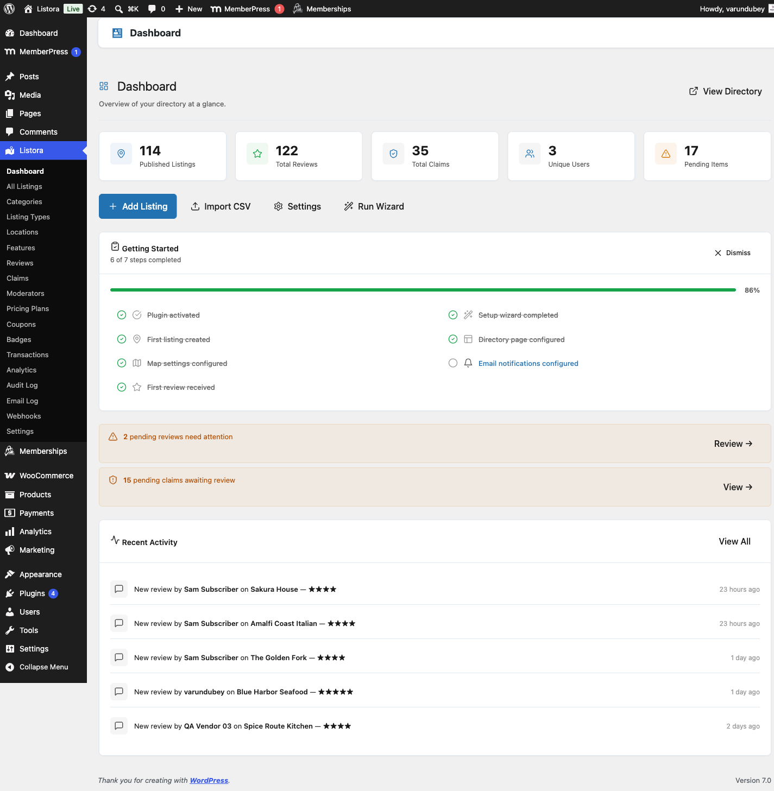

# License Management

> **Pro feature** - requires [WB Listora Pro](activating-pro.md). Free sites do not need a license key.

## What it does

Your WB Listora Pro license key unlocks all Pro features and enables automatic plugin updates directly from your WordPress dashboard. This page explains how to activate, deactivate, and renew your license.

## Why you'd use it

- A valid license is required to receive automatic updates and security patches.
- Deactivating a license on one site lets you move it to another without buying a new key.
- WB Listora automatically re-validates your license weekly so you don't need to manage it manually.

## How to use it

### For site owners (admin steps)

**Activating a license:**

1. Go to **Listora → Settings → License**.
2. Paste your license key into the **License Key** field.
3. Click **Activate License**.
4. A green success notice confirms activation. The license status changes to **Active**.

**Deactivating a license:**

1. Go to **Listora → Settings → License**.
2. Click **Deactivate License**.
3. The key is released from this site. You can now activate it on a different site.

**Renewing a license:**

1. Visit [your wbcomdesigns.com account](https://wbcomdesigns.com/my-account/) and log in.
2. Find your license under **My Licenses** and click **Renew**.
3. After renewing, return to **Listora → Settings → License**. The **Expires** date updates the next time the site checks your license, which happens once a week.

**Checking license status:**

The License settings page shows:
- **Status:** **Active**, **Expired** or **Not activated**.
- **Key**, **Product** and **Licensed to**.
- **Expires:** when the current license period ends.
- **Sites:** how many sites this key is activated on, for example "1 of 3 used".
- **Last verified:** when the site last checked the license.

## What happens when a license expires

- All Pro features remain active - nothing breaks on your live site immediately.
- Automatic updates stop. You will no longer receive new versions or security patches.
- A notice appears in your WordPress admin reminding you to renew.
- To restore updates, renew your license under [Licenses in your account](https://wbcomdesigns.com/my-account/?tab=licenses). The status updates at the next weekly check.

## Tips

- Keep the license key stored somewhere safe (e.g., your password manager). You can always retrieve it from [your wbcomdesigns.com account](https://wbcomdesigns.com/my-account/?tab=licenses).
- If you're moving your site to a new domain, deactivate the license on the old domain first, then activate on the new domain.
- WB Listora validates the license remotely once per week. If your server blocks outbound HTTPS requests, the validation may fail - whitelist `wbcomdesigns.com` in your firewall rules.
- On local development environments, remote validation is skipped. The license activates in local mode and shows a notice confirming this.

## Common issues

| Symptom | Fix |
|---------|-----|
| "Invalid license key" error | Check the key is copied correctly with no extra spaces |
| Status shows "Active" but updates don't appear | Go to **Dashboard → Updates** and click **Check Again** |
| "Too many activations" error | Deactivate the license on other sites from your wbcomdesigns.com account, then try again |
| License check fails on schedule | Your server may block outbound requests; contact your host to allow connections to `wbcomdesigns.com` |

## Related

- [Installing WB Listora Pro](activating-pro.md)
- [License notice](../features/license-notice.md) - where the notice shows and how to dismiss it
- [Credits and Plans](../features/credits-and-plans.md)
