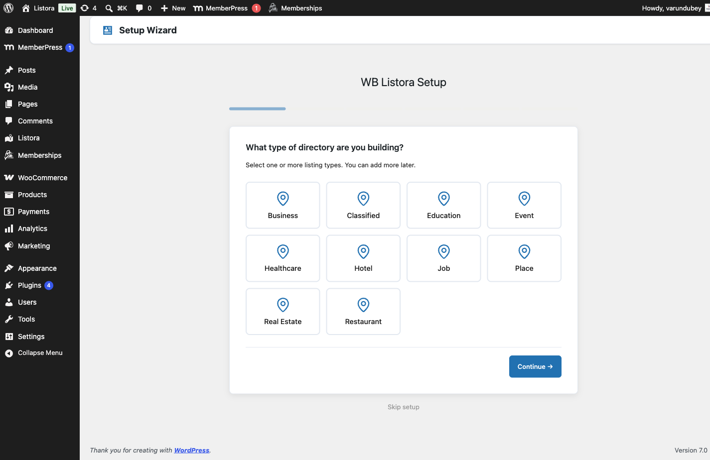

## Setup Wizard

The **WB Listora Setup** wizard opens right after you activate the plugin. It has six steps: **Directory Type**, **Location**, **Map Provider**, **Pages**, **Demo Content** and **Done!**. The bar at the top shows where you are.

Use **Continue →** to go to the next step and **← Back** to return. Nothing is final until you reach the last step, so you can go back and change an answer. To leave without finishing, click **Skip setup** under the form. You can run the wizard later.

### Step 1: Directory Type

The page asks **What type of directory are you building?** and shows one card per listing type. Tick one or more cards, for example Business, Restaurant or Real Estate.

When you finish the wizard, the types you ticked become **Active** and every other type is set to **Draft**. A **Draft** type is hidden from the directory and from the Add Listing form. If you tick nothing, the wizard keeps your earlier choice, or **Business** on a first run.

You can change any type later under **Listora > Listing Types**. See [Listing Types](listing-types.md).

### Step 2: Location

The page asks **Where is your directory based?** Fill in:

- **Country** and **City**
- **Latitude** and **Longitude**
- **This is a global directory (no default location)**

Latitude and longitude set the place maps open on. Country and City are not used to place the map. Tick the global box if your directory is not tied to one place, and no starting point is saved.

You can change the starting point later in **Listora > Settings > Maps**. See [Map Settings](../settings/map-settings.md).

### Step 3: Map Provider

The page asks you to **Choose your map provider**:

- **OpenStreetMap (Leaflet)** needs no API key.
- **Google Maps** is greyed out and marked Pro. It is available with the Pro plugin.

Below the choices:

1. Open the **Tile source** list and pick a source, or choose **My own or another provider**. Picking a source fills in the next two fields.
2. Check **Map tile server**, the address the map images come from.
3. Check **Tile attribution**, the credit your provider asks you to show.

You can leave the tile server empty and choose one later in **Listora > Settings > Maps**. Until you do, the map shows a notice and no background.

### Step 4: Pages

The page shows **Your directory pages**. These three pages are created if they are missing:

- **Directory Home**, the search and listing grid page
- **Add Listing**, the front-end submission form
- **My Dashboard**, where members manage their listings

A page that already exists shows **Edit** and **View** links. A page that is still to come shows "will be created when you continue".

Under **Optional pages**, tick the ones you want: **Browse Categories**, **Featured Listings** and **Events Calendar**. They are created when you continue. A page that is already on your site is marked "already on your site".

The wizard also creates one landing page for each listing type you chose in step 1, unless a page with that address already exists. Each one holds a search bar and a grid for that type.

### Step 5: Demo Content

The page asks **Want some sample listings?** Pick a pack:

- **Restaurant Directory**
- **Job Board**
- **Real Estate**
- **Hotel Directory**
- **General Directory**
- **Classifieds**
- **Education**
- **Healthcare**
- **Places & Attractions**
- **All packs (recommended for QA)**

Then choose **Import selected pack (recommended)**, or choose the skip option, **Skip demo content, I will add my own listings**. The button on this step reads **Finish Setup →**.

The import runs in the background, so you can start exploring while listings appear.

To remove demo content later, go to **Listora > Settings > Advanced**, find **Maintenance** and click **Delete Demo Data**. That also removes the categories and other terms the demo added, the demo member accounts, and the sample analytics. See [Advanced Settings](../settings/advanced-settings.md).

### Step 6: Done!

The page reads **Your directory is ready!** and offers:

- **View Your Directory →**
- **Add Your First Listing**
- **Configure Settings**
- **Go to Dashboard**

If the demo import is still running, the heading reads **Almost there - your demo content is importing** and a progress bar counts the listings. If the import fails, your settings are still saved. Run the wizard again to retry the import.

### What the wizard saves

When you leave the last step, the wizard saves your map start, the map provider and the tile server. It also activates the listing types you picked, saves the default email notification settings if you have never changed them, and marks setup as complete.

### Run the wizard again

1. Go to **Listora > Settings > Advanced**.
2. Under **Setup wizard**, click **Re-run setup**. The **Maintenance** block also has a **Run Setup Wizard** button.
3. If setup is already complete, the page says **Setup is already complete**. Click **Run the wizard again** to continue.

Running it again does not remove what you have set, but it can change which types are active, and it can import demo content a second time.

## Related

- [Installation & Activation](../getting-started/installation.md)
- [General Settings](../settings/general-settings.md)
- [Map Settings](../settings/map-settings.md)
- [Listing Types](listing-types.md)
