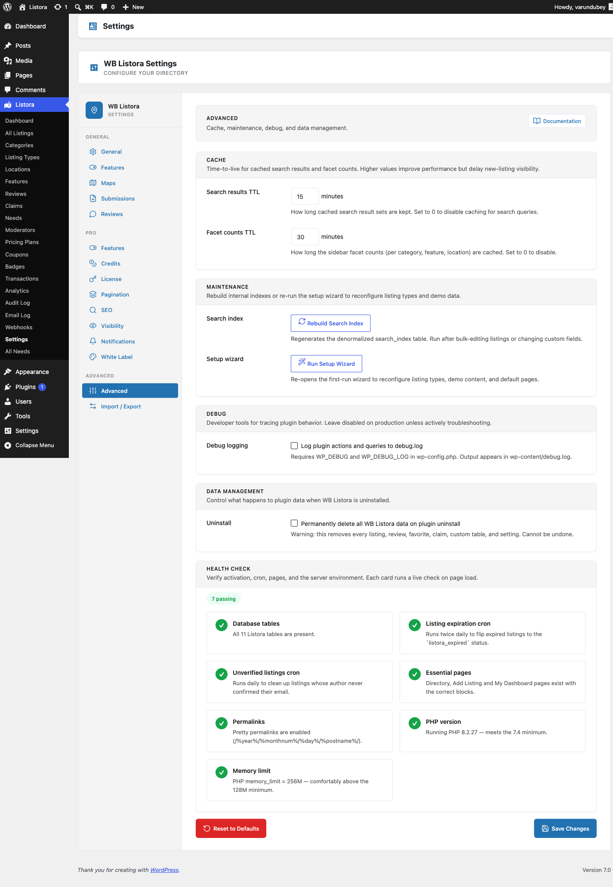

# Advanced Settings

The **Advanced** tab in **Listora → Settings** is where the lower-traffic, higher-impact options live - cache TTLs for search results and facets, the index rebuild trigger, debug logging, uninstall behaviour, and the in-page Health Check report.



## Where it lives

**WP Admin → Listora → Settings → Advanced** (`?page=listora-settings&tab=advanced`)

Requires the `manage_listora_settings` capability.

## Sections

### Cache

How long Listora keeps cached query results before refetching from the database.

| Setting | Default | Range | What it caches |
|---|---|---|---|
| **Search results TTL** | (per defaults) | 0-120 minutes | The full result set of a search query (keywords + filters). Higher = faster page loads + delayed visibility of new listings. Set 0 to disable. |
| **Facet counts TTL** | (per defaults) | 0-120 minutes | The sidebar facet counts (per category, feature, location). Higher = faster page loads + counts drift from reality. Set 0 to disable. |

**When to lower these:** sites where new listings need to appear instantly in search (job boards, classifieds with frequent new posts).

**When to raise these:** high-traffic browse-heavy directories where most visitors land on the same popular searches.

Cache invalidation is automatic on any write: a new listing publish bumps the cache key namespace, so the next read recomputes. The TTL is the upper bound, not the only invalidation trigger.

### Maintenance

| Button | What it does |
|---|---|
| **Rebuild Search Index** | Regenerates the denormalized `wp_listora_search_index` table from current listing data. Use after bulk-editing many listings, changing a listing type's custom fields, or after a CSV import that bypassed the auto-rebuild path. Equivalent to `wp listora reindex` on the CLI. |
| **Run Setup Wizard** | Re-opens the first-run wizard to reconfigure listing types, demo content, and default pages. Doesn't delete anything - wizard is idempotent. |

### Debug

| Setting | Default | What it does |
|---|---|---|
| **Debug logging** | Off | When on, Listora writes per-query and per-action breadcrumbs to `wp-content/debug.log`. **Requires `WP_DEBUG` + `WP_DEBUG_LOG` in `wp-config.php`** - without those, this toggle has no effect. Leave off on production except for active troubleshooting. |

### Data Management

| Setting | Default | What it does |
|---|---|---|
| **Permanently delete all WB Listora data on plugin uninstall** | Off | When on, deactivating + deleting the plugin removes every listing, review, favourite, claim, custom table, and Listora option. **Cannot be undone.** When off (default), data persists so reactivating brings everything back. Same safety pattern as WooCommerce. |

### Health Check

Inline diagnostic panel rendered by `WBListora\Admin\Health_Check::render_section()` - folds the previous standalone Health Check submenu into this tab so all diagnostics + maintenance live together. Shows green / amber / red signals for:

- WordPress version + PHP version + memory limit
- Listora database tables present and indexed
- REST API reachable
- Search index sync % (compares index row count to `publish` listings count)
- Geo index sync %
- Outbound email reachable (last `wp_mail` result)
- Pro license status (if Pro active)
- Cron scheduler (Action Scheduler vs WP-Cron fallback)

Any red flag links to the matching docs page or the relevant settings tab.

## Equivalent WP-CLI

```bash
# Maintenance
wp listora reindex # = Rebuild Search Index button
wp listora reindex --type=hotel # Reindex one type only
wp listora repair # Clean orphan search_index + geo rows
wp listora stats # Show sync % + table sizes

# Cache flush (via WP-CLI cache commands)
wp cache flush # All-cache flush
```

## How to use

1. **First-time tuning:** leave the cache TTLs at defaults. Lower them only if you observe stale data.
2. **After bulk edits:** click **Rebuild Search Index** to refresh the denormalized table.
3. **Troubleshooting:** turn **Debug logging** on, reproduce the issue, check `wp-content/debug.log`, then turn it back off.
4. **Before going live:** set **Uninstall** behaviour according to your data retention policy.
5. **Periodic health checks:** scroll to the inline Health Check section to surface any red flags.

## Related

- [WP-CLI Commands](../developer-guide/wp-cli-commands.md) - every CLI equivalent for the maintenance buttons.
- [General Settings](general-settings.md) - site-wide configuration (slugs, page IDs).
- [Notifications Settings](notifications-settings.md) - email event toggles.
- [Email Log](../features/email-log.md) - recent outbound notification activity.
- [Capabilities & Roles](../developer-guide/capabilities.md) - who can access this tab.
