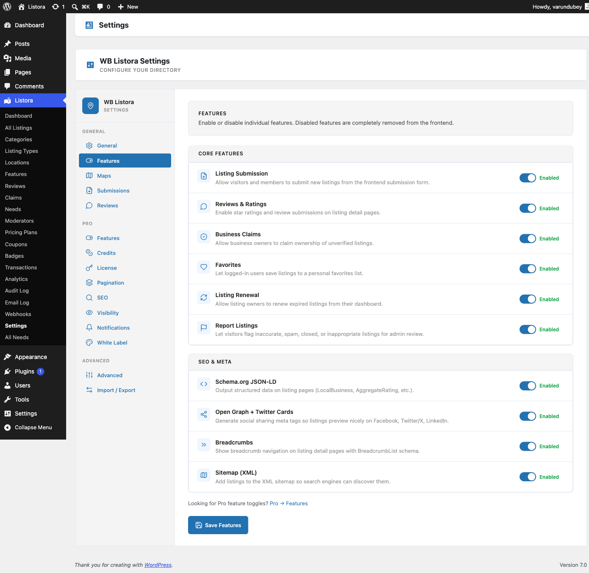

# Features Toggles

The **Features** tab in **Listora → Settings** is your master switchboard for every Listora capability that can be turned on or off site-wide. Toggle a feature off and its code paths short-circuit before any user-facing surface renders - saves CPU, network, and screen real estate when a directory doesn't need a particular capability.



## Where it lives

**WP Admin → Listora → Settings → Features** (`?page=listora-settings&tab=features`)

Requires the `manage_listora_settings` capability.

## How it works

Every toggle is read via `wb_listora_get_features()` and gates the feature class's `boot()` method. When a toggle flips OFF:

- The feature's `init()` hooks don't fire.
- Its REST routes don't register (404 if hit directly).
- Its blocks unregister from the editor inserter.
- Its admin menu items disappear.
- Existing data is **preserved** - toggle back on and everything reappears with state intact.

Toggling does NOT delete listings, reviews, or settings. It's a render-time gate, not a destruction. If you need to wipe data, use **Advanced → Uninstall** + plugin deactivation.

## Free features (grouped under Core Features)

| Toggle | What it gates | Default |
|---|---|---|
| **Frontend Submission** | The `listora/listing-submission` block + `/listora/v1/submit` REST + the Add Listing page wiring | On |
| **Reviews** | Star ratings, written reviews, helpful votes, owner replies, the Reviews tab on listing detail | On |
| **Business Claims** | "Is this your business?" claim modal + `/listora/v1/claims` REST + admin Claims page | On |
| **Favourites** | Heart icon on listing card / detail + `/listora/v1/favorites` REST + Favourites tab on user dashboard | On |
| **Renewal** | Self-service renewal CTA on expired listings + the renewal REST endpoint + email reminders | On |
| **Report Listings** | "Report this listing" link on detail page + admin Reports queue | On |

### SEO & Meta

| Toggle | What it gates | Default |
|---|---|---|
| **Schema.org** | Adds structured-data JSON-LD to every listing detail page | On |
| **OpenGraph** | OG meta tags (including `og:locale`) for social-card preview | On |
| **Breadcrumbs** | Breadcrumb navigation on listing detail and archive pages | On |
| **Sitemap** | Adds `listora_listing` posts to the WP Core sitemap (`/wp-sitemap.xml`) | On |

When a known SEO plugin (Yoast SEO or Rank Math) is active, Listora defers head meta and Schema.org output to it so tags are never duplicated. The detection runs through the `wb_listora_seo_plugin_active` filter (since 1.1.0) - return `true` to force-declare an SEO plugin Listora does not auto-detect, or `false` to keep Listora injecting when your site routes meta through a custom layer.

## Pro features (same Features screen)

Since 1.1.0, when WB Listora Pro is active its feature toggles register into **this same Features screen** - the separate Pro Features tab has been removed, so every feature is managed in one place. Pro toggles appear under their own category headings (Pro features, plus any category a Pro feature declares), and saving the Features screen persists both Free and Pro toggles together. Pro stores its values in the `wb_listora_pro_features` option; read state with `wb_listora_pro_feature_enabled( 'feature_key' )`.

See each feature doc for details: [Advanced Search](../features/advanced-search.md), [Analytics](../features/analytics.md), [Audit Log](../features/audit-log.md), [BuddyPress Integration](../features/buddypress-integration.md), [Coming Soon](../features/coming-soon.md), [Compare Listings](../features/compare-listings.md), [Coupons](../features/coupons.md), [Credits & Plans](../features/credits-and-plans.md), [Digest Notifications](../features/digest-notifications.md), [Google Maps](../features/google-maps.md), [Infinite Scroll](../features/infinite-scroll.md), [Lead Forms](../features/lead-forms.md), [Moderators](../features/moderators.md), [Multi-criteria Reviews](../features/multi-criteria-reviews.md), [Needs Marketplace](../features/needs-marketplace.md), [Outgoing Webhooks](../features/outgoing-webhooks.md), [Photo Reviews](../features/photo-reviews.md), [Pricing Plans](../features/pricing-plans.md), [Quick View](../features/quick-view.md), [SEO Pages](../features/seo-pages.md), [Services per Listing](../features/services-per-listing.md), [Verification Badges](../features/verification-badges.md), [White Label](../features/white-label.md).

## How to use

1. **Open Settings → Features.**
2. **Flip a toggle.** Each toggle has a one-line description directly under its label.
3. **Click Save Features** at the bottom. The page reloads with a "Features updated" notice.
4. **Verify in the relevant UI** - turn off Favourites and the heart icon should disappear from every listing card on the next page load.

There's no "Apply changes" delay - toggles take effect immediately. Caching layers (page cache, object cache) may need a flush if your stack aggressively caches block output.

## Programmatic access

Read and write toggle state from your own code:

```php
// Read.
$enabled = wb_listora_get_features(); // ['submission' => true, 'reviews' => true, ...]
$is_on = ! empty( $enabled['reviews'] );

// Write (admin context only - respects the same nonce + cap as the form).
update_option( 'wb_listora_features', array(
'submission' => true,
'reviews' => false, // hide reviews everywhere
'claims' => true,
'favorites' => true,
'renewal' => true,
'report_listings' => true,
'schema' => true,
'opengraph' => true,
'breadcrumbs' => true,
'sitemap' => true,
) );
```

For Pro toggles, swap `wb_listora_features` → `wb_listora_pro_features` and use `wb_listora_pro_feature_enabled( 'feature_key' )` to read.

## WP-CLI

There is **no WP-CLI command** to toggle features (Pro's previous `wp listora-pro features list / toggle` were never shipped). To script toggles, use `wp option update wb_listora_features '...' --format=json`.

## Related

- [Pro feature catalog](../feature-catalog.md) - what every feature does.
- [General Settings](general-settings.md) - site-wide options (slugs, page IDs, default listing type).
- [Capabilities & Roles](../developer-guide/capabilities.md) - who can edit features.
- [Hooks reference](../developer-guide/hooks-reference.md) - filters for runtime feature gating.
