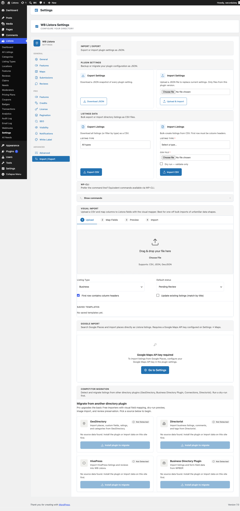

# Import & Export Settings

The **Import / Export** tab in **Listora → Settings** covers two distinct flows - plugin **settings** backup / restore as JSON, and bulk **listings** import / export as CSV. Use it for site clones, version-controlled config rollouts, supplier data feeds, and one-off bulk uploads that would otherwise hit `max_execution_time`.



## Where it lives

**WP Admin → Listora → Settings → Import / Export** (`?page=listora-settings&tab=import-export`)

Requires the `manage_listora_settings` capability.

## Plugin Settings (JSON)

### Export Settings

Click **Download JSON** to get a `wb-listora-settings-{date}.json` snapshot of every plugin setting - `wb_listora_settings`, `wb_listora_features`, `wb_listora_pro_features` (if Pro is active), and every per-tab nested config. Version number embedded so the importer can warn on mismatch.

**Common uses:**

- Back up before a major version upgrade.
- Mirror a staging site's config to production after a tuning session.
- Commit to a private repo so config changes are version-controlled.

### Import Settings

Pick a previously-exported JSON file, click **Upload & Import**, and every value in the file overwrites the matching option key in your database. Only files exported from the same plugin version are accepted - version-mismatch import gets rejected with the version it expected.

**Caution:** import REPLACES, doesn't merge. Settings present on the live site but absent in the JSON get reset to their plugin defaults. Export first if you're not sure.

## Listings Data (CSV)

### Export Listings

Pick a Listing Type from the dropdown (or **All types**) and click **Export CSV**. The exporter streams every published listing of that type into a CSV with the headers Listora's importer expects on the round-trip.

**Columns included:**

- Core post fields: `ID`, `post_title`, `post_content`, `post_status`, `post_author`, `post_date`
- Built-in meta: `address`, `lat`, `lng`, `phone`, `email`, `website`, `_listora_expiration_date`
- Every custom field for the chosen listing type (`meta_*`)
- Taxonomy terms (`listora_listing_cat`, `listora_listing_location`, `listora_listing_feature`)

Default filename: `listora-export-YYYY-MM-DD.csv`. WP-CLI lets you target a specific output path with `--output=`.

### Import Listings

1. Pick the **Listing type** the rows belong to (required - every imported row must belong to a single type).
2. Pick the **CSV file**.
3. Optional: tick **Dry run** to validate without writing.
4. Click **Import CSV**.

**CSV requirements:**

- **First row must be column headers.**
- **Column headers should match field labels OR field slugs** - the importer auto-maps by name on import. Headers it can't match get skipped (you'll see "Column X → SKIPPED" in the inline log).
- **One listing per row.** Empty cells = field skipped, not "set to empty".

The importer streams row-by-row so a 50K-row file uses constant memory. Progress + per-row decisions stream into the inline log; completion summary shows total imported / skipped / errors.

**For multi-type imports**, run separate imports per type (admin UI) or use `wp listora import` per file (CLI).

## WP-CLI equivalents

The same operations as CLI commands - useful when the file is large enough that the admin UI hits `max_execution_time`:

```bash
# Export every restaurant listing
wp listora export --type=restaurant --output=restaurants.csv

# Export every listing with status=publish (default) as a single CSV
wp listora export --output=full.csv

# Validate a CSV without importing
wp listora import file.csv --type=restaurant --dry-run

# Import for real
wp listora import file.csv --type=restaurant
```

Full reference: [WP-CLI Commands](../developer-guide/wp-cli-commands.md).

## Related

- [Import & Export](../features/import-export.md) - full customer-facing feature doc, including JSON + GeoJSON importers.
- [Competitor migration](../migrate-from-directorist.md) - Directorist / GeoDirectory / WPBDP / ListingPro pull-style imports.
- [WP-CLI Commands](../developer-guide/wp-cli-commands.md) - every command this tab calls.
- [Custom Fields](../developer-guide/custom-fields.md) - how field slugs map to CSV column headers.
- [Advanced Settings](advanced-settings.md) - Rebuild Search Index button to run after a bulk import.
