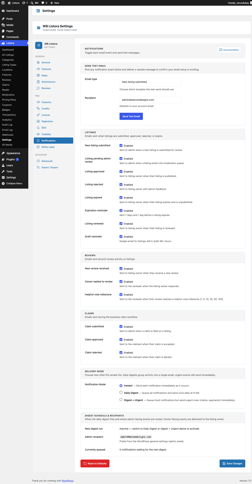

# Notifications Settings

The **Notifications** tab in **Listora > Settings** is where you decide which emails Listora sends, who receives them, and what they say. Every email, from Free and from Pro, is one row in one list.



## Where it lives

**WP Admin > Listora > Settings > Notifications** (`?page=listora-settings&tab=notifications`)

Requires the `manage_listora_settings` capability.

## The email list

Emails are grouped by what they are about: **Listings**, **Reviews**, **Claims** and **Account**. With Pro active, its emails (credits, plans, Needs) are added to the same list under their own headings.

Each row shows:

- A **switch** that turns the email on or off.
- The name of the email, with a **Customized** badge if you changed its wording.
- A short description of when it is sent.
- **To:** who receives it.
- **Edit template** and **Preview** buttons.

### Free emails

| Email | To | When it is sent |
|---|---|---|
| **New listing submitted** | Site admin | A member submits a listing. |
| **Listing pending admin review** | Site admin | A listing enters the approval queue. |
| **Listing reported** | Admins and moderators | A visitor reports a listing. Repeat reports on the same listing are held back for a few minutes, and the listing owner is never told. |
| **Listing approved** | Listing owner | The listing goes live. |
| **Listing rejected** | Listing owner | The listing is rejected. |
| **Listing expired** | Listing owner | The listing expires. |
| **Expiration reminder** | Listing owner | Shortly before the listing expires. |
| **Listing renewed** | Listing owner | The listing is renewed. |
| **Draft reminder** | Listing owner | A draft was left unfinished. |
| **New review received** | Listing owner | Someone reviews the listing. |
| **Owner replied to review** | Reviewer | The owner answers their review. |
| **Helpful-vote milestone** | Reviewer | Their review reaches a number of helpful votes. |
| **Reply reminder** | Listing owner | Approved reviews are still waiting for a reply. |
| **Claim submitted** | Site admin | A member claims a listing. |
| **Claim approved** | Claimant | Their claim is accepted. |
| **Claim rejected** | Claimant | Their claim is turned down. |
| **Verify email to publish** | Submitter | Sent only on the email verification path. |

## Turn an email off

1. Open **Listora > Settings > Notifications**.
2. Find the email and switch it off.
3. Click **Save Changes** at the bottom of the tab.

Emails are on until you switch them off. A switched-off email is not sent and does not appear in the [Email Log](../features/email-log.md). The event itself still happens, so [Webhooks](../features/outgoing-webhooks.md), the Audit Log and [Digest Notifications](../features/digest-notifications.md) still see it.

## Change what an email says

1. Click **Edit template** on the row. The editor opens under it.
2. Change the **Subject** and the **Message**. Leave a field blank to keep the built-in text.
3. Click a placeholder under **Placeholders (click to copy)** to copy it, then paste it where you want it, for example `{listing_title}`.
4. Click **Save Changes**.

To go back to the built-in email, open the editor, tick **Go back to the built-in email on save** and click **Save Changes**. That box shows only for emails you have changed.

Your wording applies to every send, whether it comes from the site, a scheduled job or WP-CLI. It also takes priority over a template file in your theme.

## Preview an email

Click **Preview** to see the email with sample details. The preview uses your saved wording, so save first if you have just edited it. Nothing is sent.

## Send a test email

At the bottom of the tab, **Send a test email** sends any email, filled with sample details, to the address you choose.

| Field | What it does |
|---|---|
| **Email** | The email to send, grouped like the list above. |
| **Send to** | Starts as your own address. Change it to test another inbox. |
| **Send test email** | Sends it and shows the result next to the button. |

If the test arrives, your site can send mail. If it does not, the problem is in your mail setup, such as an SMTP plugin or a mail service. Check the [Email Log](../features/email-log.md) for the error.

## One Save Changes per tab

Every tab saves everything on it with one **Save Changes** button, including the switches and the email wording on this tab. If you try to leave a tab with edits you have not saved, the browser asks you to confirm.

**Reset this tab** sets only this tab back to its defaults. Your other tabs keep their settings.

## What members can switch off themselves

Members see their own list of emails under **Email Notifications** on the **Profile** tab of their dashboard, grouped as My listings, Reviews, Claims, Credits and plans, and Needs. A member who switches an email off stops getting it. See [User Dashboard](../features/user-dashboard.md).

The nudge emails (**Draft reminder**, **Expiration reminder**, **Helpful-vote milestone** and **Reply reminder**) also carry a one-click unsubscribe link in the footer. The link works without signing in and cannot be forged. Developers can change the list with the `wb_listora_unsubscribable_events` filter.

## Listing reports

A report reaches the people who can act on it instead of sitting unread. Switch it off with **Listing reported** in the list above. Developers can tune it with these filters:

| Filter | Default | What it changes |
|---|---|---|
| `wb_listora_listing_report_recipients` | Administrators and moderators | Who is emailed |
| `wb_listora_listing_report_notify_interval` | `5` (minutes) | How often repeat reports on one listing email again |
| `wb_listora_max_stored_listing_reports` | `200` | How many reports are kept per listing |

## Email Log retention

How long sent emails are kept is set on the Email Log page, not here. See [Email Log](../features/email-log.md).

## For developers

```php
// Is an email switched on?
$is_on = wb_listora_notification_enabled( 'listing_approved' );

// Change the default for one email before the saved value is read.
add_filter( 'wb_listora_notification_default', function ( $default, $event_key ) {
	return 'draft_reminder' === $event_key ? false : $default;
}, 10, 2 );
```

Add-ons can add their own emails to the list with `wb_listora_notification_events`, name them with `wb_listora_event_labels`, and supply sample content for **Preview** with `wb_listora_notification_preview`. The preview itself is available at `GET /listora/v1/settings/notifications/preview`. See the [hooks reference](../developer-guide/hooks-reference.md).

## Related

- [Email Log](../features/email-log.md) - every email sent, with the full message.
- [Email Templates](../features/email-templates.md) - the template files and placeholders.
- [Digest Notifications (Pro)](../features/digest-notifications.md) - daily or weekly bundled emails.
- [Hooks reference](../developer-guide/hooks-reference.md) - filter senders, recipients, subjects and bodies.
