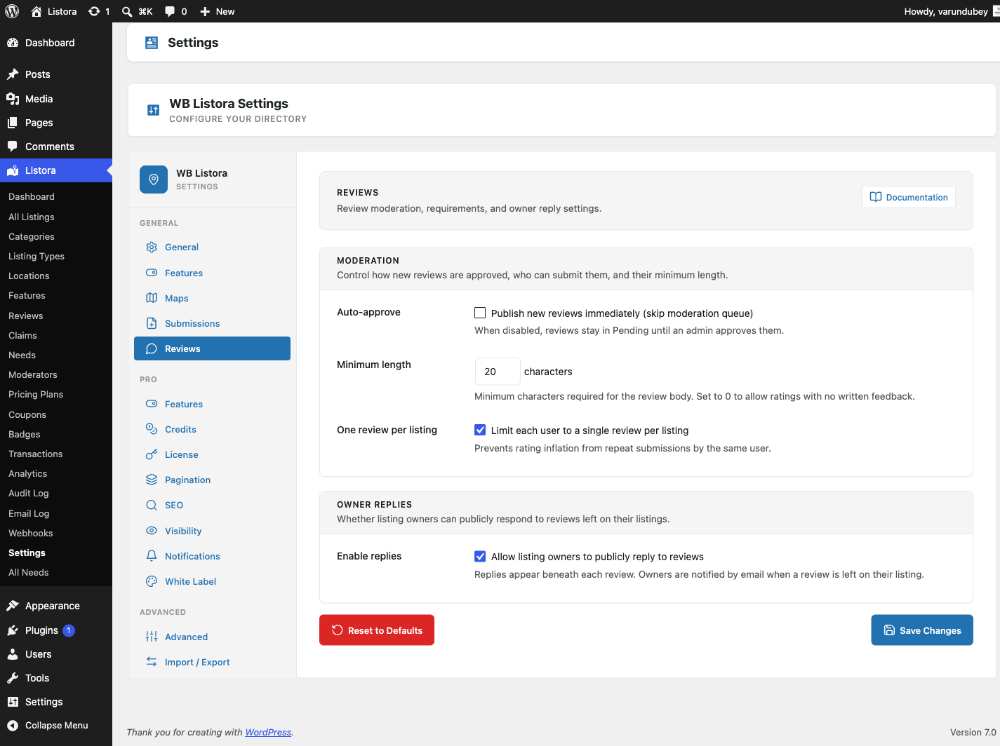

# Reviews Settings

The **Reviews** tab in **Listora → Settings** controls how new reviews are approved, the minimum length required, whether each user can submit more than one review per listing, and whether listing owners can publicly reply. This is the configuration surface for the core [Reviews System](../features/reviews-system.md) feature.

## Where it lives

**WP Admin → Listora → Settings → Reviews** (`?page=listora-settings&tab=reviews`)

Requires the `manage_listora_settings` capability.

## Setting reference

### Moderation

| Setting | Default | What it does |
|---|---|---|
| **Auto-approve** | Off | When on, new reviews skip the moderation queue and publish immediately. When off, reviews stay in **Pending** until an admin approves them from the Reviews admin page or the Moderation Queue. |
| **Minimum length** | 20 characters | The minimum number of characters required in a review body. Set to 0 to allow ratings with no written feedback (star-only reviews). Validation runs both client-side (inline error before submit) and server-side (the REST controller rejects short submissions). |
| **One review per listing** | On | When on, each logged-in user is limited to a single review per listing - prevents rating inflation from repeat submissions. When off, a user can submit multiple reviews on the same listing. |

> **Note on "Guest reviews / Require login":** this setting was removed in 1.0.5. Reviews always require a logged-in user - the REST permission callback at `create_review_permissions()` enforces it directly. The setting never actually changed behaviour, so it was misleading to show. Anonymous reviews would be a separate feature requiring schema, capture UI, dedupe, and spam handling.

### Owner Replies

| Setting | Default | What it does |
|---|---|---|
| **Enable replies** | On | When on, listing owners can publicly reply to reviews left on their listing. Replies appear beneath each review with a "Reply from owner" label. Owners are notified by email when a new review is left. When off, the reply UI disappears and the `POST /reviews/{id}/reply` REST endpoint returns 403. |

## How it interacts with the rest of the system

- **Moderation Queue.** When **Auto-approve is OFF**, every new review lands in Pending and appears in the [Moderation Queue](../features/moderation-queue.md). Admins approve / reject from there or from the standalone Reviews admin page.
- **Email Notifications.** Toggle the `review_received`, `review_reply`, and `review_helpful` events on the [Notifications tab](notifications-settings.md) to control which emails fire on each transition.
- **Capabilities.** The `moderate_listora_reviews` cap gates the approve / reject / hide / spam actions. Editor and Administrator roles have it by default; grant to custom roles via the [Capabilities reference](../developer-guide/capabilities.md).
- **REST.** Settings changes take effect on the next REST request - no flush required. `wb_listora_reviews_settings` filter lets Pro / themes override any value at runtime.

## Recommended configurations

| Goal | Settings |
|---|---|
| **Hands-off public directory** | Auto-approve ON, Minimum length 0, One per listing ON, Replies ON |
| **Hand-moderated reviews** | Auto-approve OFF, Minimum length 50, One per listing ON, Replies ON |
| **Star-only (no written feedback)** | Auto-approve ON, Minimum length 0, One per listing ON, Replies OFF |
| **Premium-vendor directory** | Auto-approve OFF, Minimum length 100, One per listing ON, Replies ON |

## Related

- [Reviews System](../features/reviews-system.md) - the user-facing review feature these settings configure.
- [Moderation Queue](../features/moderation-queue.md) - where pending reviews land when auto-approve is off.
- [Multi-criteria Reviews (Pro)](../features/multi-criteria-reviews.md) - per-category star ratings on top of the base review.
- [Photo Reviews (Pro)](../features/photo-reviews.md) - let reviewers attach photos.
- [Capabilities & Roles](../developer-guide/capabilities.md) - who can moderate.
