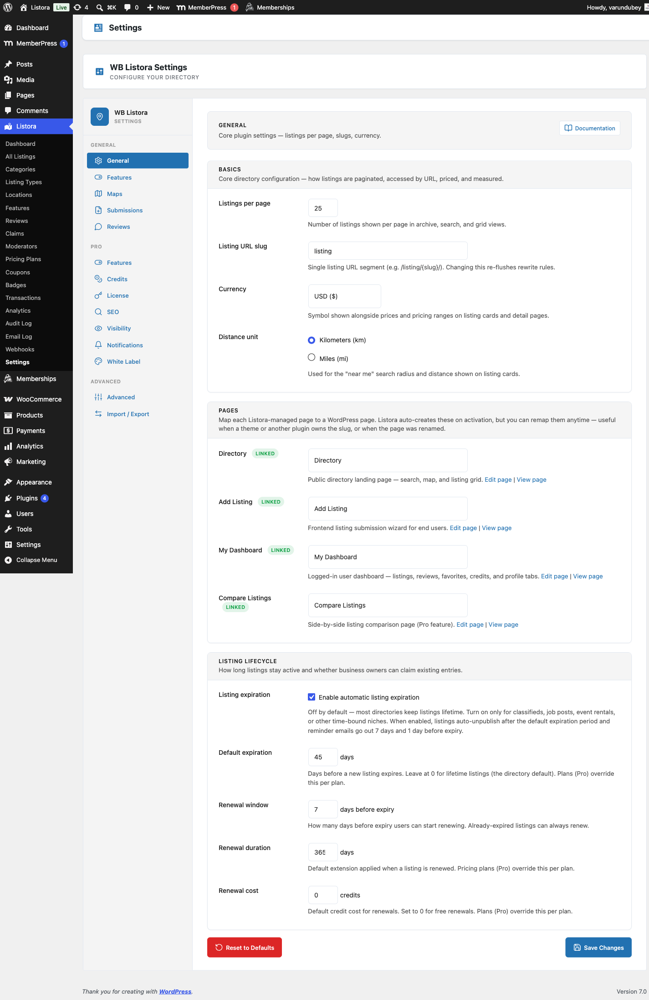

## Submission & Moderation

Open **Listora > Settings > Submissions** for how members add listings and what needs your approval. **Listora > Settings > Credits > Limits** sets how many listings each role may add.



### Account required

Submitting a listing requires a signed-in account. Visitors who are not signed in see a sign-in prompt on the submission form, with a link to register when registration is open on your site. Whether the Add Listing form is available at all follows the **Listing Submission** switch on the **Features** tab.

### Moderation

- **Require admin approval** (default): new submissions stay **Pending** until you approve them.
- **Auto-approve**: listings publish immediately. Combine it with CAPTCHA to reduce spam.

### Submission form style

- **Step-by-step wizard** (default): guided steps with a progress bar. Best when listing types have many fields.
- **Single page form**: every field on one page. Fastest for short forms and returning submitters.

This applies to the standalone Add Listing page. A Listing Submission block whose author chose a layout in the editor keeps that choice. Adding or editing from inside the member dashboard always uses the single page form, because someone already in their dashboard is not arriving cold.

Developers can override the result:

```php
add_filter( 'wb_listora_submission_layout_mode', function ( $mode ) {
    return 'single_form'; // or 'wizard'
} );
```

### Uploads

- **Max file size**: the largest image or attachment, in MB. The default is 5. Your server's `upload_max_filesize` is the real ceiling.
- **Max gallery images**: how many gallery images one listing may carry, from 1 to 100. The default is 20.

### CAPTCHA

Choose **None**, **Google reCAPTCHA v3** or **Cloudflare Turnstile**, then paste the **CAPTCHA site key** and **CAPTCHA secret key** from the provider. It protects the submission form and both review forms.

### Social Links

Tick the platforms the **Social Links** field offers. Unticking one hides it on the submission form, the listing sidebar, the dashboard profile tab and the structured data. Links members already saved are kept, just not shown.

### Which listing types accept submissions

This is set per type. Turn **Frontend submission** off in the [Listing Type editor](../features/type-editor.md) for types only you should create. A type set to **Draft** does not accept submissions at all.

### Listing expiration and renewal

These live on the **General** tab. See [General Settings](general-settings.md).

### Listing limits per role

**Listora > Settings > Credits > Limits** controls how many listings each role may submit.

1. Choose a **Limit period**: **Lifetime** (every listing ever submitted), **Calendar month** (resets on the 1st) or **Rolling 30 days**.
2. In **Per-role limits**, each role has an **Unlimited** tick box and a **Listings per period** number. Only roles that can submit listings are listed, so roles added by shop or project plugins do not clutter the table.
3. **Default limit** applies to a member whose roles are all missing from the table, for example roles added by another plugin.
4. Under **Beyond-limit behavior**, choose **Block submission** or **Allow with credit cost**. With the second option, set **Overflow cost**, the credits charged for each extra listing. An overflow cost of 0 turns the overflow path off, so the limit becomes a hard stop.
5. Click **Save Changes**.

When a member holds more than one role, the most generous limit wins, and any role marked **Unlimited** makes them unlimited. For the same reason, setting a role to 0 does not stop a member who also holds another listed role. Administrators are always unlimited.

## Related

- [Installation & Activation](../getting-started/installation.md)
- [Setup Wizard](../getting-started/setup-wizard.md)
- [General Settings](../settings/general-settings.md)
- [Frontend Submission](../features/frontend-submission.md)
