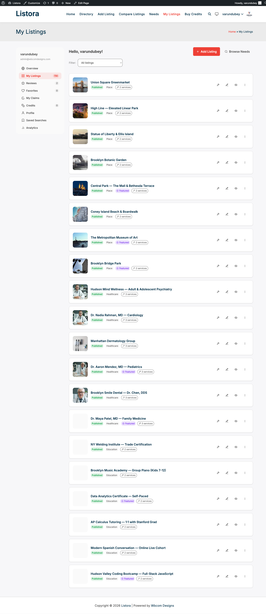

# Listing Owner Journey

You run a business. The directory operator (Site Owner) has invited you — or you found the site organically and want to claim your free listing. This is what you experience from "I want my business in this directory" through to "I'm running ongoing renewal cycles and replying to reviews."

## Who this is for

- **Restaurant / shop / studio owner** wanting to be discovered locally
- **Service professional** (photographer, electrician, designer) hunting for leads
- **Hotel / B&B operator** building presence in a city guide
- **Real estate agent** posting listings or running a personal directory
- **Job board poster** publishing openings

## Stage 1 — Discover the directory + decide to submit (~3 minutes)

What you expect: **understand within 30 seconds whether this directory matters for my business.**

What you experience:

1. You land on the directory home (Google, social, word of mouth).
2. Search for your category — see existing listings, get a sense of quality + traffic.
3. Find an "**Add Listing**" CTA in the header or hero. Click.
4. Either:
   - **Already a member?** Log in.
   - **Guest submission allowed?** Skip directly to the wizard (you'll verify your email at the end).
   - **Free signup required?** Quick register, then continue.

## Stage 2 — Submit your listing (~10-15 minutes)

What you expect: **a guided form, not a 50-field PHP relic. Save drafts. Don't lose my work.**

What you experience:

1. The [submission wizard](../features/frontend-submission.md) walks you through 4-6 steps depending on your listing type:
   - **Basics** — title, type, category, location.
   - **Details** — description, custom fields (cuisine, price range, capacity, …).
   - **Media** — featured image, gallery, video URL.
   - **Contact** — phone, email, website, social links (7 platforms supported).
   - **Hours** — business hours per day, timezone, 24/7 toggle.
   - **Services** (Pro / optional) — sub-products under the listing (e.g. menu items, service tiers).
   - **Plan** (Pro) — pick a plan if the operator charges for placement.
2. Drafts auto-save as you go. Step back to any step without losing data.
3. Map pin is draggable — pick the exact storefront.
4. Submit. Status depends on operator setting:
   - **Auto-publish** → live immediately
   - **Pending review** → email confirms submission, you'll get another when approved/rejected
   - **Awaiting credits** (Pro) → "Pay X credits to activate" if your plan requires it

## Stage 3 — Optional: Claim an existing listing (~5 minutes)

What you expect: **if my business is already in the directory (someone else added it), I should be able to take ownership without making a duplicate.**

What you experience:

1. Find your listing on the directory.
2. Click **"Claim this business"** at the top of the listing.
3. Upload proof of ownership (utility bill, business license, …).
4. Admin reviews → approves → `post_author` transfers to you. You're now the owner.
5. You can edit, reply to reviews, manage services from your dashboard.

## Stage 4 — Manage your listings (ongoing)

What you expect: **a clean dashboard where I can see status, edit, renew, reply to reviews — no WordPress admin needed.**

What you experience:

Visit **My Listings** (`/my-listings/`) — the [user dashboard](../features/user-dashboard.md):

| Tab | What you do here |
|---|---|
| **Listings** | Edit any owned listing, see status (Live / Pending / Expired / Awaiting Credits / Deactivated), renew/feature/deactivate per-row |
| **Reviews** | See reviews received, reply publicly, mark helpful |
| **Favorites** | Listings you've heart-saved across the site (for research or your own customers) |
| **Saved Searches** (Pro) | Recurring search alerts ("Notify me when a new restaurant appears in Brooklyn") |
| **Needs** (Pro) | Buyer-posted requests matching your listing's type + location |
| **My Responses** (Pro) | Quotes you've sent in response to buyer needs |

## Stage 5 — Get found + engage (ongoing)

What you expect: **traffic, reviews, leads. Not just a static directory entry.**

What you do:

- **Reply to reviews** — public replies build trust and bump SEO.
- **Add Services** (Pro) — sub-products under your listing get their own search facets and comparison.
- **Featured listing** (Pro) — spend credits to rotate into the homepage carousel for N days.
- **Lead Form / Contact Owner** — every new lead arrives at your account email with Reply-To set so a one-click reply goes straight to the visitor.
- **Verification badge** (Pro) — when the admin verifies you, the badge appears on your card + detail + search results, boosting click-through.
- **Saved searches** (Pro) — set alerts for new posted needs in your category so you can respond fast.

## Stage 6 — Respond to buyer needs (Pro, ongoing)

What you expect: **if this is a [reverse marketplace](../features/needs-marketplace.md), I want to see what buyers are looking for and respond fast.**

What you experience:

1. Visit **/needs/** or your dashboard → **Needs** tab.
2. Filter by type / urgency / location — see open requests.
3. Click a need that fits your business — read the full request.
4. **Respond** with a message + quote (price + lead time).
5. Buyer reviews your quote. If they accept, they reach out directly via the message thread.
6. Your responses live in **My Responses** tab — track status.

## Stage 7 — Renewal cycle (every N months)

What you expect: **plenty of warning before my listing expires, easy one-click renewal.**

What you experience:

1. **7 days before expiration** → email reminder ("Your listing renews in 7 days").
2. **1 day before** → second reminder.
3. **At expiration** → if you have auto-renew credits, the listing extends automatically. Otherwise it transitions to **Expired** status (hidden from public).
4. **From dashboard** → click **Renew** on the expired row, confirm the credit cost, listing transitions back to **Live**.

## What you do NOT have to do (because Listora handles it)

- ❌ Worry about HTML / CSS / shortcodes — wizard is form-based.
- ❌ Track expiration manually — auto-reminder cron fires twice before expiry.
- ❌ Email new leads to a spreadsheet — Lead Form delivers each lead to your inbox with Reply-To set.
- ❌ Reload your dashboard for status — REST + IAPI keep state in sync.
- ❌ Re-upload photos if you change your plan — gallery persists across plan changes.

## Common pitfalls

| Pitfall | Avoid by |
|---|---|
| Listing rejected for missing details | Read the rejection email — admin includes specific feedback |
| Email verification link expired | Click "Resend" in the same screen — 5-min rate-limit only |
| Lead form fills not arriving | Check your spam folder + verify the email in your WP profile is current |
| Renewal failed | Buy more credits from **/buy-credits/** then click Renew again |
| Photos look small in the gallery | Upload at 1200px or larger — Listora handles thumbnail generation |

## Related

- [Site Owner Journey](site-owner.md) — what your directory operator does.
- [Visitor Journey](visitor.md) — what your potential customers experience.
- [User Dashboard](../features/user-dashboard.md) — full dashboard feature doc.
- [Listing Lifecycle Actions](../features/listing-lifecycle.md) — renew / feature / deactivate / report.
- [Frontend Submission](../features/frontend-submission.md) — the wizard in depth.
