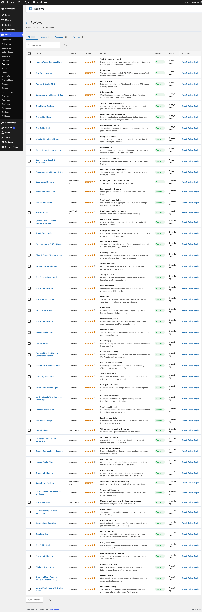
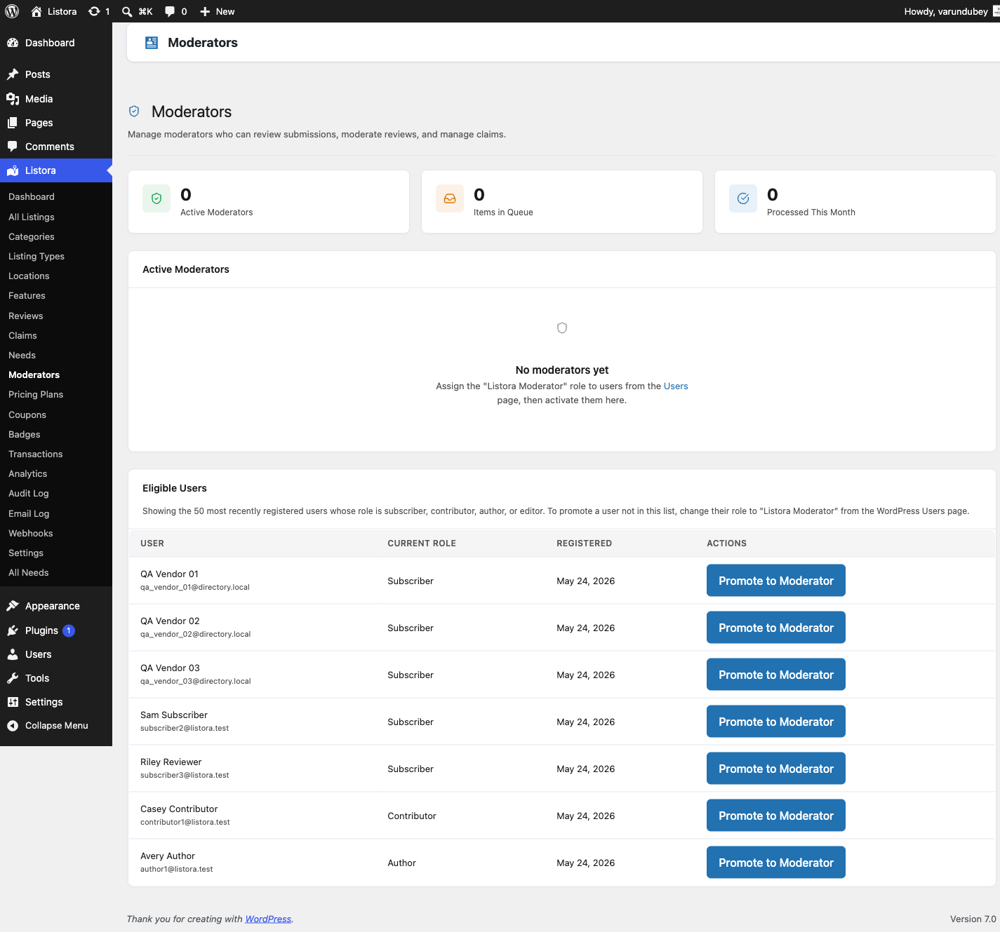

# Moderator Journey

You're not the site owner. You don't need access to settings, payment gateways, or plugin code. You DO need to approve / reject / triage everything the operator delegates to you: pending listings, flagged reviews, pending claims, user reports. The Pro **[Moderators feature](../features/moderators.md)** gives you exactly those tools and nothing more.

## Who this is for

- **Community manager** for a large directory
- **Junior team member** doing first-line review approval
- **Vetted vendor** trusted to approve their own category's listings
- **Outsourced agency** handling moderation for multiple client directories

## Stage 1 — You get invited (~5 minutes, one-time)

What happens:

1. Site Owner goes to **Listora → Moderators** in the admin.
2. Adds your WordPress user account to the moderators list with selected scopes (Listings / Reviews / Claims / Reports).
3. You receive an email notification with the link to your moderator queue.
4. Log in — you see **Moderators** + **Moderation Queue** in your admin sidebar but NOTHING ELSE Listora-related (no Settings, no Pricing Plans, no Webhooks).

## Stage 2 — Daily triage (~15-30 minutes/day)

What you expect: **one inbox, every pending item, with enough info to decide approve/reject in seconds.**

What you do:

1. Open **Listora → Moderation Queue** OR your assigned dashboard widget.
2. See all pending items grouped by type:
   - **Pending listings** — title, type, location, submitter, submitted-on
   - **Pending reviews** — rating, content preview, reviewer, listing context
   - **Pending claims** — claimant + proof file + claimed listing
   - **Reported items** — what was reported, by whom, with reason
3. For each item: **Approve** / **Reject** (with optional admin note) / **Edit** / **Hide**.
4. Bulk-select up to 100 items and bulk-moderate from the list view.
5. Status notifications fire automatically — submitters get the appropriate email.

## Stage 3 — Per-listing review (~30 seconds per item)

What you expect: **see the listing exactly as a visitor would, plus admin context (IP, submitter history, anti-spam flags).**

What you experience:

1. Click into a pending listing.
2. Top of the page: admin-only bar showing submitter, IP, anti-spam flags, prior approval count.
3. Below: the listing rendered as visitors will see it.
4. Approve → transitions to `publish`, owner gets `listing_approved` email.
5. Reject → transitions to `listora_rejected`, owner gets `listing_rejected` email with the note you wrote.

## Stage 4 — Claim approval (~1 minute per item)

What you expect: **verify the proof, transfer ownership, move on.**

What you do:

1. Open the pending claim.
2. Download / preview the proof document the claimant uploaded.
3. If legitimate → **Approve** → `post_author` transfers to the claimant + they get `claim_approved` email.
4. If suspicious → **Reject** + add a note (e.g. "Proof document was for a different business — please re-upload").

## Stage 5 — Review moderation (~10 seconds per item)

What you expect: **scan the review, decide if it's spam / personal attack / valid criticism.**

What you do:

1. Look at the review row in the Reviews queue.
2. Quick decision based on rating + content + reviewer history:
   - **Approve** → goes live; reviewer + listing owner get notification emails.
   - **Reject** → goes to `rejected` status; reviewer is silently notified (no public airing of the issue).
   - **Edit** → fix typos or trim profanity without rejecting (rare).
   - **Mark as spam** → routed to Akismet learning.

## Stage 6 — Handle reports (~1 minute per item)

What you expect: **see WHY something was reported, decide.**

What you do:

1. Reports queue shows: reporter, reported item, reason (spam / inappropriate / wrong category / duplicate / other), optional note.
2. For each report:
   - **Resolve as no-action** → mark addressed, no change to the reported item.
   - **Hide the item** → remove from public view pending Site Owner review.
   - **Delete** → permanently remove (requires extended caps).

## What you can and cannot do

| You CAN | You CANNOT |
|---|---|
| Approve / reject pending listings | Edit Settings |
| Approve / reject pending reviews | Manage Pricing Plans |
| Approve / reject business claims | Manage Coupons |
| Resolve reports | View Webhooks |
| Hide flagged content | View Audit Log |
| Add admin notes | Manage Moderators (only Site Owner can) |
| See pending-item counts in dashboard | See revenue / Transactions |
| Use bulk-moderate operations | Modify the moderator list |

This separation is enforced by [capability gating](../developer-guide/capabilities.md) — the moderator caps grant exactly these surfaces and nothing else.

## What you do NOT have to do

- ❌ Worry about email delivery — auto-notifications fire on every transition.
- ❌ Manually track who reported what — Reports queue is the audit trail.
- ❌ Edit settings to enable a feature — Site Owner controls toggles.
- ❌ Manage the moderator list yourself — only Site Owner can add/remove moderators.

## Common pitfalls

| Pitfall | Avoid by |
|---|---|
| Approving a low-quality listing because you didn't read the description | Always click into the listing detail before approving |
| Rejecting a valid claim because proof format is unfamiliar | Ask the Site Owner; err on side of "more info" via admin note |
| Bulk-approving without spot-checking | Sample 1-in-10 manually before bulk-action |
| Reviewing the same item twice | Approved/rejected items disappear from queue — use filter chips to re-find |

## Related

- [Site Owner Journey](site-owner.md) — what the operator does (different scope).
- [Listing Owner Journey](listing-owner.md) — what submitters experience (different role).
- [Moderators feature](../features/moderators.md) — full moderators feature doc.
- [Moderation Queue feature](../features/moderation-queue.md) — the unified queue.
- [Capabilities & Roles](../developer-guide/capabilities.md) — the cap map that gates everything above.
- [Audit Log](../features/audit-log.md) — every moderation action is recorded.
