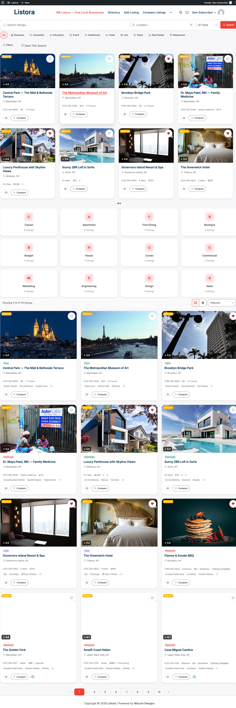
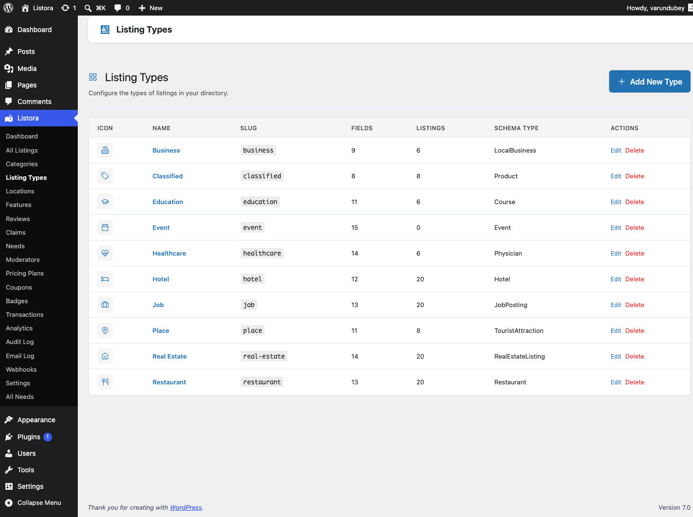
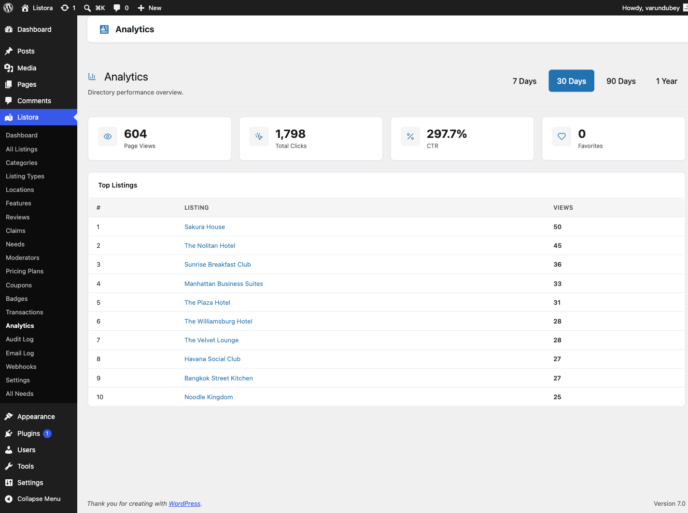

# Site Owner Journey

You operate the directory. You decide what gets listed, who can submit, how reviews are moderated, and how (or whether) money changes hands. This is your end-to-end playbook from a fresh WordPress install to a fully monetized vendor directory.

## Who this is for

- **Operator of a community directory** (city food guide, niche industry directory, local services hub)
- **Lead-gen site owner** monetizing via paid placement / verified badges
- **Agency** building a multi-tenant directory product for a client
- **Marketplace builder** layering vendor signups on top of a content site

## Stage 1 — Get the site standing up (Day 1, ~30 minutes)

What you expect from a directory plugin: **install, see something usable in minutes, no wrestling with placeholder pages.**

What you do:

1. **Install Free** from WordPress.org plugin search ("WB Listora"). Activate.
2. The [Setup Wizard](../getting-started/setup-wizard.md) auto-runs — pick 1-2 listing types (Restaurant, Hotel, Real Estate, Job, Event, Classified, …), set your default location, choose your slug structure.
3. Wizard auto-creates 3 pages: **Add Listing**, **My Listings**, **Directory** — already wired with the correct blocks.
4. Optionally load a demo pack: `wp listora demo seed --pack=restaurant --with-users --reindex` adds ~20 realistic listings + 4 test users so you can browse a populated site immediately.
5. Visit your site — the Directory page shows search + filters + grid. Pages live. You're operational.

What you're left with: a working directory with real-looking content, ready to demo to clients or share with early vendors.

## Stage 2 — Customize the look (Day 1-2, ~1 hour)

What you expect: **make it look like YOUR brand, not "another WP plugin."**

What you do:

- Open **Settings → General** — adjust permalink slugs (`listing-cat`, `listing-location`, `listing-feature` defaults work but you can rename to match your taxonomy language).
- Visit **Listora → Listing Types** — change icons, rename labels, mark a default type for new submissions.
- Tweak any block's Inspector (per-instance padding, color, layout) — every block has 20 standard responsive attributes.
- Override the listing card template if needed: copy `wp-content/plugins/wb-listora/templates/blocks/listing-card/card.php` to `{your-theme}/wb-listora/blocks/listing-card/card.php` and edit.

## Stage 3 — Build your taxonomy (Day 2-3, ~2 hours)

What you expect: **a clean, scannable browse experience — visitors find what they need without overwhelm.**

What you do:

1. **[Categories](../features/listing-categories.md)** — define your top-level groupings (food, professional services, retail, …) and 2-3 levels of children.
2. **[Locations](../features/locations.md)** — build your geo tree (Country → State → City → Neighborhood as deep as you need).
3. **[Amenities / Features](../features/amenities.md)** — flat list of 10-15 attributes customers will filter on (WiFi, Parking, Pet Friendly, Outdoor Seating, …). Keep it short.

Rule of thumb: customers can name 5-10 categories before getting bored. Anything beyond that should be a secondary filter (Feature) or a sub-category.

## Stage 4 — Configure submissions (Day 3, ~30 minutes)

What you expect: **decide who can submit, whether you moderate, how much it costs.**

What you do:

- **Settings → Submissions** — toggle guest submissions on/off, set the per-listing expiration window, enable auto-publish or moderation-queue flow.
- **Settings → Security** — turn on reCAPTCHA v3 OR Cloudflare Turnstile (Turnstile is GDPR-friendly).
- **Settings → Notifications** — confirm the per-event emails are on; send a test email to confirm SMTP works.
- **Settings → Reviews** — auto-approve or hand-moderate; set minimum review length.

## Stage 5 — Activate Pro (Day 3-4, ~20 minutes) — optional

What you expect: **if you're charging vendors or need lead capture / verification badges / multi-criteria reviews, add Pro without rebuilding what Free already gives you.**

What you do:

1. Install [WB Listora Pro](../getting-started/activating-pro.md) → activate → run the Pro setup wizard.
2. Configure your **[credit packs](../features/credits-and-plans.md)** (e.g. "5 credits / $25", "20 credits / $80", "100 credits / $300").
3. Define your **[pricing plans](../features/pricing-plans.md)** (Basic / Featured / Premium with credit cost + duration + entitlements).
4. Toggle the Pro features you actually need from **Settings → Pro Features**: Lead Forms, Verification, Badges, Audit Log, Analytics, Compare, Quick View, Coming Soon, etc. (You can leave the rest off.)
5. Add a payment integration — easiest path is the bundled [WooCommerce bridge](../features/payment-webhooks.md) or the direct [Stripe webhook receiver](../developer-guide/rest-api.md).

## Stage 6 — Open the floodgates (Week 1+)

What you expect: **start onboarding real vendors, see real traffic, get real reviews — no surprise failure modes.**

What you do:

- **Onboard vendors** via [frontend submission](../features/frontend-submission.md) or bulk-import via [CSV / GeoJSON](../features/import-export.md) or [competitor migration](../migrate-from-directorist.md).
- Watch the **[Audit Log](../features/audit-log.md)** — every approval / rejection / refund leaves a trail.
- Monitor **[Analytics](../features/analytics.md)** — top listings, top categories, conversion rate, lead form fills.
- Keep an eye on the **[Email Log](../features/email-log.md)** — confirm every notification delivers.

## Stage 7 — Ongoing operations (Weekly)

| Cadence | What | Tool |
|---|---|---|
| Daily | Approve pending listings + reviews | [Moderation Queue](../features/moderation-queue.md) |
| Daily | Reply to flagged content reports | Reports queue |
| Weekly | Check [Audit Log](../features/audit-log.md) for anomalies | Audit Log admin |
| Weekly | Send digest to vendors (auto, if Pro Digest is on) | Pro Digest Notifications |
| Monthly | Run `wp listora repair` to clean orphan index rows | CLI |
| Monthly | Renewal reminders (auto-fire 7 days + 1 day before expiry) | (handled by cron) |
| Quarterly | Update credit pack pricing if needed | Pro settings |

## What you do NOT have to do (because Listora handles it)

- ❌ Set up cron manually — Action Scheduler is bundled in Free.
- ❌ Worry about scale — denormalized search_index table + facet caching handles 100K+ listings.
- ❌ Build a separate "Verified Owner" badge — Pro has it.
- ❌ Stitch together payment integrations — credit-and-plan with 6 payment providers built-in.
- ❌ Manually email expiring listings — cron + the renewal flow handle it.
- ❌ Roll your own spam protection — honeypot + rate limits + Akismet + CAPTCHA + URL density all layered out of the box.

## Common pitfalls (and how to avoid them)

| Pitfall | Avoid by |
|---|---|
| Listing duplication when migrating from a competitor | Run `wp listora migrate --dry-run` first |
| Vendors confused by submission failures | Test the wizard yourself end-to-end before going live |
| Lost emails | Always send a test email from **Settings → Notifications** before launch |
| Outdated search results | Rebuild search index after bulk edits: **Settings → Advanced → Rebuild Search Index** |
| Pro features showing on Free-only sites | Pro features are gated by toggles — confirm in **Settings → Pro Features** |

## Related

- [Listing Owner Journey](listing-owner.md) — what your vendors experience.
- [Visitor Journey](visitor.md) — what your end customers experience.
- [Moderator Journey](moderator.md) — what a team member with moderator caps sees.
- [Feature Matrix](../feature-matrix.md) — full Free vs Pro capability grid.
