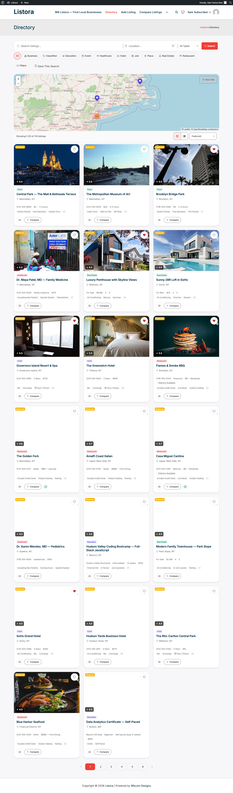
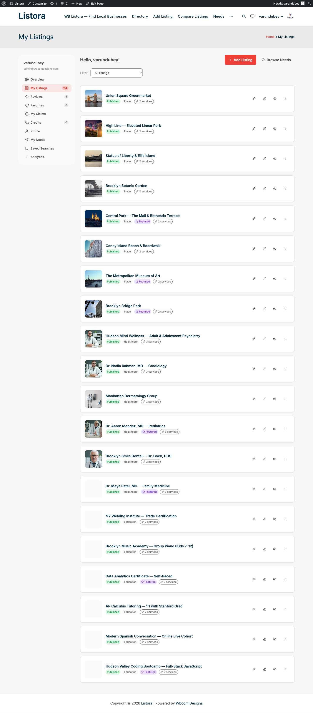
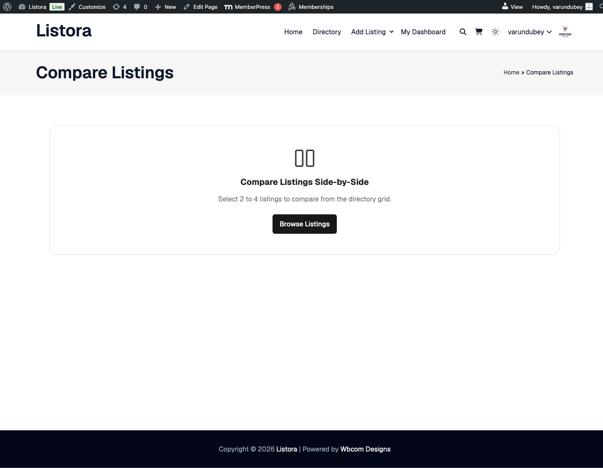

# Visitor Journey

You're a real person who needs to find a real business — a restaurant for tonight, a plumber for tomorrow, a venue for next month. You don't care about the plugin. You just want answers, fast. This is what Listora gives you out of the box.

## Who this is for

- **Tonight diner** looking for "Italian near me, open now, takes reservations"
- **Urgent buyer** needing a plumber / electrician / mobile vet today
- **Researcher** comparing 3 venues for an event
- **Tourist** browsing for things to do in a new city
- **Subscriber** wanting to be notified when a new listing matches their criteria (Pro)

## Stage 1 — Land on the directory (~10 seconds)

What you expect: **see relevant listings immediately, no signup wall, no popup, no confusion.**

What you experience:

1. Land on the homepage or `/listings/`.
2. Above the fold: search bar with autocomplete + popular categories + featured listings.
3. Below: a grid of recent or top-rated listings.
4. No login required. Browse anonymously as long as you want.

## Stage 2 — Search & filter (~30 seconds)

What you expect: **type, narrow down, get answers.**

What you experience:

| You want… | You do… |
|---|---|
| "Italian restaurants" | Type "italian" in search — autocomplete suggests as you type |
| "…near me" | Click the **Near Me** button — browser asks for location, results re-sort by distance |
| "…with outdoor seating" | Tick the **Outdoor Seating** facet in the sidebar |
| "…under $$" | Use the Price filter (custom field facet) |
| "…with 4+ stars" | Set the **Minimum Rating** dropdown |
| "…in Brooklyn" | Click the location chip in the sidebar |
| "…open right now" | Toggle **Open Now** (if business-hours filter is on) |

Results update reactively — no page reload, the URL updates so you can share/bookmark the exact filter set.

## Stage 3 — Compare candidates (~1-3 minutes)

What you expect: **side-by-side comparison without opening 5 tabs.**

What you experience (Pro):

1. Heart any listing card to save to favorites.
2. Use the **Compare** checkbox on cards to add 2-4 to comparison.
3. Hit **Compare now** in the floating bar → side-by-side table of every detail (price, rating, hours, services, amenities).
4. Pick a winner.

## Stage 4 — Open the detail page (~30 seconds)

What you expect: **everything I need to make a decision, all on one page.**

What you experience:

- **Hero gallery** with photos + video URL
- **Tabs:** Overview, Location, Reviews, Services, Map, Place Details (varies per type)
- **Sidebar:** Contact owner CTA + claim link + share buttons + listing meta
- **Schema.org JSON-LD** embedded — Google rich-result eligible automatically

## Stage 5 — Decide → contact / book / visit (~1 minute)

What you expect: **one click to reach the business — phone, email, website, directions.**

What you do:

- **Click phone** → mobile tel: link launches dialer; analytics records the click (Pro).
- **Click website** → opens vendor site in new tab; analytics tracked.
- **Get directions** → opens Google Maps / Apple Maps with the listing's address.
- **Contact owner** → fill the contact form (Free) or [Lead Form](../features/lead-forms.md) (Pro) — owner gets your message; you can reply directly to their email.
- **Submit a quote request** via Needs marketplace (Pro) — buyer flow that auto-distributes to matching businesses.

## Stage 6 — Write a review (~2 minutes, post-experience)

What you expect: **share my honest opinion in a way that helps the next visitor — not a 12-field interrogation.**

What you experience:

1. Visit the listing detail.
2. Click **Write a review**.
3. (If not logged in) Quick signup or social login.
4. Rate overall (1-5 stars) + write a few sentences.
5. (Pro: multi-criteria) Rate per aspect — Food / Service / Value / Ambiance.
6. (Pro: photo reviews) Attach up to 3 photos.
7. Submit — review goes live (or to moderation queue depending on operator setting).
8. Get email when the owner replies (`review_reply` event).
9. Get email when your review hits a helpful-vote milestone (1, 5, 10, 25, 50, 100).

## Stage 7 — Stay engaged (ongoing, Pro)

What you expect: **don't make me re-search every time. Notify me when something new matches.**

What you do (Pro):

1. From dashboard → **Saved Searches** tab.
2. Save your current filter set with a name ("Italian in Brooklyn, 4+ stars, outdoor").
3. Toggle alerts.
4. Get an email every time a new listing matches.

## Stage 8 — Optional: Post a need (Pro reverse marketplace)

What you expect: **flip the script — instead of searching, post what I'm looking for and let businesses come to me.**

What you do:

1. Visit **/needs/** (the marketplace feed) or **/post-need/** (the submission form) — both auto-created by Pro.
2. Describe what you need (catering for 100 guests, plumber for water heater, real estate agent in Queens).
3. Pick type + urgency + budget.
4. Submit.
5. Matching businesses see your need and respond with quotes.
6. Review quotes in your dashboard → **Needs** tab → pick a winner.

## What you do NOT have to do (because Listora handles it)

- ❌ Sign up to browse — guest browsing is unlimited.
- ❌ Re-enter your filters after a page reload — URL state preserves them.
- ❌ Pinch-zoom on mobile — block themes adapt to your screen.
- ❌ Worry about fake reviews — moderation + Akismet + helpful-vote weighting filter spam.
- ❌ Track which businesses you've contacted — your activity (favorites, contact form fills, saved searches) lives in your dashboard.

## Common pitfalls (operator-side problems you'd see)

| You see | Operator should fix |
|---|---|
| "No results" for common queries | Operator should reindex search OR check facet visibility |
| Map shows no markers | Operator should set the Google Maps API key (Pro) or Leaflet OSM endpoint (Free) |
| Contact form says "rate-limited" | You hit the per-IP / per-listing cap — wait 1 hour or contact via phone |
| Verification badge missing | Operator hasn't approved the business yet (Pro Verification feature) |
| Phone number not clickable on mobile | Browser bug — manually long-press to call |

## Related

- [Site Owner Journey](site-owner.md) — what the directory operator does.
- [Listing Owner Journey](listing-owner.md) — what businesses experience.
- [Reviews System](../features/reviews-system.md) — full review feature doc.
- [Lead Forms (Pro)](../features/lead-forms.md) — analytics + integrations.
- [Needs Marketplace (Pro)](../features/needs-marketplace.md) — reverse marketplace.
